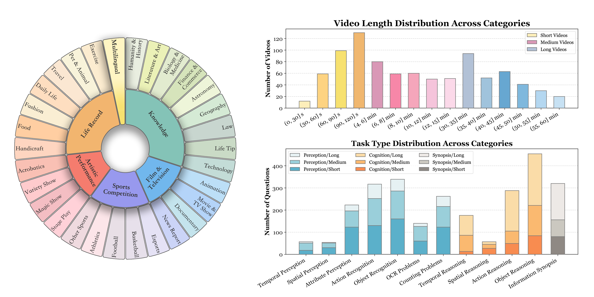
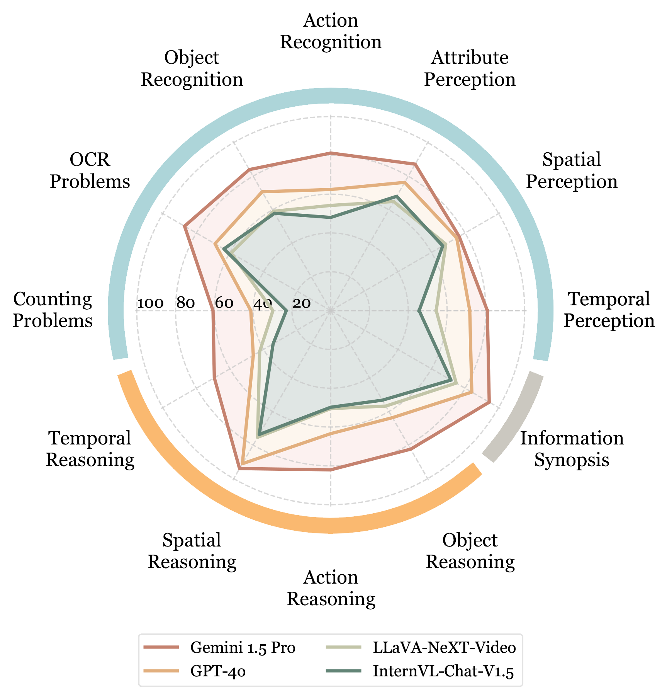

# Video-MME — Research Note

## 📇 Academic Context

| Field | Value |
|-|-|
| Title | Video-MME: The First-Ever Comprehensive Evaluation Benchmark of Multi-modal LLMs in Video Analysis |
| Venue | CVPR 2025 |
| Year | 2025 |
| Authors | Chaoyou Fu, Yuhan Dai, Yongdong Luo, Lei Li, Shuhuai Ren, ..., Ran He, Xing Sun（共 21 位作者，NJU / XMU / HKU / PKU / CUHK / ECNU / CASIA 等） |
| Official Code | https://video-mme.github.io |
| Venue Kind | paper |

## First Principles

### 這篇論文到底想解決什麼

多模態大語言模型（MLLM）過去的評測幾乎都集中在**靜態影像**理解，缺少一個能全面、細緻衡量模型「看影片」能力的高品質基準。Video-MME 就是為了填補這個缺口而生：它手工蒐集 900 支 YouTube 影片、標註 2,700 題四選一選擇題（每支影片 3 題），橫跨 6 大領域（Knowledge、Film & Television、Sports Competition、Artistic Performance、Life Record、Multilingual）與 30 個細分類別，影片長度從 11 秒橫跨到 1 小時。它同時把 subtitles 與 audios 一起納入評測，讓評測不只看畫面。（本筆記基於 arXiv:2405.21075 版本，即 CVPR 2025 camera-ready 原始碼，正式會議版可能略有差異。）

作者刻意用三步驟壓出資料品質：先依 YouTube 熱門趨勢建立領域階層並蒐集短（< 2 分鐘）、中（4–15 分鐘）、長（30–60 分鐘）三檔影片，取得 900 videos with 744 subtitles and 900 audio files；再由具備 vision-language 研究經驗的標註者逐支看完影片後出題；最後做人工複審，並且把「只給文字題幹」的題目餵給 Gemini 1.5 Pro，凡是純文字就能答對的題目一律剔除。統計顯示 Gemini 1.5 Pro achieves less than 15% accuracy in the text-only setup，用來反證題目確實需要看影片才能作答。

### 用 certificate length 量化「這題到底有多難」

如何客觀衡量一題需要「看多久影片」才能答對？Video-MME 沿用 EgoSchema 的 certificate length：一個 QA 對的 certificate 是「足以讓人類驗證者確認標註答案正確」的最小必要子片段集合，certificate length 則是這些子片段時長的總和。以下用我們自訂的記號把這個定義寫成式子（notation 為本筆記所加）：

$$\mathrm{CL}(q) = \sum_{c \in \mathcal{C}(q)} \lvert c \rvert$$

其中 $\mathcal{C}(q)$ 是題目 $q$ 的最小充分子片段集合，$\lvert c \rvert$ 是子片段 $c$ 的時長。作者從每個類別隨機抽 3 支影片估計分佈，得到短、中、長影片的 median certificate length 分別為 26s, 164.7s, and 890.7s——長影片子集需要消化的內容遠超 EgoSchema（其影片上限僅 180 秒），這也是作者宣稱 Video-MME 是「最具挑戰性」影片 QA 資料集的主要依據。

### 主結果一眼看懂

下表節錄 Table「Performance of MLLMs on Video-MME」中具代表性的幾列（overall 為不分時長的整體準確率，%）：

| Model | LLM Params | Short w/o subs | Long w/o subs | Overall w/o subs | Overall w/ subs |
|-|-|-|-|-|-|
| Gemini 1.5 Pro | - | 81.7 | 67.4 | 75.0 | 81.3 |
| GPT-4o | - | 80.0 | 65.3 | 71.9 | 77.2 |
| GPT-4V | - | 70.5 | 53.5 | 59.9 | 63.3 |
| VILA-1.5 | 34B | 68.1 | 50.8 | 59.0 | 59.4 |
| VITA-1.5 | 7B | 67.0 | 47.1 | 56.1 | 58.7 |
| InternVL-Chat-V1.5 | 20B | 60.2 | 45.6 | 50.7 | 52.4 |

只用影格輸入時，Gemini 1.5 Pro attains an accuracy of 75%，領先 GPT-4o 的 71.9% 與 GPT-4V；最強開源模型 VILA-1.5（34B）only reaches 59.0% overall，與商用模型仍有明顯落差。值得注意的是純影像模型 InternVL-Chat-V1.5 靠多影格輸入也能到 50.7%，與影片專用模型 LLaVA-NeXT-Video 相當，作者以此論證 image understanding is the foundation of video understanding，也證明基準對影像／影片模型都適用。

### 一個具體的模態消融例子

把焦點放在 Gemini 1.5 Pro 的分類別消融（Table「Performance of Gemini 1.5 Pro across six major categories」）能看清多模態的價值。以 Multilingual 這一類的長影片為例：只給 frames 時準確率是 70.8%，加上 subtitles 後躍升到 87.5%（+16.7），改加 audio 則到 83.3%（+12.5）。放大到整個長影片子集，加字幕讓 overall 從 67.4% 提升到 77.4%（+10.1），而在短影片上加字幕只帶來 +2.8，說明字幕對長影片的邊際效益遠大於短影片。另一條軸線是時長：Gemini 1.5 Pro 從短到長影片準確率 declines by −14.3% from short to long videos，暴露出模型在長距時序關係上的弱點；作者把主因歸為長影片中推理題比例升高、固定影格數導致取樣過稀、以及長脈絡本身難解。

## 🧪 Critical Assessment

### 問題是真的，但「第一個」的框定值得斟酌

影片理解評測不足是真問題：把 11 秒到 1 小時、含 subtitles 與 audios 的開放領域影片放進同一個手工標註基準，確實補上了既有 benchmark 的空缺。不過 the first-ever comprehensive 這個定位帶有行銷成分——同期已有 MVBench、TempCompass、EgoSchema 等多個影片 MLLM 基準，Video-MME 的差異化主要在「長影片 + 多模態 + 人工標註」的組合，而非單一維度的原創；把它讀成「一次把多個既有維度湊齊的工程整合」比「全新問題」更貼近事實。

### 度量與基線設計的幾個縫隙

規模其實不大：2,700 題、每支影片僅 3 題，換算下來每個 30 子類別平均只有約 90 題，長影片子集更只有 300 題，統計上一個模型幾個百分點的差距很可能落在雜訊裡，但論文並未報告任何信賴區間或顯著性檢定。certificate length 只從每類抽 3 支影片估計（全表約 90 支），樣本極小，卻被用來支撐「最具挑戰性」這種全域宣稱，說服力有限。此外，主要的模態增益結論高度依賴單一模型 Gemini 1.5 Pro——分類別的模態消融只在它身上做，audio 幾乎沒有開源模型能吃，因此「subtitles 比 audio 有效」這類結論的外推性存疑。

### 「自家出題自家評」帶來的循環風險

題目過濾用的是 Gemini 1.5 Pro（filter out QA pairs answerable from text alone），而 Gemini 1.5 Pro 又是榜上第一名的受測模型，這構成一種微妙的循環：用某模型篩掉它自己覺得能純文字作答的題，可能系統性保留了對該模型視覺管線友善的題型，讓它在最終榜單佔優。論文沒有交叉用多個過濾器來排除這個偏差。領域清單本身也有小瑕疵：正文列 6 領域時只寫出 5 個（漏了 Artistic Performance），顯示標註流程的描述並非完全嚴謹。

### 這個基準真的推動了問題被解決嗎

作為「診斷工具」，Video-MME 是成功的：它清楚量化了「時長越長、準確率越低」與「多模態能補資訊」兩個現象，對社群定義下一步很有幫助。但它衡量的是模型能力，本身不提供任何解法；而且因為影片全部來自 YouTube 公開內容，較新的商用模型很可能在預訓練階段見過相關素材，造成潛在的資料污染，這會讓排行榜的絕對數字隨時間虛高。作為快照式排行榜它有時效性，作為「長影片理解已被解決」的證據則遠遠不夠。

## 🔗 Related notes

<!-- 目前 vision_language 下沒有可安全解析的相關筆記，保留標題、暫留空。 -->
