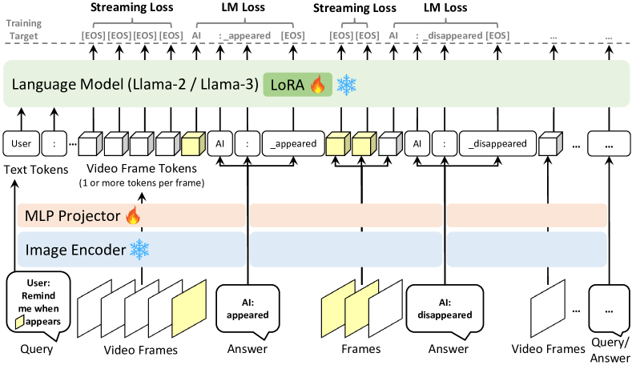
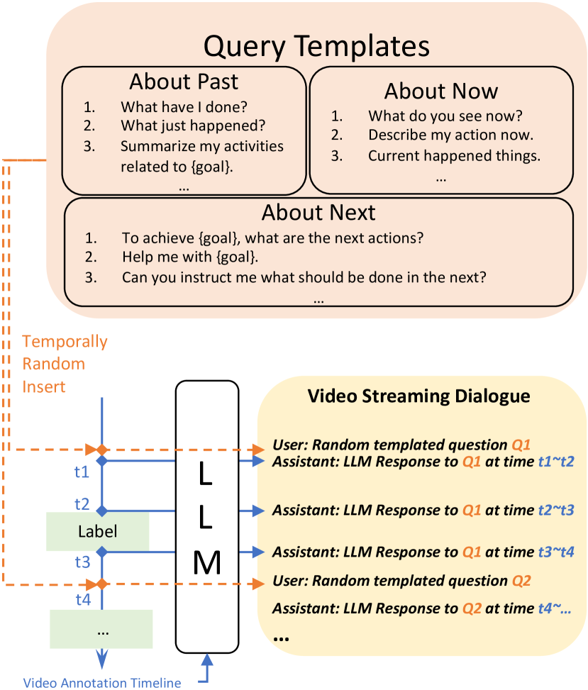
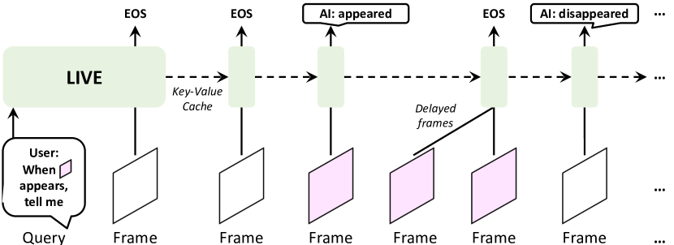

# VideoLLM-online — Research Note
> [English](./README.md) | **繁體中文**

## 📇 Academic Context

| Field | Value |
|-|-|
| Title | VideoLLM-online: Online Video Large Language Model for Streaming Video |
| Venue | CVPR 2024 |
| Year | 2024 |
| Authors | Joya Chen, Zhaoyang Lv, Shiwei Wu, Kevin Qinghong Lin, Chenan Song, Difei Gao, Jia-Wei Liu, Ziteng Gao, Dongxing Mao, Mike Zheng Shou |
| Official Code | https://github.com/showlab/videollm-online |
| Venue Kind | paper |

> 本文根據 arXiv 版 `2406.11816`（CVPR camera-ready 的 Llama-3 升級版）撰寫，數值與引文均以論文
> LaTeX 原始碼為準；正式會議版若有差異以 CVPR 官方版為主。引用次數在撰寫當下因 Semantic Scholar
> API 回傳 HTTP 429 而標記為 unavailable，並非 0。

## First Principles

### 問題設定：從「離線影片問答」到「影片串流對話」

多數影片大型多模態模型（VideoLLM）把影片當成一段「事先挑好的短片」來理解：使用者上傳一段 clip，
模型讀完整段後才吐出一次回答。本文主張這種離線範式無法支撐「隨時待命、貼著時間軸」的 AI 助理
（例如 AR 眼鏡邊煮菜邊提醒你翻面）。作者把新問題命名為 video streaming dialogue：模型持續接收
不斷刷新的影格，需要在正確的時間點主動說話，其餘時間保持沉默。

作者把難點拆成三個彼此拉扯的維度。第一是 temporally aligned（時間對齊）：像「該翻牛排時提醒我」
這種查詢要求模型逐格掃描、不能只給影片級別的整體回答。第二是 long-context（長脈絡）：要回答摘要與
規劃問題，就得保留大量歷史視覺與語言 token，很快會撐爆 LLM 的 context window，也拖慢因果解碼速度
並吃掉 GPU 記憶體。第三是 real-time（即時）：回應必須跟得上影片流速，才能做到 always-on。

形式化來說，給定 $t_1$ 之前的上下文 `[Ctx]` 與 $t_1$ 到 $t_2$ 之間持續進來的影格 `[Frame]`，模型
的目標有兩層：先判斷「當前時刻 $t_2$ 是否適合開口做語言模型」，若判定要說話，才在該時刻做標準的
next-token 語言模型。這個「先決定要不要說、再決定說什麼」的二段式結構，是後續所有設計的出發點。

### 為什麼 per-frame 對話行不通：Streaming EOS 預測

一個直覺解法是把互動頻率拉到每一格：把每個影格當 query，逐格做語言模型，並在不需回答的影格輸出一句
很短的話（例如「現在還不是回答的時候」）。但這會逼模型在每一格都跑一次冗長、循環的 billion 級
next-token 解碼，速度上不可能即時，還會反覆消耗 `[INST]`、`[/INST]` 等對話模板 token，讓長影片的
context 迅速膨脹。作者也實測過 GPT-4V 的 per-frame prompting：它傾向每一格都輸出長篇內容，造成明顯
延遲，並不適合即時串流。

本文的核心貢獻是一個新的訓練目標 streaming EOS prediction（串流結束符預測）。對於「該回答」的時刻
$t_2$，照常做語言模型：

$$\max P(\texttt{[Txt}^{t_2}_{i+1}\texttt{]} \mid \texttt{[Ctx}^{<t_2}\texttt{]},\ \texttt{[Frame}^{t_2}\texttt{]},\ \texttt{[Txt}^{t_2}_{\le i}\texttt{]})$$

而對於 $t_1 \le t < t_2$ 這些「冗餘、不需產生答案」的影格，則直接教模型在該影格 token 上預測 EOS：

$$\max P(\text{EOS} \mid \texttt{[Ctx}^{<t}\texttt{]},\ \texttt{[Frame}^{t}\texttt{]}),\quad \text{where } t_1 \le t < t_2$$

關鍵巧思在於：這個 EOS 只作為監督訊號，**不會被 append 進輸入/輸出序列**，因此不會像真的插入大量
EOS token 那樣推高 perplexity，也不佔用 context。它本質上不是 next-token prediction（EOS 不出現在
序列裡），卻能與自回歸損失並存，一起訓練出「知道何時該閉嘴」的串流模型。作者也強調這裡的 EOS 不必
是語言模型原生的 `</s>`，可以是任何在 system prompt 中約定的 token。

### 訓練損失：語言建模損失 + 串流損失

把兩個目標合起來，訓練損失是逐 token cross-entropy 的加總（符號沿用論文 Eq. 5）：

$$L = \frac{1}{N}\sum_{j=1}^{N}\left(-\log l_{j+1} P_j^{\texttt{[Txt}_{j+1}\texttt{]}} -\ w\log f_j P_j^{\texttt{[EOS]}}\right)$$

其中 $l_j$ 是語言 token 指示子（第 $j$ 個 token 是語言回應才為 1），$f_j$ 是串流指示子：當第 $j$ 個
token 是某一影格的**最後一個** token、且下一個位置不是語言 token（$l_{j+1}=0$）時才為 1，也就是把
EOS 監督只施加在「即將沉默」的影格上。$w$ 是平衡係數，預設 $w=1$。當每格只用 1 個 token 時，語言
損失與串流損失在序列上的作用範圍如下圖標示。

### 資料引擎：把離線標註轉成串流對話

上述訓練需要「影片流內的使用者查詢與助理回應」資料，但主流影片資料集大多只有離線的時間段標註。作者
提出兩條資料生成路線。對 Ego4D narration 這種本身就以串流方式標註（標註者邊看 5 分鐘影片邊即時描述）
的資料，直接沿用給人類標註者的指示當作訓練 prompt。對只有時間段標註的離線資料（如 COIN），則用 LLM
合成對話：先準備一個涵蓋過去/現在/未來時態的問題模板庫，作者共準備了每類 50 題、合計 $N=150$ 條查詢；
接著把時間軸標註整理成「time $t_a \sim t_b$: boiling the water」這樣的語言 prompt，把所有狀態轉變的
關鍵時間點視為理想回應時刻，再讓 LLM 在每個關鍵時間點生成回應。訓練時隨機抽一條查詢、隨機插入到某個
時間戳 $t_r$、丟掉 $t_r$ 之前的回應，每個樣本最多插入 3 條查詢。

### 模型架構與推論管線

架構延續 LLaVA 的三件式：影像編碼器、MLP projector、語言模型。影像編碼器用在 DataComp-1B 上預訓練的
CLIP ViT-L，以 2 FPS 抽取影格 embedding，形狀為 $(1+h_p\times w_p)\times c$（1 個 CLS token 加上平均
池化後的空間 token）。論文正文實驗刻意設 $h_p=w_p=0$，也就是每格只用 1 個 CLS token，這是最省的設定，
可在 4096 context window 內處理近半小時影片；釋出的 demo 模型則用 $1+3\times3=10$ 個 token/格以換取
更細的對話細節。影格 token 經 MLP 投影後與語言 token 交錯輸入 Llama-2-7B-Chat 或 Llama-3-8B-Instruct，
並在每個線性層加上 LoRA 做高效微調（rank 128、scaling 256）。

推論端有三個工程設計。其一是 probability correction：因為 EOS 太常見會讓模型偏向沉默，作者引入門檻
$\theta$，只有當 $P_j^{\texttt{[EOS]}} \ge \theta$ 才把 EOS 當下一個 token，實務上 $\theta$ 設在
$0.5 \sim 0.8$ 明顯優於不設門檻。其二是 continuous key-value cache：影片逐格串流輸入，靠 KV cache
免去每格重算，配合「傾向沉默」的訓練讓連續推論很有效率。其三是 encoding/decoding 平行化：CLIP ViT-L
（307M）遠小於 7B/8B 的 LLM，兩者速度落差會導致跳格；作者用一個 FIFO queue 讓快的編碼器持續編碼、
不必等慢的 LLM 解碼完，避免瓶頸。

### 一個帶真實數字的走查

以論文預設的 VideoLLM-online-7B-v1（CLIP + Llama-2-7B-Chat，每格 1 個 CLS token）在一段 5 分鐘 Ego4D
narration 上運作為例：@2 FPS 抽樣約產生 600 影格，每格 1 token，因此整段串流僅約 600 個影格 token，
遠低於 4096 的 context 上限。假設在 $t_r$ 插入查詢「Remind me when X appears」，在 X 尚未出現的每個影格
上，模型被監督在該影格最後一個 token 預測 EOS（保持沉默）；當 X 於 $t_2$ 出現時，模型才被監督輸出
「appeared」這串語言 token。正因為沉默影格不佔序列，串流方法的平均訓練 token 長度只有 1694，相較
per-frame streaming 的 6737 少了約 4 倍，訓練時間也從 22h 降到 12h。推論時設 $\theta \in [0.5, 0.8]$
做 EOS 門檻校正，5 分鐘串流可在單張 A100 上以 18.2 GB 記憶體、平均 13.5 FPS 運作。

下表是串流學習方法的消融（Ego4D Narration Stream 驗證集，7B-v1）。No Training 的 LM-PPL 高達 498.5、
Fluency 幾乎為 0；interleaved 對話雖把 PPL 壓到 2.45，但 TimeDiff 仍有 6.47、幾乎不會沉默；per-frame
streaming 把 TimeDiff 降到 2.52 卻犧牲了 PPL（3.34）。本文的 streaming 方法在三項指標上都最好，且訓練
token 與成本與最省的 interleaved 相同。

| Method | Objective | LM-PPL↓ | TimeDiff↓ | Fluency↑ | #Train Token↓ | Cost |
|-|-|-|-|-|-|-|
| No Training | n/a | 498.5 | 6.50 | 0.1% | n/a | n/a |
| Interleaved Dialogue | Language Modeling | 2.45 | 6.47 | 11.1% | 1694 | 12h |
| Per-frame for Streaming | LM (w/ EOS turns) | 3.34 | 2.52 | 37.7% | 6737 | 22h |
| Streaming Dialogue (Ours) | LM + Streaming EOS | 2.43 | 2.32 | 42.6% | 1694 | 12h |

效率消融同樣支持串流設計：interleaved 因每格都輸出語言而吃 34.4 GB、只有 1.5 FPS；per-frame streaming
改善到 24.9 GB / 7.5 FPS；本文 streaming 因不在冗餘影格花 token、KV cache 較小，達到 18.2 GB / 13.5 FPS。

| Method | Mem↓ | FPS↑ |
|-|-|-|
| Interleaved | 34.4G | 1.5 |
| Per-frame Streaming | 24.9G | 7.5 |
| Streaming | 18.2G | 13.5 |

在離線 benchmark 上，作者宣稱在 end-to-end 模型中取得 SOTA。COIN 六項 Top-1 Accuracy 中，7B-v1 的 step
recognition 為 59.8、8B-v1+ 更達 63.1，皆高於先前最佳的 VideoTaskGraph（57.2）；Ego4D LTA 的
ED@Z=20（越低越好）Action 欄，8B-v1+ 為 0.884，優於同為 end-to-end 的 VideoLLM（0.921），但仍略遜於
使用 egocentric 預訓練特徵、且串接多重複雜方法的非 end-to-end AntGPT（0.877）。

| Method | COIN Step↑ | COIN Task↑ | Ego4D LTA Action ED↓ |
|-|-|-|-|
| VideoTaskGraph | 57.2 | 90.5 | n/a |
| VideoLLM | n/a | n/a | 0.921 |
| VideoLLM-online-7B-v1 | 59.8 | 92.1 | 0.897 |
| VideoLLM-online-8B-v1+ | 63.1 | 92.7 | 0.884 |

## 🧪 Critical Assessment

### 問題是真需求，還是為方法量身打造的設定

「always-on 影片助理」的動機是可信的：GPT-4o 當時的多模態互動仍需人聲觸發，逐格提醒/摘要/預測確實是
未被滿足的能力。streaming EOS 這個「用不進序列的監督訊號教模型何時沉默」的想法也乾淨而有效，屬於實質
創新而非改名包裝。但要留意的是，論文賴以立論的主要評測——Ego4D Narration Stream——高度貼合作者方法的
強項：作者自己也承認 narration 文本「相對簡單，主要由主詞、動詞、受詞構成」，因此 LM-PPL 與 LG-Match
才勉強適用。換句話說，這個串流基準是圍繞方法能發揮的簡單語言場景所定義的，對更複雜、free-form 的線上
對話能力，論文明說現有指標「並不有效」並留待未來工作。這是一種評測邊界的自我圈定，需要讀者警覺。

### 基線、消融與指標是否足夠

正面看，消融相當完整：學習方法（interleaved / per-frame / streaming）、串流損失函數（CE vs OHEM vs
Focal）、損失權重 $\tau$、以及記憶體/速度都各有一張表，且 CE、$\tau=1.0$ 的預設選擇有數據支撐。但有幾
處缺口值得質疑。其一，TimeDiff、Fluency、LG-Match 三項核心指標全是作者自定義，沒有外部資料集或既有
文獻的可比基準，讀者難以判斷 2.32 秒的 TimeDiff 在絕對意義上算好還是普通。其二，主要串流實驗只在單一
資料集（Ego4D narration）驗證，COIN+Ego4D 的 free-form 設定僅作定性展示，缺乏跨資料集的量化外推。其三，
所有數字看不到多次隨機種子的變異或信賴區間，像 $\tau=0.5/1.0/2.0$ 之間 Fluency 只差 0.2 個百分點這種
差距，是否統計顯著並不明朗。

### 離線 SOTA 的宣稱要打折扣看

論文標題與敘事把「離線 benchmark SOTA」當作賣點，但表格裡的比較條件並不完全對等。作者的 SOTA 宣稱限定
在「end-to-end 模型」這個子集：在 Ego4D LTA 上，真正最佳的 AntGPT（0.877）與 Palm 都被以灰字列在
end-to-end 分隔線之下，理由是它們用了 egocentric 預訓練特徵與級聯方法。這個界定本身合理且有揭露，但把
它讀成「無條件 SOTA」會失真——本文的 0.884 其實仍輸給既有非 end-to-end 方法。COIN 一側則加了「Not use
HT100M」欄位來凸顯自身未用額外預訓練，這雖是公平性論述，也同時是縮小可比集合、讓自己更突出的框定方式。

### 是否真的解決了宣稱的問題，以及現實相關性

就「能否在單卡上以 >10 FPS 跑 5 分鐘串流並適時回應」這個工程目標而言，論文的證據（13.5 FPS、18.2 GB）
是有說服力的，方法在其定義的任務上確實可用。但「解決 always-on 影片助理」這個更大的敘事仍有距離：正文
實驗刻意用每格 1 token 的最省設定，作者自陳這會犧牲空間細節，需要更多空間 token 才能做好 zero-shot 的
下游空間理解，而這正被列為未來工作；demo 用的 10 token/格設定則沒有進入量化評測。此外，資料引擎依賴
Llama-2/3 為 COIN 標註「幻想」出對話回應，這些合成回應的正確性與偏誤沒有被系統性評估，可能把 LLM 的
既有偏差引入監督訊號。因此比較穩妥的結論是：本文在一個定義清晰但相對狹窄的串流敘述任務上給出了漂亮且
高效的解法，但距離其願景中通用、free-form 的即時助理，仍是一個有前景的起點而非終點。

## 🔗 Related notes

<!-- 目前 domains/vision_language 下無與串流影片對話直接相關且可解析的既有筆記，故保留標題留空。 -->
