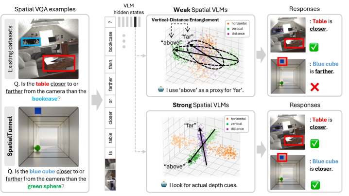
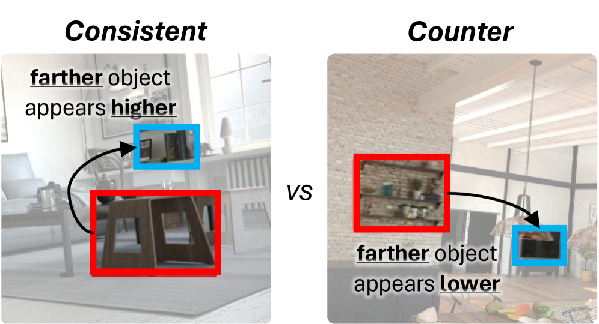
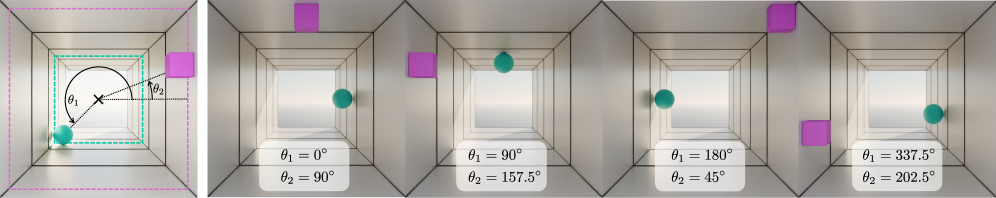
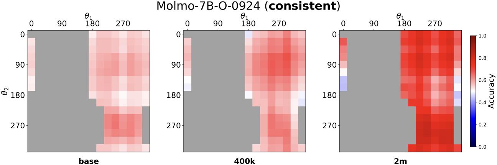
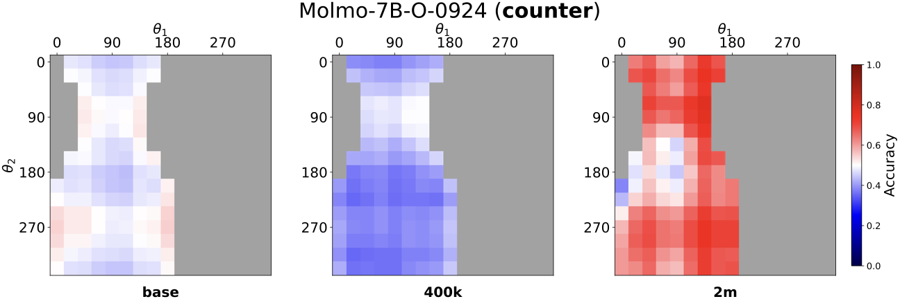
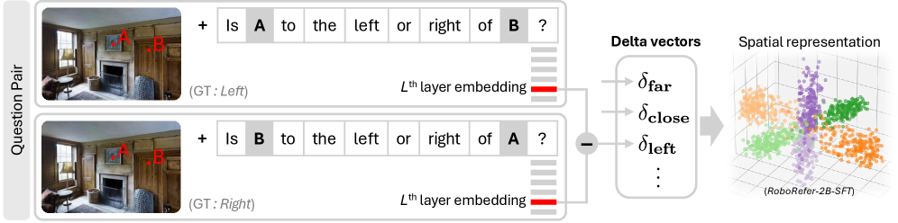
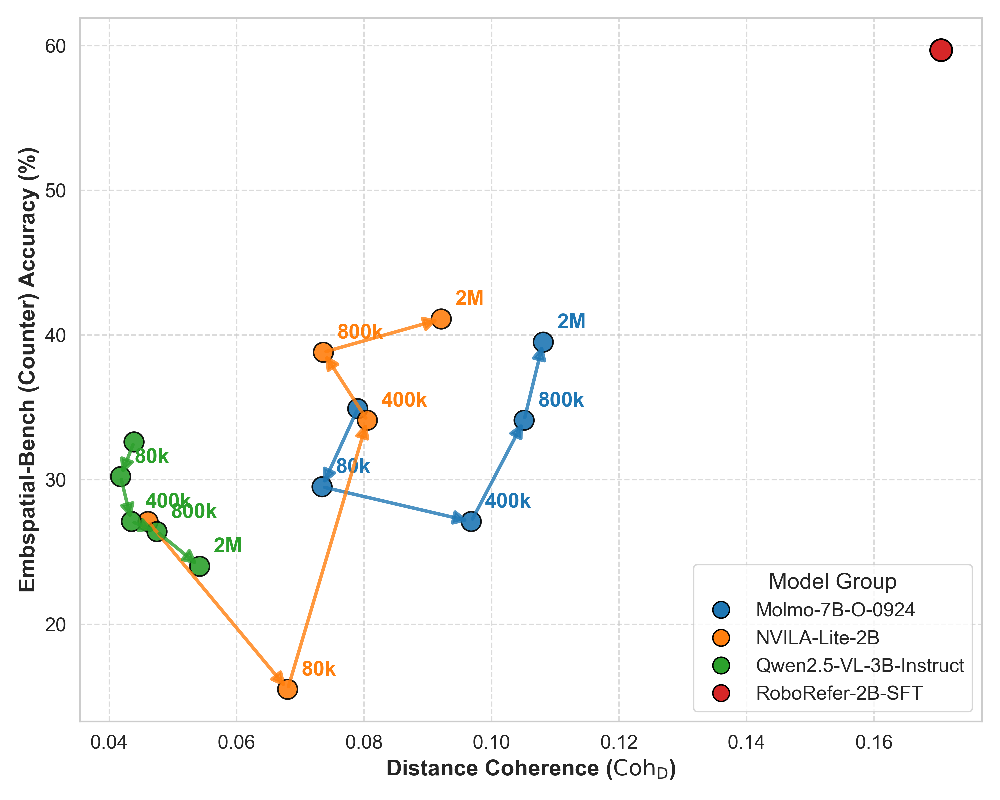
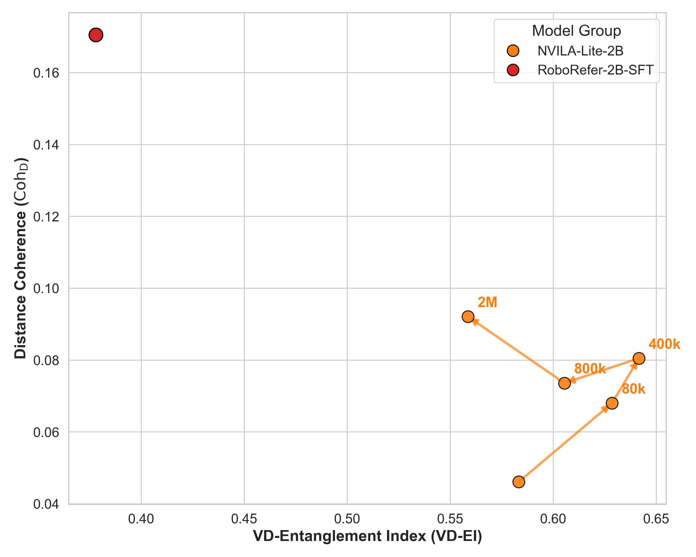
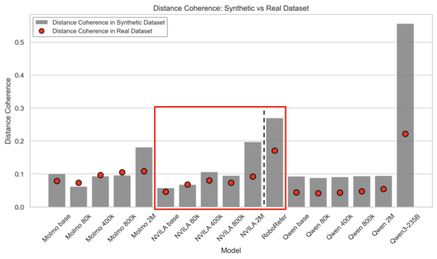
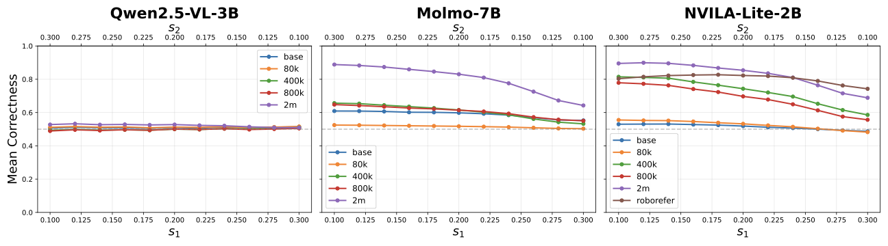

# WhyFarLooksUp — Spatial Representation Probing Research Note
> **English** | [繁體中文](./README.zh-TW.md)

## 📇 Academic Context

| Field | Value |
|-|-|
| Title | Why Far Looks Up: Probing Spatial Representation in Vision-Language Models |
| Venue | ECCV 2026 |
| Year | 2026 |
| Authors | Cheolhong Min, Jaeyun Jung, Daeun Lee, Hyeonseong Jeon, Yu Su, Jonathan Tremblay, Chan Hee Song, Jaesik Park |
| Official Code | https://github.com/cheolhong0916/contrastive-probing |
| Venue Kind | paper |

> This note is written from the LaTeX source of the arXiv e-print (arXiv id `2605.30161`, fetched on 2026-07-03); the `Venue` field records the paper's self-stated submission venue ECCV 2026, whose peer-review and acceptance status is not independently corroborated in the original text, and the official-version data may differ slightly from this preprint.

## First Principles

### How perspective projection swaps "up" for "far"

A single RGB photo is just a 2D projection of a 3D scene, and to answer a question like "is the chair closer to the camera than the table," a model can only infer the spatial structure indirectly from visual cues. The problem is that everyday photos contain a stable correlation: for objects on the ground, the farther they are from the observer, the higher they appear in the image (approaching the horizon). This "elevation cue" gives the model a chance to take a shortcut: when asked about depth, it is partly reading an object's vertical position rather than truly reasoning about 3D geometry. The authors name this tendency vertical-distance entanglement, i.e. the model internally treats *above* as roughly *far* and *below* as roughly *close*.



This shortcut is dangerous because a behavioral benchmark only measures "did it answer correctly," but cannot see "how it answered correctly." Two models with similar scores on the benchmark may have completely different internal mechanisms: one encodes spatial relations as structured, separable directions, the other merely relies on correlated cues in natural images and becomes fragile once the distribution shifts. To distinguish the two, one must directly examine how spatial information is represented inside the model.

### Using a consistent / counter split to turn the shortcut into a measurable gap

The authors split all depth-related samples into two groups by "whether the true answer aligns with the elevation shortcut": if the farther object is higher in the image, it is consistent; if the farther object is instead lower, it is counter. In practice they compare the vertical center coordinates of the two queried objects; if the farther one has a smaller $y$ value (higher position), it is consistent, otherwise counter. If the model has no entanglement, the two groups' accuracies should be close; once a systematic gap appears, it is evidence that the model is exploiting the vertical-position shortcut.



The distribution of real benchmarks is itself severely biased toward consistent. In EmbSpatial-Bench, consistent accounts for 976 questions (80.9%) and counter only 129 (10.7%); in CV-Bench-3D, consistent is 363 questions (60.5%) and counter 65 (10.8%); the rest are ambiguous ($\Delta y$ smaller than 5% of the image height). This exactly replicates the natural statistics of real photos: in most scenes the far object is indeed higher. As a result, all models consistently and substantially regress on the counter subset — for example, after fine-tuning Qwen2.5-VL-3B on 2M samples, it has 60.9% on EmbSpatial-Bench's consistent but only 24.0% on counter, a gap as large as 36.9 percentage points; and this phenomenon holds across the three families Molmo, NVILA, Qwen2.5-VL, across model sizes, and across fine-tuning data volumes.

### SpatialTunnel: decoupling 2D height from 3D depth in a synthetic corridor

Real photos entangle multiple depth cues (vertical position, visual size, occlusion) together, making it hard to isolate any single one. The authors therefore use Blender to build a tunnel (single-point-perspective corridor) synthetic dataset: the walls, ceiling, and floor are symmetric about the camera's optical axis, and objects can be attached anywhere on the corridor's inner walls. The key is that objects at the top and bottom ends of the corridor can be equidistant from the camera, so the "higher is farther" shortcut directly fails geometrically. Each object is parameterized by depth $z$ and cross-section angle $\theta$; fixing $z$ and sweeping only $\theta$ lets the object move up/down/left/right in the image without changing the depth ordering, forming a paired set of counterfactuals.



In practice the cross-section is discretized into 16 angles, forming a $16\times16$ grid of $(\theta_1,\theta_2)$ for two objects; each configuration renders 12 randomized scenes (shape, color, size, and lighting are all randomized), giving $16\times16\times12=3{,}072$ images, paired with 4 question templates for $12{,}288$ questions. The scoring does not look at the literal generated answer but takes the logits of `Yes` and `No` at the first generated token, defining:

$$
p=\sigma\!\bigl(\ell_{\texttt{Yes}}-\ell_{\texttt{No}}\bigr)
$$

The per-question correctness is $v=p$ (if the ground truth is `Yes`) or $v=1-p$ (if `No`). Then, split by consistent / counter, four metrics are reported: mean correctness $v$, consistent correctness $v_\text{cons}$, counter correctness $v_\text{ctr}$, and the accuracy gap that quantifies entanglement strength, $\Delta=v_\text{cons}-v_\text{ctr}$; a model with no directional bias should have $\Delta\approx0$.

Because the $16\times16$ grid exhaustively enumerates all cross-section angle combinations of the two objects, the correctness of each cell can be plotted as a heatmap, directly showing which configurations the bias falls on. The figure below places, side by side, the consistent and counter heatmaps for Molmo-7B's three fine-tuning scales (base → 400k → 2M): on the consistent side the red (high-correctness) region stably expands with data scale and becomes a large deep-red area by 2M; the counter side is the opposite, being pale overall at base (close to random guessing), dropping to the deepest blue at 400k (most severe entanglement, largest gap), and by 2M recovering to a large red area, but redder-but-lighter than the consistent side and interlaced with a whitish/blue band — i.e. what the original text calls "partial recovery, but counter remains substantially harder." This figure lays bare, on the same color scale, the mechanism that "adding data mainly fills in consistent, and counter only passively follows."





### Walking through Qwen2.5-VL-3B's aggregated SpatialTunnel result (worked example)

Take the aggregated result of the base Qwen2.5-VL-3B on the full SpatialTunnel evaluation as an example, to concretely see how the numbers land. Each image in the corridor places two objects at fixed depths, asking "is obj$_1$ farther from the camera than obj$_2$"; the model reads in the RGB image and the question, runs a forward pass, reads out $\ell_{\texttt{Yes}}$ and $\ell_{\texttt{No}}$ at the first generated position, and substitutes into $p=\sigma(\ell_{\texttt{Yes}}-\ell_{\texttt{No}})$ to get the per-question confidence. Averaging $v$ over all consistent samples across the $16\times16$ grid, 12 randomized scenes, and 4 question templates gives $v_\text{cons}=0.776$; averaging over all counter samples gives only $v_\text{ctr}=0.360$, so $\Delta=+0.416$ — this is the largest entanglement gap in the whole table (these are aggregated statistics over the entire dataset, not the value of a single cell or a single forward pass), showing that this base model answers almost entirely by "high means far" rather than by truly comparing depth. As a contrast, RoboRefer-2B-SFT, which shares the NVILA base but was trained on over 20M samples including depth supervision, has $v=0.793$ and $\Delta$ of only $+0.046$ on the same test; the scale-to-the-extreme Qwen3-VL-235B has $v=0.908$ and $\Delta=+0.068$. On the same "two-way depth question," entanglement can be pushed from 0.416 all the way down to around 0.05 — the difference lies not in the question but in the representation.

### contrastive probing: reading out the spatial axis directly with a delta vector

To look at the internal representation, the authors design contrastive probing. Given an image, they construct a pair of questions differing only in object order, e.g. changing "is A to the left or right of B" to "is B to the left or right of A," so that the ground-truth answer is exactly reversed (left becomes right). For each question, take the last-token hidden state $h_q\in\mathbb{R}^d$ at a fixed intermediate layer $L^*$, and define the delta vector as the displacement before and after the swap, $\delta=h_{q_2}-h_{q_1}$; repeating across many images gives a set of delta vectors for each spatial category (above, below, far, close, left, right), which cancels out the common visual components and leaves only the latent encoding of the spatial direction.



Two metrics are defined on the delta vectors. The first is axis coherence: for each axis (horizontal, vertical, distance), gather the deltas of the two opposite categories, negate the opposite side so all point in the same positive direction ($\tilde{\delta}$), and compute the mean of pairwise cosine similarities:

$$
\mathrm{Coh}_{\mathrm{axis}} = \frac{2}{N(N-1)} \sum_{i < j} \cos\!\bigl(\tilde{\delta}^{(i)},\; \tilde{\delta}^{(j)}\bigr)
$$

High coherence means the model encodes that axis as a stable, direction-consistent vector. The second is the VD-Entanglement Index (VD-EI): computing the mean delta $\mu_c$ for each of above, below, far, close, it measures the directional overlap of the vertical and distance axes:

$$
\mathrm{VD\text{-}EI} = \tfrac{1}{4}\bigl[\cos(\mu_{\text{above}},\mu_{\text{far}}) + \cos(\mu_{\text{below}},\mu_{\text{close}}) - \cos(\mu_{\text{above}},\mu_{\text{close}}) - \cos(\mu_{\text{below}},\mu_{\text{far}})\bigr]
$$

The first two terms are perspective-consistent pairings (above↔far, below↔close), and the last two are perspective-opposite pairings; a positive VD-EI means the vertical and distance representations are coupled exactly as perspective projection predicts, and zero means the two axes are independent. The authors extract hidden states on EmbSpatial-Bench images at a fixed layer per family; the analysis layer falls at roughly 71% to 93% depth of the network (Molmo $L^*{=}23$ / 32 layers ≈72%, NVILA $L^*{=}20$ / 28 layers ≈71%, Qwen2.5-VL $L^*{=}28$ / 36 layers ≈78%, Qwen3-VL-235B $L^*{=}87$ / 94 layers ≈93%). The first three small-to-medium models fall at about 71–78%, in the mid-to-late range, consistent with the existing observation that "spatial representations form in the middle layers and the last layers turn output-specific"; Qwen3-VL-235B is the exception — the original text explicitly says its coherent representation for the three axes "forms very late," so the selected layer is pushed to 93% depth, and the authors speculate this relates to its 94-layer MoE architecture delaying the formation of a stable spatial representation. The core procedure can be written as:

```python
# 每張圖建一組最小對比對:交換兩物體順序,標準答案被反轉
q1 = "Is A closer to / farther from the camera than B?"
q2 = "Is B closer to / farther from the camera than A?"
h1 = hidden_state(model, image, q1, layer=L_star)[-1]   # 最後一個 token
h2 = hidden_state(model, image, q2, layer=L_star)[-1]
delta = h2 - h1                                          # delta vector δ
# 對每條軸:相反類別取負號對齊,再算兩兩餘弦相似度平均 -> Coh_axis
# above/below/far/close 的平均 delta 之間算餘弦 -> VD-EI
```

### The distance axis is the weakest, and its growth predicts counter robustness

Laying out the coherence of the three axes, the conclusion is clean: the distance-axis coherence $\mathrm{Coh}_\mathrm{D}$ is the lowest of the three axes on every model and every training scale. Fine-tuning pulls the vertical coherence very high (Molmo from 0.23 to 0.57, Qwen from 0.29 to 0.59), but $\mathrm{Coh}_\mathrm{D}$ grows much less. The table below excerpts a few representative rows (see the original Table 5 for the full table):

| Model | $\mathrm{Coh}_\mathrm{H}$ | $\mathrm{Coh}_\mathrm{V}$ | $\mathrm{Coh}_\mathrm{D}$ | VD-EI |
|-|-|-|-|-|
| Molmo-7B (base) | 0.143 | 0.228 | 0.075 | 0.279 |
| Molmo-7B (+2M) | 0.239 | 0.574 | 0.112 | 0.474 |
| NVILA-2B (base) | 0.323 | 0.289 | 0.052 | 0.539 |
| NVILA-2B (+2M) | 0.241 | 0.553 | 0.104 | 0.550 |
| RoboRefer-2B | 0.649 | 0.830 | 0.182 | 0.362 |
| Qwen2.5-3B (base) | 0.367 | 0.293 | 0.043 | 0.457 |
| Qwen2.5-3B (+2M) | 0.485 | 0.586 | 0.052 | 0.472 |

What is truly interesting is the linkage between $\mathrm{Coh}_\mathrm{D}$ and behavioral robustness. When the distance coherence grows with data scale, the counter accuracy rises with it: NVILA's $\mathrm{Coh}_\mathrm{D}$ doubles from 0.052 to 0.104, and its EmbSpatial-Bench counter accuracy rises from 27.1% to 41.1%; conversely, Qwen2.5-VL's $\mathrm{Coh}_\mathrm{D}$ barely moves (0.043→0.052), and its counter accuracy instead drops from 32.6% to 24.0%, with the gap widening. In other words, if the distance representation does not grow, continuing to add data does not resolve the entanglement.



From another angle, laying out $\mathrm{Coh}_\mathrm{D}$ (vertical axis) against VD-EI (horizontal axis) makes the internal geometry of the same NVILA family clearer: the ordinary fine-tuned variants (the orange dots from 80k→2M, with arrows marking the scaling trajectory) all cluster in the lower-right corner — high VD-EI (about 0.56–0.64), low $\mathrm{Coh}_\mathrm{D}$ (about 0.05–0.09), i.e. vertical and distance are still highly entangled and the distance axis has not yet grown; RoboRefer (the dark-red dot) sits alone in the upper-left corner, the only point in the whole family that simultaneously achieves low entanglement and high distance coherence. Note that this scatter plot is computed at each model's plot-selected layer, and the values differ slightly from the per-row selected-layer values reported in the main-text Table 4 (e.g. RoboRefer is about $\mathrm{Coh}_\mathrm{D}\approx0.17$ / VD-EI$\approx0.38$ on the plot vs 0.182 / 0.362 in the table; NVILA-2M is about 0.09 / 0.56 on the plot vs 0.104 / 0.550 in the table), but the relative structure the two present is consistent.



Moreover, $\mathrm{Coh}_\mathrm{D}$ is not merely an internal product of some benchmark. The $\mathrm{Coh}_\mathrm{D}$ computed on SpatialTunnel correlates across domains with the counter accuracy of the other two benchmarks: $\rho=0.759$ for EmbSpatial-Bench and $\rho=0.804$ for CV-Bench-3D (both $p<10^{-3}$). This cross-domain consistency supports that "distance coherence captures a reusable representational signal rather than a computational artifact of some dataset."

Further, recomputing $\mathrm{Coh}_\mathrm{D}$ separately on the synthetic corridor (SpatialTunnel) and real images (EmbSpatial-Bench) and comparing side by side, one can see that although the absolute values of the two domains differ (the synthetic corridor is generally higher), the relative ordering within each family is largely preserved — for the NVILA family boxed in red in the figure below, its order RoboRefer $>$ 2M $>$ 400k$\approx$800k $>$ 80k $>$ base is completely consistent across the synthetic and real domains. This corroborates that "the absolute magnitude of $\mathrm{Coh}_\mathrm{D}$ is affected by the environment, but under the same data conditions it provides a reliable relative comparison."



### What kind of representation counts as "strong"

Putting the same-base NVILA series together with RoboRefer for a PCA, one can directly see the difference. Base NVILA's distance delta vectors collapse near the origin and form no identifiable axis at all; fine-tuning to 2M starts to show directional spread, but the vertical and distance clusters still overlap; RoboRefer, on the other hand, has the three axes cleanly separated into independent clusters, aligned to different principal components. Quantitatively, NVILA's entire scaling trajectory has only a marginal growth in $\mathrm{Coh}_\mathrm{D}$ and a VD-EI persistently high at 0.54–0.64; RoboRefer occupies a distinctive region — the highest $\mathrm{Coh}_\mathrm{D}$ in the family (0.182) and the lowest VD-EI (0.362), corresponding to 59.7% EmbSpatial-Bench counter accuracy, far above NVILA-2M's 41.1%.


Because of this, a single behavioral-accuracy number alone is unreliable: NVILA(2M) has 93.8% on CV-3D Depth but drops to 62.9% on BLINK Spatial Relation; Qwen(2M) has 78.3% on BLINK Spatial Relation but only 52.2% on CV-3D Distance. In contrast, RoboRefer and Qwen3-VL-235B, with the cleanest representation structure, are consistently high across benchmarks. The authors thus argue that a high $\mathrm{Coh}_\mathrm{D}$ (with a low VD-EI as a complementary signal) can serve as a practical diagnostic for "whether this training truly improved the spatial representation." However, the authors also explicitly state that RoboRefer changed both the training scale and the supervision type, so it is only used as an illustrative reference rather than attributing the benefit to a single factor.

## 🧪 Critical Assessment

### Is this shortcut a real defect, or an artifact amplified by the benchmark distribution

The paper's most valuable step is actually to first see through that its own evidence may be problematic. Real benchmarks are themselves severely biased toward consistent (EmbSpatial 80.9%, CV-Bench-3D 60.5%), so "counter loses points" has two explanations: the model internalized the bias, or the evaluation set is simply skewed. The authors use SpatialTunnel, a balanced synthetic set, to cut off the latter, and still see a positive $\Delta$ when the geometry is symmetric and consistent and counter are balanced, which makes the "model-intrinsic" claim tenable and is methodologically honest and to the point. What could be strengthened: the counter subset has very small sample sizes on real benchmarks (only 129 questions for EmbSpatial, only 65 for CV-Bench-3D), so the confidence interval of a single model's counter accuracy would be quite wide. Take Qwen2.5-VL-3B(+2M) as a rough estimate: the normal approximation 95% confidence interval for EmbSpatial counter 24.0% ($n=129$) is about $[16.6\%, 31.4\%]$, and for CV-Bench-3D counter 53.8% ($n=65$) is about $[41.7\%, 65.9\%]$ (the intervals are derived by this note using a binomial normal approximation, not reported in the original text) — intervals as wide as 15–24 percentage points. The paper uses quite a few 3–5 percentage-point differences for its narrative, and the statistical stability of such small-sample comparisons is worth reserving judgment on.

### Is treating RoboRefer as the "strong representation" reference fair

Almost all of the paper's positive anchors rest on RoboRefer and Qwen3-VL-235B, but neither is a clean controlled variable. RoboRefer, relative to the NVILA series, changed both the data scale (20M+) and the supervision type (including RGB-D depth supervision), and Qwen3-VL-235B changed the pretraining scale by an order of magnitude. The authors themselves admit RoboRefer is "only an illustrative reference," which is appropriate caution; but the paper's core narrative (structured representation brings robustness) largely depends on these two points that confound multiple factors, and the truly controlled within-family evidence is really only the single thread of "$\mathrm{Coh}_\mathrm{D}$ grows with scale ↔ counter rises," which is a counterexample on the Qwen family. Using a single depth-supervised model as an existence proof of a "structured representation" is fine, but supporting "this is the path to achieving robustness" is thinly evidenced.

### CohD and robustness: the risk of treating correlation as causation

The relationship between $\mathrm{Coh}_\mathrm{D}$ and counter accuracy is, throughout, correlational evidence (cross-domain $\rho=0.759/0.804$, same-direction trajectories within families), while the narrative tone often slides toward causation ("forming a coherent distance representation makes the model more robust"). There is a circularity concern here: $\mathrm{Coh}_\mathrm{D}$ and counter accuracy are both computed on the same batch of EmbSpatial-Bench images, sharing the input distribution; although cross-domain validation mitigates part of this, correlation does not rule out "both being covariates of some more fundamental capability." The paper does no interventional experiment (e.g. directly editing the representation along the distance axis, or explicitly boosting $\mathrm{Coh}_\mathrm{D}$ during training and then checking whether counter improves), so the "diagnostic signal" positioning is honest, but reading it as a "training objective" goes beyond the existing evidence.

### The external validity of the synthetic corridor and the near-chance confound

SpatialTunnel trades a symmetric corridor for clean control, at the cost of a visual distribution far from real photos — single-point perspective, objects randomly attached to inner walls, random appearance — and this domain gap may itself depress the absolute performance of all models and may introduce synthetic-specific cues. However, the authors use the same corridor to add one more control to alleviate the concern of "only capturing the height shortcut": fixing $s_1+s_2=0.4$ and sweeping only object appearance size, making the far object grow from small to large (size-conflicting). The curves of the three models below show that Molmo and NVILA clearly drop in accuracy as the far object grows larger (the fine-tuned versions especially steeply, with gaps up to 0.2 or more), meaning they equally exploit the "large means close" visual-size shortcut; while Qwen stays near 0.5 (random guessing) throughout and barely moves — but this is not robustness, rather that it has no depth discrimination ability at all in this setting, which precisely echoes the near-chance confound discussed below. That is, vertical position is only one of many cues that correlate with depth, and the model's "depth judgment" is actually a superposition of multiple surface cues.



Another thing to be careful of is the near-chance confound: base NVILA's $\Delta$ of only +0.033 seems "unbiased," but its overall $v<0.5$ is actually near random guessing, and the small gap reflects incapability rather than unbiasedness. The paper touches on this point (NVILA base is near random), which is commendable; but many rows in the table have $v$ near 0.5, and looking only at $\Delta$ is easy to misread, so ideally it should be viewed together with a significance test against a random baseline.

### Is the coverage of metrics, ablations, and reproducibility sufficient

The analysis layer $L^*$ is a single layer hand-selected per family, and the paper argues for its robustness with an appendix coherence plateau (Spearman $\rho=0.928$), which is a necessary defense; but VD-EI oscillates at high layers and Qwen3-235B has no obvious plateau (the code comments admit this), reminding the reader that these absolute values are still somewhat sensitive to layer selection. Overall, the problem definition is clear, the metrics are operational, and executable probing code is attached (`probing.py` implements delta, coherence, and the 6×6 similarity matrix), so the reproducibility is relatively solid. On real-world relevance, the vertical-distance shortcut is indeed a real risk for VLMs deployed on robots / embodied agents (once the viewpoint changes, the shortcut fails), and this problem is real; but the paper stops at "diagnosis" and does not prove that the proposed metric can, in reverse, drive a more robust model, so it is a clear distance from "solving" — a point the paper states with restraint, without overclaiming.

## 🔗 Related notes

<!-- There are currently no directly related and parseable existing notes under the vision_language domain, so the heading is kept empty. -->
