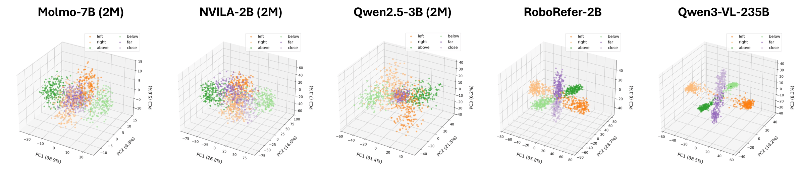

# WhyFarLooksUp — Research Note

## 📇 Academic Context

| Field | Value |
|-|-|
| Title | Why Far Looks Up: Probing Spatial Representation in Vision-Language Models |
| Venue | ECCV |
| Year | 2026 |
| Authors | Cheolhong Min, Jaeyun Jung, Daeun Lee, Hyeonseong Jeon, Yu Su, Jonathan Tremblay, Chan Hee Song, Jaesik Park |
| Official Code | https://github.com/cheolhong0916/contrastive-probing |
| Venue Kind | paper |

## First Principles

視覺語言模型 (VLMs) 在許多空間推理的基準測試中表現優異，但這究竟是源自於真實的 3D 空間理解，還是依賴自然影像中的統計捷徑 (statistical shortcuts)？本論文指出一個名為**垂直距離糾纏 (vertical-distance entanglement)** 的現象：模型會將影像平面上的垂直位置與 3D 深度混淆，亦即預設「在畫面中位置較高的物體，距離相機較遠」，這反映了自然攝影中的透視投影偏差。

為了驗證此現象，作者將測試樣本分為兩類：
1. **一致樣本 (Consistent)**：較遠的物體在畫面中的高度較高，符合透視捷徑。
2. **反直覺樣本 (Counter)**：較遠的物體在畫面中的高度較低，違反捷徑。

在真實世界影像的基準測試 (例如 EmbSpatial-Bench) 中，所有測試的模型在一致樣本上的準確率皆大幅高於反直覺樣本。例如，經過 2M 樣本微調的 Qwen2.5-VL-3B 模型，在 EmbSpatial-Bench 的一致樣本準確率為 60.9%，但在反直覺樣本上僅有 24.0%，兩者差距達 36.9%。

### 隔離空間偏差：SpatialTunnel

為了排除真實影像中其他深度線索的干擾，論文提出了一個合成資料集 SpatialTunnel (Synthetic benchmark for spatial bias)。在該場景中，兩個物體的深度保持固定，僅在隧道截面上進行角度旋轉，從而將垂直位置與深度完全脫鉤。

即使在此受控環境下，VLMs 依然表現出嚴重的偏差。以 Qwen2.5-VL-3B (Base) 為例，其在 `SpatialTunnel` 的一致樣本準確率為 0.776，而反直覺樣本僅為 0.360，說明模型內部強烈依賴垂直位置作為深度的判斷依據。

### 對比探測 (Contrastive Probing)

論文進一步透過「對比探測」框架來分析模型內部的空間表徵。給定一個空間關係的問題，透過交換物體的順序 (例如將「A 在 B 的左邊嗎？」改為「B 在 A 的左邊嗎？」) 來反轉真實關係。接著提取模型在中間層最後一個 token 的隱藏狀態 $h_q \in \mathbb{R}^d$，並計算其差異向量 $\delta = h_{q_2} - h_{q_1}$。

透過這些差異向量，可以計算**軸向連貫性 (Axis coherence)**，用以衡量模型是否在表徵空間中編碼了穩定的方向 (stable direction)：
$$ \mathrm{Coh}_{\mathrm{axis}} = \frac{2}{N(N-1)} \sum_{i < j} \cos(\tilde{\delta}^{(i)},\; \tilde{\delta}^{(j)}) $$

同時，定義了 **VD-Entanglement Index (VD-EI)** 來量化垂直表徵與深度表徵之間的糾纏程度：
$$ \mathrm{VD\text{-}EI} = \tfrac{1}{4} \bigl[ \cos(\mu_{\text{above}}, \mu_{\text{far}}) + \cos(\mu_{\text{below}}, \mu_{\text{close}}) - \cos(\mu_{\text{above}}, \mu_{\text{close}}) - \cos(\mu_{\text{below}}, \mu_{\text{far}}) \bigr] $$
若數值 (positive value) 為正，代表垂直與距離方向在表徵空間 (representation space) 中耦合 (coupled)。

論文推論 (This suggests that as models form)，當模型透過擴展空間訓練資料而形成更具連貫性的距離表徵時，對垂直位置捷徑的穩健性也會隨之提升。相反地，若距離連貫性停滯，即便持續增加訓練資料量，也無法解決空間表徵的糾纏問題。

上圖的 PCA 視覺化顯示，具備強大空間推理能力的模型 (如 RoboRefer 與 Qwen3) 能夠展現出三個清晰分離的叢集 (clusters)，且各自對齊於不同的主成分 (principal components)。表現較差的模型則無法呈現如此清晰的幾何結構。

### 實例演練：對比探測計算

為具體理解對比探測如何運作，我們可以追蹤 Molmo 模型的真實探測數據。給定兩張包含相同物體的影像與反轉的空間關係問題 ($q_1$ 與 $q_2$)：
模型計算差異向量 $\delta = h_{q_2} - h_{q_1}$ 後，求取平均餘弦相似度 (Cosine similarity)。在微調過程中，模型的垂直連貫性顯著提升 (如 Molmo: $0.23 \to 0.57$; Qwen: $0.29 \to 0.59$)，但距離連貫性 $\mathrm{Coh}_{\mathrm{D}}$ 的增長幅度相對較小。這直接反映在行為層面的失敗：其 EmbSpatial-Bench 的一致樣本準確率達 65.3%，但反直覺樣本 (Counter) 僅有 39.5%。這展示了表徵糾纏如何預測模型的捷徑依賴 (Shortcut dependency)。

## 🧪 Critical Assessment

### 捷徑依賴的災難性風險
該論文提出的問題極具現實意義。對於需要與物理環境互動的具身智能 (Embodied AI) 與機器人而言，若視覺語言模型僅依賴 2D 透視捷徑而非真正的 3D 幾何理解，將在視角改變或非典型場景中產生嚴重的災難性失敗。揭露「高準確率背後的捷徑依賴」對於該領域的評測標準有重要貢獻。

### 隔離干擾：合成環境的控制力
實驗設計相當嚴謹。SpatialTunnel 有效地移除了自然影像中的多重共線性 (multicollinearity)，將垂直位置與深度 (depth) 隔離。此外，論文並非僅測試單一模型 (model)，而是涵蓋了多個模型家族與微調規模 (scale)，其關於「資料規模與表徵連貫性」的結論具有合理的實證基礎。

### 深入表徵層的診斷工具
本研究並非單純的基準測試包裝，其核心創新在於將行為層面的失敗 (Behavioral gap) 連結至內部表徵空間的幾何結構。透過 VD-EI 與對比探測 (Contrastive Probing)，論文提供了一個不依賴特定任務格式的內部診斷工具，這比單純提出新資料集更具深度。

### 探測方法的限制與未解之謎
儘管對比探測提供了一個優雅的診斷工具 (diagnostic tool)，但其依賴合成場景的結論是否能完全泛化至複雜的自然真實環境仍有待商榷。SpatialTunnel 雖然控制了變因，但也過度簡化了模型在真實世界中依賴的豐富深度線索（如遮擋、相對大小等）。這意味著我們觀察到的「表徵糾纏」，或許部分是模型應對自然影像分佈的合理特徵壓縮 (feature compression)，而非單純的缺陷。這部分的泛化邊界尚未被充分驗證。

### 未來的解方與監控訊號
論文的定位是「診斷與探測」而非提出一個通用架構解法 (architecture solution)。然而，作者指出兩條可能解決此問題的途徑：一是提供顯式的 3D 深度監督 (如 RoboRefer)，二是極大規模的預訓練 (如 Qwen3-VL-235B)。雖然論文並未發明新的模型架構來消除糾纏，但其提出的指標 ($\mathrm{Coh}_{\mathrm{D}}$) 可作為未來模型訓練時監控空間理解能力的實用訊號。

## 🔗 Related notes

