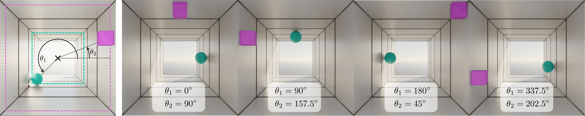
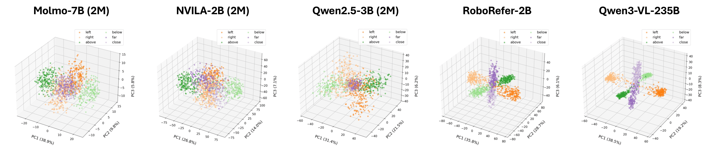

# Why Far Looks Up: Probing Spatial Representation in Vision-Language Models — 研究筆記

## 📇 Academic Context

| Field | Value |
|---|---|
| Title | Why Far Looks Up: Probing Spatial Representation in Vision-Language Models |
| Venue | ECCV |
| Year | 2026 |
| Authors | Cheolhong Min, Jaeyun Jung, Daeun Lee, Hyeonseong Jeon, Yu Su, Jonathan Tremblay, Chan Hee Song, Jaesik Park |
| Official Code | https://github.com/cheolhong0916/contrastive-probing |
| Venue Kind | paper |

## 空間表徵探測與幾何糾纏分析 (Spatial Representation Probing and Geometric Entanglement Analysis)


在單目圖像 (monocular images) 的 3D 空間推理 (spatial reasoning) 中，視覺語言模型 (VLMs) 常常依賴透視投影所帶來的統計捷徑，即「圖像中位置較高的物體通常在 3D 空間中更遠」。本研究將此現象定義為**垂直-距離糾纏** (vertical-distance entanglement)，即模型在表徵空間中將垂直高度 (above / below) 與深度距離 (far / close) 的編碼方向相耦合。為了定量評估此偏差，研究者將評估數據分為與透視啟發式一致的 consistent 樣本與違反該啟發式的 counter-heuristic 樣本。在真實基準測試 EmbSpatial-Bench 和 CV-Bench-3D 上，所有模型在 consistent 樣本上的準確率均顯著優於 counter 樣本，顯示出普遍的捷徑依賴。


為了探測模型內部的空間幾何結構，研究者提出了**對比探測** (contrastive probing) 框架。該框架透過交換空間關係問題中的主賓語順序 (例如將 `Is A to the left of B?` 與 `Is B to the left of A?` 進行 swap)，構建最小對比對 (minimal contrastive pairs) 並執行兩次前向傳播。接著，提取特定中間層 $L^*$ 上最後一個 token 的隱狀態 (hidden state) $h_q$，並計算其差值向量——**差值向量** (delta vector) $\delta = h_{q_2} - h_{q_1}$。透過在多個樣本上聚合並校正這些差值向量，可以量化各個空間軸（水平、垂直、距離）的**軸相干性** (axis coherence)，以及垂直和距離軸之間的幾何糾纏程度。其垂直-距離糾纏指數 (VD-Entanglement Index, VD-EI) 透過計算不同空間關係類別 mean delta vector 之間的餘弦相似度 (cosine similarity) 來量化這一幾何耦合度。


$$
\mathrm{VD\text{-}EI} = \frac{1}{4} \left[ \cos(\mu_{\text{above}}, \mu_{\text{far}}) + \cos(\mu_{\text{below}}, \mu_{\text{close}}) - \cos(\mu_{\text{above}}, \mu_{\text{close}}) - \cos(\mu_{\text{below}}, \mu_{\text{far}}) \right]
$$

然而，真實照片中混雜了多種深度線索（如遮擋、視角、尺寸等），難以分離單一特徵的影響。為此，論文設計了 **SpatialTunnel** 合成基準測試。該場景基於 Blender 渲染，構建了一個透視對稱的隧道走廊。研究者在固定物體 3D 深度的情況下，沿著橫截面掃描物體角度位置 ($\theta_1, \theta_2$)，從而使 2D 圖像面上的位置變化與 3D 深度完全解耦。在這一沒有方向性高度偏置的平衡測試集上，模型在 consistent 區域與 counter 區域的準確率熱圖 (heatmap) 依然呈現出劇烈的對比，證實了垂直-距離糾纏是模型內在的表徵偏置，而非評估數據集偏斜的產物。下表總結了 NVILA-Lite-2B 隨數據規模微調 (SFT data scaling) 的表徵演變軌跡，並與顯式深度監督訓練的 RoboRefer-2B-SFT 進行對比：



| 模型 (Model) | 數據規模 (Data Scale) | 距離軸相干性 ($\mathrm{Coh}_{\mathrm{D}}$) | 垂直-距離糾纏指數 ($\mathrm{VD\text{-}EI}$) |
|---|---|---|---|
| NVILA-Lite-2B | vanilla | 0.052 | 0.539 |
| NVILA-Lite-2B | 2M | 0.104 | 0.550 |
| RoboRefer-2B-SFT | 20M+ | 0.182 | 0.362 |

對比 NVILA-Lite-2B 微調系列與 RoboRefer-2B-SFT 的 PCA 表徵結果，NVILA 在 2M 規模下距離軸 (distance axis) 仍與垂直軸重疊，而 RoboRefer 藉由 RGB-D 深度監督，實現了高 CohD 0.182 與低 VD-EI 0.362 的解耦結構。對比探測中計算糾纏指數的核心 Python 邏輯如下，此實現已被整合至 [probing.py](./probing.py) 中：

```python
if 'vertical' in means and 'distance' in means:
    v, d = means['vertical'], means['distance']
    denom = (np.linalg.norm(v) * np.linalg.norm(d) + 1e-12)
    out[layer] = float(np.dot(v, d) / denom)
```




## 具體數值推導與工作實例 (Concrete Numerical Derivation and Worked Example)

為了更具體地展示對比探測 (contrastive probing) 的計算過程，我們以 Qwen2.5-VL-3B-Instruct 模型（共 36 層）在分析層 $L^* = 28$ 上的實際運算為例。當模型輸入原問題 $q_1$ 「Is the cup to the left of the book?」時，我們提取最後一個 token 的隱狀態 $h_{q_1} \in \mathbb{R}^{3072}$。接著，我們交換物體順序得到對照組問題 $q_2$ 「Is the book to the left of the cup?」，並提取其對應隱狀態 $h_{q_2} \in \mathbb{R}^{3072}$。透過計算兩者差值，我們得到該樣本的差值向量 $\delta = h_{q_2} - h_{q_1}$，從而有效地過濾了圖像背景與無關特徵。

在聚合多個樣本後，我們可以進行軸相干性 (axis coherence) 與幾何糾纏的計算。根據論文附錄中 Qwen2.5-VL-3B-Instruct (2M 樣本微調版本) 在 $L^* = 28$ 層的真實跨類別相似度熱圖 (Figure 13)，`above` 和 `far` 兩大類別平均差值向量的餘弦相似度為 $\cos(\mu_{\text{above}}, \mu_{\text{far}}) = 0.4975$，`below` 和 `close` 的餘弦相似度為 $\cos(\mu_{\text{below}}, \mu_{\text{close}}) = 0.4390$；而交叉對立項的相似度分別為 $\cos(\mu_{\text{above}}, \mu_{\text{close}}) = -0.4299$ 和 $\cos(\mu_{\text{below}}, \mu_{\text{far}}) = -0.4954$。將這些真實數據代入 VD-EI 公式可得：

$$
\mathrm{VD\text{-}EI} = \frac{1}{4} \left[ 0.4975 + 0.4390 - (-0.4299) - (-0.4954) \right] = \frac{1}{4} \left[ 1.8618 \right] = 0.46545
$$

計算得出的垂直-距離糾纏指數 $\mathrm{VD\text{-}EI} \approx 0.465$（論文 Table 3 中四捨五入報告為 0.472），這表明模型在該層的垂直編碼與距離編碼存在強烈的幾何耦合。

## 🧪 Critical Assessment

### 單目圖像中的透視投影先驗與垂直-距離糾纏 (Perspective Projection Prior and Vertical-Distance Entanglement in Monocular Images)

單目圖像 (monocular images) 由於缺乏直接的 3D 深度測量，其 3D 推理實質上是一個高度病態的反問題 (ill-posed inverse problem)，模型必須依賴透視啟發式 (perspective heuristics) 等先驗統計規律。論文指出的 vertical-distance entanglement 揭示了 VLM 目前並非基於場景的 3D 幾何結構進行推理，而是依賴「越靠近圖像中央/高度越高則越遠」這一 2D 統計捷徑。這種幾何缺陷表明，當前 VLM 對物理三維空間的感知是不健全的，難以應對相機外參變化或場景結構漂移。

### 多模態指令微調規模擴展與 EmbSpatial-Bench 評估的侷限性 (Limitations of Instruction Tuning Scale-up and EmbSpatial-Bench Evaluation)

研究結果表明，僅僅擴大現有空間指令微調數據的規模 (spatial SFT data scaling up to 2M) 並不能真正解耦垂直與距離軸的表徵。例如，NVILA-Lite-2B 在 2M 數據微調後，儘管基準測試評分提升，但其 CohD 依然在 0.104 的低位掙扎，且 VD-EI 高達 0.550。這意味著現有的多模態指令微調在沒有顯式深度幾何監督的情況下，極易流於「首選多數類別統計」的捷徑依賴。同時，主流的 3D 空間推理評估基準中 consistent 樣本佔比過高（如 EmbSpatial-Bench 中 consistent 佔比達 80.9%），這在客觀上縱容並掩蓋了模型這一缺陷。

### 差值向量探測的診斷屬性與主動解耦訓練的缺失 (Diagnostic Attributes of Delta Vector Probing and the Lack of Active Decoupling Training)

在探測方法論上，本研究採用的對比探測 (contrastive probing) 本質上是語言模型表徵分析技術在視覺語言領域的重新組合。雖然差值向量 $\delta = h_{q_2} - h_{q_1}$ 能夠在一定程度上抵消問題範本等無關混淆因素，但這種靜態表徵分析本質上仍是一種診斷性工具 (diagnostic tool)。如何將這種診斷指標轉化為訓練過程中的主動正則化（例如將解耦損失顯式地加入訓練目標中），依然是本研究未能解決的核心挑戰。

### 具身智能物理操縱中的相機視角偏置與幾何脆性 (Camera Viewpoint Bias and Geometric Fragility in Embodied Robotic Manipulation)

為了讓 VLM 在機器人操縱 (robotic manipulation) 或自動駕駛 (autonomous driving) 等真實世界物理場景中實現高可靠性落地，空間軸的解耦是極為關鍵的。當前模型若僅依賴 2D 捷徑，在面對反啟發式或相機視角偏置的真實分佈偏移時，將表現出極高的脆性。因此，研發具體深度感知能力或具備內置三維幾何歸納偏置的視覺編碼器，是未來邁向可信物理交互的必經之路。

### SpatialTunnel 合成場景的理想化歸納偏置 (Idealized Inductive Biases in the SpatialTunnel Synthetic Environment)

論文所引入的 SpatialTunnel 合成基準測試，雖然在控制變因上表現優異，但其本質上是為驗證作者提出的「垂直-距離糾纏」假說而量身定制的封閉測試集。在這一極度簡化且對稱的 Blender 隧道走廊中，物體形狀、光影與背景均被高度人工化與理想化。模型在此類人工環境下的低準確率熱圖，未必能完全等同於其在真實世界複雜 3D 場景中的失效模式。作者圍繞自身的研究假說構建特定測試場景，容易忽略模型在現實中可能依賴的其他語意線索，這在一定程度上限制了該基準對通用空間理解能力的代表性。

## 🔗 Related notes

