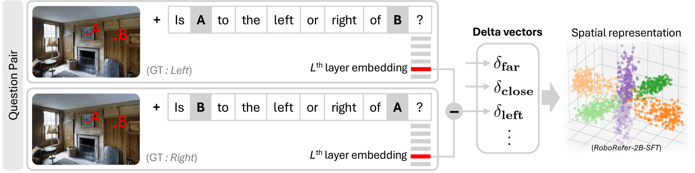

# WhyFarLooksUp — Research Note

## 📇 Academic Context

| Field | Value |
|-|-|
| Title | Why Far Looks Up: Probing Spatial Representation in Vision-Language Models |
| Venue | ECCV |
| Year | 2026 |
| Authors | Cheolhong Min, Jaeyun Jung, Daeun Lee, Hyeonseong Jeon, Yu Su, Jonathan Tremblay, Chan Hee Song, Jaesik Park |
| Official Code | https://github.com/cheolhong0916/contrastive-probing |
| Venue Kind | paper |

## 透視捷徑如何混進距離判斷

這篇論文處理的不是「VLM 會不會答對空間題」這種表層問題，而是追問模型答對時是否真的分開了三個空間軸：horizontal、vertical、distance。作者把核心失敗模式稱為 vertical-distance entanglement：在自然影像中，地面上的遠物常靠近地平線、在畫面中更高，因此模型可能把 above 當成 far、把 below 當成 close 的替代訊號。這個設定重要，因為同樣的 benchmark accuracy 可能來自幾何理解，也可能來自畫面統計捷徑。

作者先把 depth-related examples 分成 consistent、counter、ambiguous。若較遠物體的 vertical center 有較小的 $y$ coordinate，也就是在畫面更上方，樣本就是 consistent；反之則是 counter。這個分類直接檢查模型是否依賴「higher in image $\Rightarrow$ farther」：沒有這種偏向時，consistent 與 counter 的 accuracy 應該接近；若兩者差距穩定存在，就表示模型至少部分使用了 vertical position shortcut。

為了避免真實照片裡 apparent size、occlusion、場景語意等深度線索混在一起，作者設計 SpatialTunnel。它是在 Blender 裡建立的 single-point-perspective corridor，兩個物體可以固定在預定深度 $z$，再沿 tunnel cross-section 的 angular position $\theta$ 移動；因此物體可以在影像中上下左右改變，但 depth ordering 不變。主設定把內部離散成 16 個 angular positions，形成 $16 \times 16$ 的 joint configuration grid，用來看同一深度關係在不同 2D placement 下的模型反應。

在 SpatialTunnel 的二元深度問題中，作者不只看 hard answer，而是抽取第一個 generated token 的 `Yes` 與 `No` logits，定義：

$$
p=\sigma\!\bigl(\ell_{\texttt{Yes}}-\ell_{\texttt{No}}\bigr)
$$

若 ground truth 是 `Yes`，single-query correctness score 是 $v=p$；若 ground truth 是 `No`，則是 $v=1-p$。舉例來說，若某個問題的 $\ell_{\texttt{Yes}}-\ell_{\texttt{No}}=1.386$，則 $p \approx 0.800$；當答案為 `Yes` 時這題給 $v\approx0.800$，當答案為 `No` 時同一組 logits 只給 $v\approx0.200$。論文接著平均 $v$，並把 $v_\text{cons}-v_\text{ctr}$ 作為 entanglement gap：例如 Qwen2.5-VL-3B 在 SpatialTunnel base 設定有 $v_\text{cons}=0.776$、$v_\text{ctr}=0.360$、$\Delta=+0.416$，表示模型在符合透視捷徑的格子上明顯更有把握。

| 觀察點 | 論文中的數值 | 讀法 |
|-|-|-|
| EmbSpatial-Bench 分布 | Consistent 976 (80.9%), Counter 129 (10.7%) | 真實 benchmark 本身偏向符合透視捷徑的樣本。 |
| Qwen2.5-VL-3B + 2M on EmbSpatial | Consistent 60.9, Counter 24.0, gap 36.9 points | 增加 spatial fine-tuning data 後，counter split 仍大幅落後。 |
| SpatialTunnel Qwen2.5-VL-3B base | $v=0.570$, $v_\text{cons}=0.776$, $v_\text{ctr}=0.360$, $\Delta=+0.416$ | 在控制場景中仍出現方向性偏差。 |
| RoboRefer-2B-SFT on EmbSpatial | Consistent 87.0, Counter 59.7 | 較強模型仍有 gap，但 counter accuracy 明顯較高。 |
| RoboRefer-2B representation | $\mathrm{Coh_D}=0.182$, $\mathrm{VD\text{-}EI}=0.362$ | 在 NVILA-family 對照中，它的 distance coherence 最高、vertical-distance coupling 較低。 |

表示層分析的做法是 contrastive probing：對同一張圖構造兩個只交換 object order 的問題，例如 `A left/right of B` 與 `B left/right of A`。在固定中間層 $L^*$，取 final-token hidden state $h_q\in\mathbb{R}^d$，再用 $\delta=h_{q_2}-h_{q_1}$ 表示這次 swap 在 representation space 造成的 displacement。把 left/right、above/below、far/close 的 delta vectors 收集起來後，作者計算 axis coherence 與 VD-Entanglement Index；前者看同一軸的 sign-corrected deltas 是否朝穩定方向，後者看 above/far、below/close 是否在向量方向上被耦合。

結果的重點不是「某個模型分數最高」，而是 distance axis 普遍最不穩。表 5 顯示 Molmo-7B 的 $\mathrm{Coh_D}=0.075$ 低於 $\mathrm{Coh_H}=0.143$ 與 $\mathrm{Coh_V}=0.228$；NVILA-2B 的 $\mathrm{Coh_D}=0.052$ 也低於 horizontal/vertical；Qwen2.5-3B 的 $\mathrm{Coh_D}=0.043$ 更低。RoboRefer-2B 同時有較高 $\mathrm{Coh_H}=0.649$、$\mathrm{Coh_V}=0.830$、$\mathrm{Coh_D}=0.182$，所以論文把它當作「較乾淨空間軸」的參考，而不是把一般 fine-tuning scale 直接解釋成可靠 3D understanding。

## 🧪 Critical Assessment

### 透視捷徑是機器人視角的真問題

這篇論文抓到的問題是真實的：VLM 被部署到 robotics、embodied agents、multimodal assistants 時，relative depth 錯誤不是小瑕疵，而可能改變行動規劃或人機互動。論文也沒有只用單一 benchmark accuracy 下結論，而是把真實資料分布、控制合成場景、hidden-state geometry 串在一起；這讓「模型是否靠 2D 位置線索作答」成為可被檢查的假設。不過，vertical-distance entanglement 只是空間推理失敗的一種，不能代表全部 3D spatial understanding。

### Consistent/Counter 與 SpatialTunnel 的互補限制

證據最強的地方是 consistent/counter split 與 SpatialTunnel 互相補位：前者指出自然 benchmark 的 skew，後者把 vertical placement 與 depth ordering 解耦。可是 SpatialTunnel 仍是作者自建的 synthetic corridor，物體形狀、材質、lighting 與問題格式都比開放世界窄；它很適合診斷特定 shortcut，但不足以單獨證明模型在真實場景會如何失敗。$\mathrm{Coh_D}$ 與 counter accuracy 的相關性也有價值，但相關性不等於訓練介入的因果證明。

### Contrastive Probing 把舊工具對準三個空間軸

contrastive probing 本身是合理的機制設計：交換 object order 後，用 hidden-state delta 抵消共同視覺內容，這比直接看答案更接近 representation geometry。新意主要在於把這個 probing 框到 VLM spatial axes，並提出 VD-EI 來量化 vertical/distance coupling；它不是全新的表徵分析範式。論文的敘事若要更強，還需要更多對照來排除 layer choice、question template、object detector/grounding quality 對 delta vectors 的影響。

### 診斷訊號多於修復配方

論文比較像診斷工具與資料設計，而不是修復方法。它說明更多 spatial fine-tuning data 不一定帶來更好的 distance representation，並指出 RoboRefer 或 Qwen3 類模型有更乾淨的軸結構；但它沒有提供一個可保證降低 entanglement 的 training objective。實務上，這篇最有用的產物是讓研究者在訓練或評估 VLM 時加入 counter split、SpatialTunnel-like controls、以及 representation probes，而不是把 overall score 當成空間理解已完成的證據。

## 🔗 Related notes
