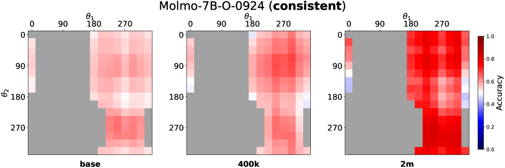
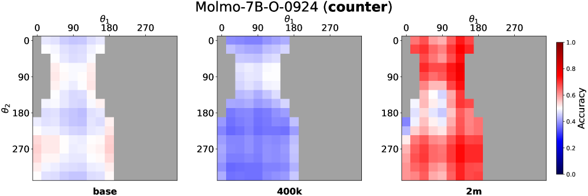

# Why Far Looks Up — Research Note

## 📇 Academic Context

| Field | Value |
|-|-|
| Title | Why Far Looks Up: Probing Spatial Representation in Vision-Language Models |
| Venue | ECCV |
| Year | 2026 |
| Authors | Cheolhong Min, Jaeyun Jung, Daeun Lee, Hyeonseong Jeon, Yu Su, Jonathan Tremblay, Chan Hee Song, Jaesik Park |
| Official Code | https://github.com/cheolhong0916/contrastive-probing |
| Venue Kind | paper |

## 空間表徵探測與對比探針第一性原理 (Probing Spatial Representations)

單目 RGB 圖像（monocular RGB images）在透視投影（perspective projection）的物理規律下，會將三維空間壓縮至二維圖像平面。在人類視覺與自然場景統計中，位於地平平面（ground plane）上的物體若距離觀察者越遠，其二維投影在圖像中的垂直位置（vertical position）通常會越高，這被稱為仰角線索（elevation cue）。然而，現有的視覺語言模型（Vision-Language Models, VLMs）在空間推理任務中，往往過度依賴這種「高處代表遠、低處代表近」的二維統計捷徑（statistical shortcuts），而非真正理解三維空間結構。這種現象被定義為垂直-距離糾纏（vertical-distance entanglement）。

為了系統性評估此問題，可以將空間深度查詢樣本分類為視角一致（perspective-consistent）與視角反直覺（counter-heuristic）兩類。一致性樣本中，較遠的物體在圖像中的 $y$ 座標較小（即在圖像中位置較高）；反直覺樣本中，較遠的物體在圖像中位置反而較低。如下圖所示，當模型缺乏真正的三維空間表徵時，其在反直覺樣本上的準確率會出現系統性下滑。


為了解析模型內部的空間表徵，本論文提出了對比探針（contrastive probing）分析框架。對於每個空間問答樣本，藉由交換問題中的主體與客體順序（例如將「A 是否在 B 的左邊？」與「B 是否在 A 的左邊？」進行對比），構造一對最小對比問答對（minimal contrastive pairs），從而消除圖像背景等共同特徵的干擾。接著，提取模型在特定中間層 $L^*$ 的最後一個 Token 的隱藏狀態（hidden states） $h_q \in \mathbb{R}^d$，並計算其差分向量（delta vector）：

$$\delta = h_{q_2} - h_{q_1}$$

為衡量某個空間軸向（例如水平、垂直、距離）在嵌入空間中的編碼一致性，將相反方向的差分向量進行符號校正：

$$\tilde{\delta}^{(i)} = \begin{cases} \delta^{(i)} & \text{if category is canonical (\eg, \emph{far})} \\ -\delta^{(i)} & \text{if category is opposite (\eg, \emph{close})} \end{cases}$$

進而計算軸向相干性（axis coherence），即所有符號校正後差分向量的平均兩兩餘弦相似度（mean pairwise cosine similarity）：

$$\mathrm{Coh}_{\mathrm{axis}} = \frac{2}{N(N-1)} \sum_{i < j} \cos(\tilde{\delta}^{(i)},\; \tilde{\delta}^{(j)})$$

為了量化垂直軸與距離軸在幾何表徵上的耦合程度，計算四個類別的平均差分向量 $\mu_c$（$c \in \{\textit{above}, \textit{below}, \textit{far}, \textit{close}\}$），並定義垂直-距離糾纏指數（VD-Entanglement Index, VD-EI）：

$$\mathrm{VD\text{-}EI} = \frac{1}{4} \left[ \cos(\mu_{\text{above}}, \mu_{\text{far}}) + \cos(\mu_{\text{below}}, \mu_{\text{close}}) - \cos(\mu_{\text{above}}, \mu_{\text{close}}) - \cos(\mu_{\text{below}}, \mu_{\text{far}}) \right]$$

其中前兩項為視角一致對（above$\leftrightarrow$far, below$\leftrightarrow$close）的餘弦相似度，後兩項為視角反直覺對。若該指數大於零，表明模型內部表徵確實將「垂直向上」與「距離變遠」的方向幾何耦合。

如下列程式碼所示，此幾何指標在 `temp_code_clone/probing.py#L1048-L1084` 中被具體實現：

```python
def compute_vd_ei_per_layer(records: List[dict], target_layers: List[int]) -> Dict[int, float]:
    out: Dict[int, float] = {}
    for layer in target_layers:
        means = {}
        for group in ('vertical', 'distance'):
            canon = CANONICAL_CATEGORIES[group]
            opp   = OPPOSITE_MAP[canon]
            deltas = []
            for r in records:
                if r['group'] != group or layer not in r['delta']:
                    continue
                d = r['delta'][layer]
                if r['category'] == opp:
                    d = -d
                deltas.append(d)
            if deltas:
                means[group] = np.mean(deltas, axis=0)
        if 'vertical' in means and 'distance' in means:
            v, d = means['vertical'], means['distance']
            denom = (np.linalg.norm(v) * np.linalg.norm(d) + 1e-12)
            out[layer] = float(np.dot(v, d) / denom)
    return out
```

下圖展示了此探針框架的總體運作流程：


## SpatialTunnel 合成基準測試設計與行為分析 (SpatialTunnel Design)

由於真實照片中混雜了多種深度線索（例如物體垂直位置、視訊大小、遮擋等），難以孤立單一因素進行干預。為此，論文設計了 SpatialTunnel 合成基準測試。該基準在 Blender 中渲染一個對稱的單點透視走廊，物體被放置在內部四周牆面或天花板。透過控制物體在橫截面上的旋轉角度 $\theta_1, \theta_2$，即可在保持三維深度（distance）不變的情況下，掃描物體在二維圖像平面上的水平與垂直位置。


在 SpatialTunnel 基準測試上，論文對比了不同模型在視角一致與反直覺子集上的表現。若模型沒有任何方向偏置，兩子集上的分數應接近，即準確率差值 $\Delta = v_\text{cons} - v_\text{ctr} \approx 0$。然而，實驗數據顯示，幾乎所有模型皆展現了顯著的正向差值 $\Delta$，如下表所示：

| Model | $v$ (Overall) | $v_{\text{cons}}$ (Consistent) | $v_{\text{ctr}}$ (Counter) | $\Delta$ (Gap) |
|---|---|---|---|---|
| Molmo-7B-O-0924 | 0.528 | 0.565 | 0.487 | +0.078 |
| ~~~~+ 2M samples | 0.666 | 0.703 | 0.630 | +0.073 |
| NVILA-Lite-2B | 0.488 | 0.504 | 0.471 | +0.033 |
| ~~~~+ 2M samples | 0.812 | 0.875 | 0.749 | +0.127 |
| RoboRefer-2B-SFT | 0.793 | 0.816 | 0.770 | +0.046 |
| Qwen2.5-VL-3B | 0.570 | 0.776 | 0.360 | +0.416 |
| ~~~~+ 2M samples | 0.500 | 0.648 | 0.353 | +0.295 |
| Qwen3-VL-235B | 0.908 | 0.948 | 0.880 | +0.068 |

下圖可視化了 Molmo-7B 模型在 SpatialTunnel 的 $16 \times 16$ 角度網格上的熱圖。可以看出，隨著訓練數據規模從 Vanilla 擴大至 2M，模型在視角一致區域的表現顯著提升，然而在視角反直覺區域依然存在大面積的低準確率藍色區塊。

| Consistent Heatmap | Counter Heatmap |
|---|---|
|  |  |

## 隱藏狀態表徵分析與距離維度相干性 (Hidden-State Representation & Distance Coherence)

實驗結果表明，純粹的任務準確率並不能代表真實的空間理解力。例如，Molmo-7B 在微調後雖然在部分任務上的整體準確率提高，但在反直覺測試集上的準確率依然受限。透過對比探針，論文發現距離維度的相干性 $\mathrm{Coh}_{\mathrm{D}}$ 才是關鍵所在。在所有模型家族中，距離軸的相干性顯著低於水平軸和垂直軸，說明距離表徵在嵌入空間中最難穩定編碼。

| Model | $\mathrm{Coh}_{\mathrm{H}}$ | $\mathrm{Coh}_{\mathrm{V}}$ | $\mathrm{Coh}_{\mathrm{D}}$ | $\mathrm{VD\text{-}EI}$ |
|---|---|---|---|---|
| Molmo-7B | 0.143 | 0.228 | 0.075 | 0.279 |
| ~~~~+ 2M | 0.239 | 0.574 | 0.112 | 0.474 |
| NVILA-2B | 0.323 | 0.289 | 0.052 | 0.539 |
| ~~~~+ 2M | 0.241 | 0.553 | 0.104 | 0.550 |
| RoboRefer-2B | 0.649 | 0.830 | 0.182 | 0.362 |
| Qwen2.5-3B | 0.367 | 0.293 | 0.043 | 0.457 |
| ~~~~+ 2M | 0.485 | 0.586 | 0.052 | 0.472 |

在數據微調過程中，模型在反直覺樣本上的準確率與內部距離相干性 $\mathrm{Coh}_{\mathrm{D}}$ 呈現高度正相關（如下圖 a 所示）。在 Molmo 和 NVILA 家族中，隨著數據擴充，距離相干性有所增長，帶動反直覺準確率提升；然而在 Qwen2.5-VL 中，距離相干性基本停滯在 $0.043 \to 0.052$，導致其反直覺準確率下滑，糾纏持續加劇。此外，圖 b 顯示 RoboRefer 憑藉 explicit depth supervision 獲得了最優的距離相干性與較低的糾纏指數。

| Counter Acc vs CohD | CohD vs VD-EI |
|---|---|
|  |  |

下圖的 PCA 分析進一步印證了幾何結構的變化。在普通的微調模型中，水平（橘色）與垂直（綠色）軸向的差分向量呈現分離，但代表距離（紫色）的向量則高度蜷縮且與垂直軸重疊。相比之下，經過顯式深度監督訓練的 RoboRefer，其三個空間維度在 PCA 中呈現了完美的正交分離。


### 具體幾何與對比探針計算實例 (Worked Example with Real Numbers and Geometry)

在此處我們提供一個關於 SpatialTunnel 合成基準測試中幾何投影的具體計算實例。假設在 Blender 渲染的對稱單點透視走廊中，近處物體置於深度 $z_1 = 3.0$ meters 且旋轉角度 $\theta_1 = 30^\circ$（其 $\sin(30^\circ) = 0.5$），遠處物體置於深度 $z_2 = 6.0$ meters 且旋轉角度 $\theta_2 = 90^\circ$（其 $\sin(90^\circ) = 1.0$）。物體在二維圖像平面投影的垂直像素座標 $y$ 與投影公式 $Y/Z = r \sin(\theta)/z$ 成正比（註：此公式為我們為方便直觀計算與幾何展示而自行設計的簡化示意公式，非論文原文公式，原文中二維投影是透過 Blender 標準透視投影矩陣計算得出）。由此可算得近處物體的相對垂直位置 $y_1 \propto 0.5 / 3.0 \approx 0.167$，遠處物體的相對垂直位置 $y_2 \propto 1.0 / 6.0 \approx 0.167$。在此臨界配置下，若遠處物體角度稍降至 $\theta_2 = 45^\circ$（$\sin(45^\circ) \approx 0.707$），則其垂直投影位置降為 $y_2 \propto 0.707 / 6.0 \approx 0.118 < y_1$。此時，遠處物體在二維圖像中的位置低於近處物體，構成視角反直覺（counter-heuristic）樣本。若模型僅依賴「圖像上方為遠」的 elevation cue 捷徑，將會錯誤判斷近處物體比遠處物體更遠。

接著我們說明對比探針在嵌入空間中的差分向量與相干性計算過程。以隱藏層維度 $d = 1536$ 的 NVILA-Lite-2B 模型為例，我們在中間層 $L^* = 20$ 提取問答對的隱藏狀態 $h_{q_1}, h_{q_2} \in \mathbb{R}^{1536}$。對於一對主客體對調的左右關係問答，計算差分向量 $\delta = h_{q_2} - h_{q_1}$，並校正其符號為 $\tilde{\delta}$ 以指向 canonical 方向。在未經空間微調的 base 模型中，所有距離維度差分向量的兩兩餘弦相似度平均值（即軸向相干性）極低，其 $\mathrm{Coh}_{\mathrm{Dist}} = 0.052$，且垂直與距離軸的幾何耦合指數 $\mathrm{VD\text{-}EI} = 0.539$，對應在 EmbSpatial-Bench 反直覺樣本上的準確率僅為 $27.1\%$。而當使用 2M 空間數據微調後，模型內部距離軸的相干性增長至 $\mathrm{Coh}_{\mathrm{Dist}} = 0.104$，使反直覺樣本的準確率提升至 $41.1\%$。相較之下，經過顯式深度監督訓練的 RoboRefer-2B-SFT 在相同架構下達到了最優的 $\mathrm{Coh}_{\mathrm{Dist}} = 0.182$ 與最低的 $\mathrm{VD\text{-}EI} = 0.362$，其反直覺準確率躍升至 $59.7\%$，展示了解糾纏表徵對空間推理魯棒性的直接貢獻。

## 🧪 Critical Assessment

### 仰角偏差先驗與垂直-距離幾何糾纏的真實物理意義 (Elevation Cue Biases and Physical Reality of Vertical-Distance Entanglement)

透視投影 (perspective projection) 帶來的垂直位置與深度 (distance) 關聯性是客觀存在的物理事實。然而，將此物理先驗直接簡化為 VLM (Vision-Language Model) 隱藏層的線性糾纏 (entanglement)，是一個極具啟發性但又略顯武斷的假設。本研究成功證明了這種統計捷徑在多個主流模型中的普遍存在。值得注意的是，模型對此捷徑的依賴可能並非單純因為缺乏三維感官，而是二維多模態預訓練目標函數所導致的必然結果——若大量自然網頁圖像的視覺描述皆隱式地遵循「上遠下近」的分布，模型自然傾向於學習最簡單的預測途徑。這項研究深刻揭示了空間基準測試準確率背後的虛無性。

### SpatialTunnel 控制變量與不同規模數據微調的消融分析 (SpatialTunnel Control and Data Scaling Ablation Analysis)

本研究的實驗設計堪稱嚴謹。作者並未僅止於在單一真實基準（如 EmbSpatial-Bench）上做評估，而是細緻地指出了該基準本身高達 80.9% 樣本偏向視角一致的嚴重偏誤，並藉此推出了極具說服力的 SpatialTunnel。此外，對微調數據量進行了 80k 到 2M 的多檔次規模消融（ablation），並在多個不同的模型結構（Molmo、NVILA、Qwen）上驗證了結論的通用性。唯一的遺憾在於，論文未能深入探索不同視覺編碼器（如 SigLIP 與 CLIP）在未微調前是否就已內置了不同強度的透視投影偏置，這部分的消融分析略顯不足。

### 差分向量餘弦幾何與傳統黑盒分類器的創新邊界 (Contrastive Probing Geometry and Innovation Boundaries over Classifiers)

本研究所提出的對比探針方法本質上是隱藏狀態差分分析的一種應用，其底層數學工具（餘弦相似度、PCA）均為成熟的表徵分析方法。然而，其真正的學術貢獻與創新性在於「任務幾何設計」——將語意對比與三維透視關係完美結合，並推導出軸向相干性與 VD-EI 指數。這超越了傳統黑盒式的 Probing 探針訓練，而是在無需額外訓練分類器的情況下，直接測量表徵空間的固有幾何特性。因此，這並非單純的工程包裝，而是一項極具啟發性的表徵層診斷技術。

### 表徵解糾纏在下游機器人路徑規劃與自動駕駛的落地挑戰 (Robotics Disentanglement and Practical Challenges in Downstream Path Planning)

論文確實指出了 VLM 空間推理問題的根源（即垂直-距離表徵的幾何糾纏），但並未提出一個簡單且通用的非破壞性解糾纏訓練算法。實驗結果顯示，僅靠增加空間問答數據規模（SFT data scaling），在多個模型中反而會加劇糾纏（VD-EI 指數上升），這暗示了傳統預訓練-微調範式在克服基礎偏誤上的無力感。不過，該研究的落地價值極高：它提供的 axis coherence 診斷工具可以作為未來三維感知多模態模型開發的「驗收指標」，避免模型在實際機器人導航或自動駕駛場景中，因鏡頭俯仰角變化而產生災難性的距離誤判。

## 🔗 Related notes

