# 六小時多角色參考圖實驗：Codex／Qwen Edit／H3

資料更新：2026-09-13T21:31:19.903713+00:00。**持續實驗中，非最終結論。**

## 目前觀察（非最終結論）

這是特定量化模型、參考素材與前處理工作流的比較，不是模型排行榜。以下只統計已成功成像且已評估的原生流程；執行失敗、不支援與未執行仍保留在完整分母表。

| 已評估條件 | Codex | Qwen | H3 |
|---|---:|---:|---:|
| 單人：恰好一人的明確符合數 | 9/9 | 0/10 | 1/10 |
| 三人：角色對應的明確符合數 | 12/12 | 2/8 | 10/10 |
| 三人：全部動作要求的明確符合數 | 3/12 | 0/8 | 2/10 |

- 人數與角色大致可辨，不代表細節、指定左右手或旁觀者動作正確；手部解剖正常也可能配錯角色。逐圖註記保留這些差異。
- 單人重複成多人是目前Qwen／H3原生流程反覆出現的失敗；不能據此斷言模型無法生成單人。原始提示詞含泛用複數表述，且Qwen第一張圖經中心裁切，皆是待分離的混雜因素。
- 一筆Qwen完整第一張參考圖的對照改善了人物細節，但只有單一案例，尚不能證明普遍改善或公平速度優勢。
- Qwen現有adapter最多3張獨立參考圖；4–5張標為不支援，沒有暗中減少圖片或改成拼貼。Codex沒有可控制seed，不能把兩張圖的差異當成嚴格同噪聲因果實驗。

[跳至分組評分](#分組評分明確符合數已評估數) · [跳至完整圖片對照](#圖片對照包含失败成像不做優勝挑選) · [耗時與硬體](#耗時與硬體紀錄)

## 問題與方法

比較同一組參考角色在 1–5 人、不同互動動作下的外觀保留、數量、對應與手部表現。六小時窗口：台灣時間 2026-09-13 23:41:32 至 2026-09-14 05:41:32；到期後不新增提交，已提交任務完成、檢查與清理另計。

兩類角色 × 五種人數 × 三類動作 × 兩次重複，預先登記 60 個場景；完整窮舉所有角色子集／排列將遠超時窗，因此先做分層覆盖，再依剩餘時間增加單變因對照。未執行、流程不支援、執行失敗與未人工檢查皆分開列出。

三類動作：各自揮手；共同看同一本綠色書（單人為自己看書）；兩兩擊掌（單人為雙手持藍色杯）。比較靜態完成姿勢，並非完整動作序列。H3 要求首幀即持有該姿勢並保持 5 幀；固定眼平構圖。

| 模型 | 實驗配置 | 限制 |
|---|---|---|
| Codex 內建生圖 | 同一語意 prompt + 3:2 構圖要求 | 工具未提供可核實 seed、steps、CFG、GPU 與底層模型版本；實際尺寸逐張記錄 |
| Qwen Image Edit 2511 FP8 mixed | 768×512、40 steps、CFG4、Euler/simple、denoise1、shift3.1、CFGNorm1、batch1 | 現有 adapter／TextEncodeQwenImageEditPlus 接受至多3張獨立參考圖；4–5張原生條件不支援，不代表模型架構永遠不可能 |
| H3 Ref2VA INT8 ConvRot | 768×512、20 steps、Euler/linear_quadratic、5幀、24fps、batch1、無Turbo LoRA | 專用六欄 prompt；5幀低於常規片長，視為取圖實驗。保留全部5幀及MP4，主比較固定第1幀，不挑最佳幀 |

本地模型使用 RTX 5090，共享 ComfyUI 的 vision-flow 裝置策略；H3 low-VRAM／reserve6GiB，Qwen 使用既有 image 策略。工作流快照含實際編碼器裝置選項與硬體資訊。不重啟服務、不全域中斷 GPU。六個場景為一小模型批段並交替模型順序，以降低頻繁換模；時間漂移與cache差異仍是限制。

## 來源與素材限制

- [芙莉蓮官方角色頁](https://frieren-anime.jp/character/chara_group1/1-1/)與[菲倫](https://frieren-anime.jp/character/chara_group1/1-5/)；[2026官方消息](https://frieren-anime.jp/news/)。
- [SPY×FAMILY 官方頁](https://spy-family.net/tvseries/)：Loid、Yor、Anya。
- [Netflix 官方 Wednesday Season 2 角色頁](https://www.netflix.com/tudum/articles/wednesday-season-2-character-cast-guide)：Wednesday、Enid、Bianca、Tyler、Dort。
- [Qwen 官方模型卡](https://huggingface.co/Qwen/Qwen-Image-Edit-2511)列40 steps／CFG4範例；本地量化版本不等於官方BF16配置。

原始下載URL、尺寸與SHA-256見 [reference-receipts.json](assets/multichar-reference-20260913/reference-receipts.json)。官方圖版權屬各權利人，僅作本報告的具名比較與來源證據；不是本專案原創或可再授權素材。生成結果為虛構場景。

動漫素材含透明背景，實際RGB／alpha處理由各adapter不同流程處理，並非完全相同的編碼輸入；真人素材是含大型字母、品牌、特殊效果的官方海報，不是乾淨肖像。原圖姿勢與道具均明確不要求保留，且未用任一比較模型先重畫參考圖。這些素材品質／前處理差異須列為解讀限制；不能將結果只歸因於模型本身。Tyler參考服裝限制手部活動，是額外的姿勢轉移難例。

## 進度與分母

| 模型 | 預登記格數 | 已提交 | 推論／取圖成功 | 執行失敗 | 不支援 | 已目視評估 |
|---|---:|---:|---:|---:|---:|---:|
| Codex built-in | 60 | 59 | 57 | 2 | 0 | 57 |
| Qwen Edit 2511 | 60 | 26 | 26 | 0 | 24 | 26 |
| H3 Ref2VA 5 frames | 60 | 46 | 46 | 0 | 0 | 46 |

### 資料完整性快照

檢查 1027 項，記錄 349 個成果檔案雜湊；8 項未通過。此快照不代表實驗完成，也不等於重新連線驗證遠端刪除。

[完整檢查與失敗清單](assets/multichar-reference-20260913/evidence-audit.json) · [檢查程式](assets/multichar-reference-20260913/audit_evidence.py)

早期8筆Codex多角色揮手請求只保存參考圖路徑，缺少提交當下的reference_hashes；現在原圖與下載紀錄雜湊一致，但不能以事後計算補造當時的傳輸證據。這8筆保留成果與缺漏標記，不宣稱完全可追溯。

實際GPU工作流核查：981 項，0 項未通過；包括provider已接收圖與prepared圖一致、prompt、參考圖連線／順序／上傳雜湊、seed與採樣設定。這證明配置連線，不證明模型一定保留角色。

[實際工作流核查](assets/multichar-reference-20260913/workflow-audit.json) · [核查程式](assets/multichar-reference-20260913/audit_workflows.py)

提交時間快照：134 筆 run 收據，已記錄時間落在窗口外 0 筆，缺少本機提交時間 0 筆。沒有provider時間的請求保留未知；沒有terminal result可能仍在執行，不能由檔案推斷程序已停止。此快照不代表六小時已結束。

[逐筆提交時間](assets/multichar-reference-20260913/admission-audit.json) · [檢查程式](assets/multichar-reference-20260913/audit_admissions.py)

遠端清理獨立快照：217 個已完成任務檔案的本機封存bytes／SHA-256通過核對，逐一SSH檢查後仍存在的遠端檔案為 0。僅包含終止且已有清理憑證的自有輸入／輸出；不包含正在生成的任務，也不代表整台5090為空。

[逐檔封存與遠端不存在證據](assets/multichar-reference-20260913/remote-cleanup-audit.json) · [唯讀檢查程式](assets/multichar-reference-20260913/audit_remote_cleanup.py)

評分：0明確失敗、1部分符合或不確定、2明確符合；null未審查／不適用。人工目視評分不是生物辨識身份驗證，也不是盲測或多評審共識。尚未有足夠重複樣本前，不宣稱統計顯著或模型優劣排名。

[完整CSV](assets/multichar-reference-20260913/results.csv) · [JSON](assets/multichar-reference-20260913/results.json) · [預登記計畫](assets/multichar-reference-20260913/plan.json)

## 分組評分（明確符合數／已評估數）

只把評分2計為明確符合；1是部分符合或不確定，0是明確失敗。沒有圖、未審查與不支援不當作視覺0分，也不藏入已評估分母。以下原生流程表不包含額外對照。

[人數／動作／重複批次的完整0/1/2及缺漏計數](assets/multichar-reference-20260913/quality-summary.json)

### 目前可用的全部原生流程成果

| 人數 | 模型 | 格數 | 數量 | 外觀 | 對應 | 動作 | 手部 |
|---:|---|---:|---:|---:|---:|---:|---:|
| 1 | Codex built-in | 12 | 9/9 | 9/9 | 9/9 | 8/9 | 9/9 |
| 1 | Qwen Edit 2511 | 12 | 0/10 | 0/10 | 0/10 | 1/10 | 9/10 |
| 1 | H3 Ref2VA 5 frames | 12 | 1/10 | 1/10 | 1/10 | 1/10 | 9/10 |
| 2 | Codex built-in | 12 | 12/12 | 9/12 | 12/12 | 4/12 | 12/12 |
| 2 | Qwen Edit 2511 | 12 | 8/8 | 0/8 | 6/8 | 2/8 | 7/8 |
| 2 | H3 Ref2VA 5 frames | 12 | 10/10 | 0/10 | 10/10 | 1/10 | 7/10 |
| 3 | Codex built-in | 12 | 12/12 | 0/12 | 12/12 | 3/12 | 12/12 |
| 3 | Qwen Edit 2511 | 12 | 6/8 | 0/8 | 2/8 | 0/8 | 3/8 |
| 3 | H3 Ref2VA 5 frames | 12 | 10/10 | 0/10 | 10/10 | 2/10 | 7/10 |
| 4 | Codex built-in | 12 | 12/12 | 0/12 | 12/12 | 4/12 | 12/12 |
| 4 | Qwen Edit 2511 | 12 | —（0已評估） | —（0已評估） | —（0已評估） | —（0已評估） | —（0已評估） |
| 4 | H3 Ref2VA 5 frames | 12 | 8/8 | 0/8 | 8/8 | 0/8 | 5/8 |
| 5 | Codex built-in | 12 | 12/12 | 0/12 | 12/12 | 3/12 | 12/12 |
| 5 | Qwen Edit 2511 | 12 | —（0已評估） | —（0已評估） | —（0已評估） | —（0已評估） | —（0已評估） |
| 5 | H3 Ref2VA 5 frames | 12 | 8/8 | 0/8 | 8/8 | 2/8 | 4/8 |

### 三模型均成功且已評估的相同場景

目前交集為 24 個場景。此表以成功且完成評估為條件，會排除失敗及不支援條件，存在完整案例選擇偏差；不是完整成功率或公平模型排名。尺寸、前處理、量化與seed可控性等差異仍存在。

| 人數 | 模型 | 格數 | 數量 | 外觀 | 對應 | 動作 | 手部 |
|---:|---|---:|---:|---:|---:|---:|---:|
| 1 | Codex built-in | 8 | 8/8 | 8/8 | 8/8 | 7/8 | 8/8 |
| 1 | Qwen Edit 2511 | 8 | 0/8 | 0/8 | 0/8 | 1/8 | 7/8 |
| 1 | H3 Ref2VA 5 frames | 8 | 0/8 | 0/8 | 0/8 | 0/8 | 7/8 |
| 2 | Codex built-in | 8 | 8/8 | 6/8 | 8/8 | 4/8 | 8/8 |
| 2 | Qwen Edit 2511 | 8 | 8/8 | 0/8 | 6/8 | 2/8 | 7/8 |
| 2 | H3 Ref2VA 5 frames | 8 | 8/8 | 0/8 | 8/8 | 1/8 | 5/8 |
| 3 | Codex built-in | 8 | 8/8 | 0/8 | 8/8 | 3/8 | 8/8 |
| 3 | Qwen Edit 2511 | 8 | 6/8 | 0/8 | 2/8 | 0/8 | 3/8 |
| 3 | H3 Ref2VA 5 frames | 8 | 8/8 | 0/8 | 8/8 | 2/8 | 5/8 |
| 4 | Codex built-in | 0 | —（0已評估） | —（0已評估） | —（0已評估） | —（0已評估） | —（0已評估） |
| 4 | Qwen Edit 2511 | 0 | —（0已評估） | —（0已評估） | —（0已評估） | —（0已評估） | —（0已評估） |
| 4 | H3 Ref2VA 5 frames | 0 | —（0已評估） | —（0已評估） | —（0已評估） | —（0已評估） | —（0已評估） |
| 5 | Codex built-in | 0 | —（0已評估） | —（0已評估） | —（0已評估） | —（0已評估） | —（0已評估） |
| 5 | Qwen Edit 2511 | 0 | —（0已評估） | —（0已評估） | —（0已評估） | —（0已評估） | —（0已評估） |
| 5 | H3 Ref2VA 5 frames | 0 | —（0已評估） | —（0已評估） | —（0已評估） | —（0已評估） | —（0已評估） |

## 個別結果

| 場景 | Codex | Qwen | H3 |
|---|---|---|---|
| anime-01-wave-r1 | [succeeded](assets/multichar-reference-20260913/runs/codex/anime-01-wave-r1/result.json) | [succeeded](assets/multichar-reference-20260913/runs/qwen/anime-01-wave-r1/result.json) | [succeeded](assets/multichar-reference-20260913/runs/h3/anime-01-wave-r1/result.json) |
| live-01-wave-r1 | [succeeded](assets/multichar-reference-20260913/runs/codex/live-01-wave-r1/result.json) | [succeeded](assets/multichar-reference-20260913/runs/qwen/live-01-wave-r1/result.json) | [succeeded](assets/multichar-reference-20260913/runs/h3/live-01-wave-r1/result.json) |
| anime-02-wave-r1 | [succeeded](assets/multichar-reference-20260913/runs/codex/anime-02-wave-r1/result.json) | [succeeded](assets/multichar-reference-20260913/runs/qwen/anime-02-wave-r1/result.json) | [succeeded](assets/multichar-reference-20260913/runs/h3/anime-02-wave-r1/result.json) |
| live-02-wave-r1 | [succeeded](assets/multichar-reference-20260913/runs/codex/live-02-wave-r1/result.json) | [succeeded](assets/multichar-reference-20260913/runs/qwen/live-02-wave-r1/result.json) | [succeeded](assets/multichar-reference-20260913/runs/h3/live-02-wave-r1/result.json) |
| anime-03-wave-r1 | [succeeded](assets/multichar-reference-20260913/runs/codex/anime-03-wave-r1/result.json) | [succeeded](assets/multichar-reference-20260913/runs/qwen/anime-03-wave-r1/result.json) | [succeeded](assets/multichar-reference-20260913/runs/h3/anime-03-wave-r1/result.json) |
| live-03-wave-r1 | [succeeded](assets/multichar-reference-20260913/runs/codex/live-03-wave-r1/result.json) | [succeeded](assets/multichar-reference-20260913/runs/qwen/live-03-wave-r1/result.json) | [succeeded](assets/multichar-reference-20260913/runs/h3/live-03-wave-r1/result.json) |
| anime-04-wave-r1 | [succeeded](assets/multichar-reference-20260913/runs/codex/anime-04-wave-r1/result.json) | [unsupported](assets/multichar-reference-20260913/runs/qwen/anime-04-wave-r1/result.json) | [succeeded](assets/multichar-reference-20260913/runs/h3/anime-04-wave-r1/result.json) |
| live-04-wave-r1 | [succeeded](assets/multichar-reference-20260913/runs/codex/live-04-wave-r1/result.json) | [unsupported](assets/multichar-reference-20260913/runs/qwen/live-04-wave-r1/result.json) | [succeeded](assets/multichar-reference-20260913/runs/h3/live-04-wave-r1/result.json) |
| anime-05-wave-r1 | [succeeded](assets/multichar-reference-20260913/runs/codex/anime-05-wave-r1/result.json) | [unsupported](assets/multichar-reference-20260913/runs/qwen/anime-05-wave-r1/result.json) | [succeeded](assets/multichar-reference-20260913/runs/h3/anime-05-wave-r1/result.json) |
| live-05-wave-r1 | [succeeded](assets/multichar-reference-20260913/runs/codex/live-05-wave-r1/result.json) | [unsupported](assets/multichar-reference-20260913/runs/qwen/live-05-wave-r1/result.json) | [succeeded](assets/multichar-reference-20260913/runs/h3/live-05-wave-r1/result.json) |
| anime-01-book-r1 | [succeeded](assets/multichar-reference-20260913/runs/codex/anime-01-book-r1/result.json) | [succeeded](assets/multichar-reference-20260913/runs/qwen/anime-01-book-r1/result.json) | [succeeded](assets/multichar-reference-20260913/runs/h3/anime-01-book-r1/result.json) |
| live-01-book-r1 | [succeeded](assets/multichar-reference-20260913/runs/codex/live-01-book-r1/result.json) | [succeeded](assets/multichar-reference-20260913/runs/qwen/live-01-book-r1/result.json) | [succeeded](assets/multichar-reference-20260913/runs/h3/live-01-book-r1/result.json) |
| anime-02-book-r1 | [succeeded](assets/multichar-reference-20260913/runs/codex/anime-02-book-r1/result.json) | [succeeded](assets/multichar-reference-20260913/runs/qwen/anime-02-book-r1/result.json) | [succeeded](assets/multichar-reference-20260913/runs/h3/anime-02-book-r1/result.json) |
| live-02-book-r1 | [succeeded](assets/multichar-reference-20260913/runs/codex/live-02-book-r1/result.json) | [succeeded](assets/multichar-reference-20260913/runs/qwen/live-02-book-r1/result.json) | [succeeded](assets/multichar-reference-20260913/runs/h3/live-02-book-r1/result.json) |
| anime-03-book-r1 | [succeeded](assets/multichar-reference-20260913/runs/codex/anime-03-book-r1/result.json) | [succeeded](assets/multichar-reference-20260913/runs/qwen/anime-03-book-r1/result.json) | [succeeded](assets/multichar-reference-20260913/runs/h3/anime-03-book-r1/result.json) |
| live-03-book-r1 | [succeeded](assets/multichar-reference-20260913/runs/codex/live-03-book-r1/result.json) | [succeeded](assets/multichar-reference-20260913/runs/qwen/live-03-book-r1/result.json) | [succeeded](assets/multichar-reference-20260913/runs/h3/live-03-book-r1/result.json) |
| anime-04-book-r1 | [succeeded](assets/multichar-reference-20260913/runs/codex/anime-04-book-r1/result.json) | [unsupported](assets/multichar-reference-20260913/runs/qwen/anime-04-book-r1/result.json) | [succeeded](assets/multichar-reference-20260913/runs/h3/anime-04-book-r1/result.json) |
| live-04-book-r1 | [succeeded](assets/multichar-reference-20260913/runs/codex/live-04-book-r1/result.json) | [unsupported](assets/multichar-reference-20260913/runs/qwen/live-04-book-r1/result.json) | [succeeded](assets/multichar-reference-20260913/runs/h3/live-04-book-r1/result.json) |
| anime-05-book-r1 | [succeeded](assets/multichar-reference-20260913/runs/codex/anime-05-book-r1/result.json) | [unsupported](assets/multichar-reference-20260913/runs/qwen/anime-05-book-r1/result.json) | [succeeded](assets/multichar-reference-20260913/runs/h3/anime-05-book-r1/result.json) |
| live-05-book-r1 | [succeeded](assets/multichar-reference-20260913/runs/codex/live-05-book-r1/result.json) | [unsupported](assets/multichar-reference-20260913/runs/qwen/live-05-book-r1/result.json) | [succeeded](assets/multichar-reference-20260913/runs/h3/live-05-book-r1/result.json) |
| anime-01-contact-r1 | [succeeded](assets/multichar-reference-20260913/runs/codex/anime-01-contact-r1/result.json) | [succeeded](assets/multichar-reference-20260913/runs/qwen/anime-01-contact-r1/result.json) | [succeeded](assets/multichar-reference-20260913/runs/h3/anime-01-contact-r1/result.json) |
| live-01-contact-r1 | [failed](assets/multichar-reference-20260913/runs/codex/live-01-contact-r1/result.json) | [succeeded](assets/multichar-reference-20260913/runs/qwen/live-01-contact-r1/result.json) | [succeeded](assets/multichar-reference-20260913/runs/h3/live-01-contact-r1/result.json) |
| anime-02-contact-r1 | [succeeded](assets/multichar-reference-20260913/runs/codex/anime-02-contact-r1/result.json) | [succeeded](assets/multichar-reference-20260913/runs/qwen/anime-02-contact-r1/result.json) | [succeeded](assets/multichar-reference-20260913/runs/h3/anime-02-contact-r1/result.json) |
| live-02-contact-r1 | [succeeded](assets/multichar-reference-20260913/runs/codex/live-02-contact-r1/result.json) | [succeeded](assets/multichar-reference-20260913/runs/qwen/live-02-contact-r1/result.json) | [succeeded](assets/multichar-reference-20260913/runs/h3/live-02-contact-r1/result.json) |
| anime-03-contact-r1 | [succeeded](assets/multichar-reference-20260913/runs/codex/anime-03-contact-r1/result.json) | [succeeded](assets/multichar-reference-20260913/runs/qwen/anime-03-contact-r1/result.json) | [succeeded](assets/multichar-reference-20260913/runs/h3/anime-03-contact-r1/result.json) |
| live-03-contact-r1 | [succeeded](assets/multichar-reference-20260913/runs/codex/live-03-contact-r1/result.json) | [succeeded](assets/multichar-reference-20260913/runs/qwen/live-03-contact-r1/result.json) | [succeeded](assets/multichar-reference-20260913/runs/h3/live-03-contact-r1/result.json) |
| anime-04-contact-r1 | [succeeded](assets/multichar-reference-20260913/runs/codex/anime-04-contact-r1/result.json) | [unsupported](assets/multichar-reference-20260913/runs/qwen/anime-04-contact-r1/result.json) | [succeeded](assets/multichar-reference-20260913/runs/h3/anime-04-contact-r1/result.json) |
| live-04-contact-r1 | [succeeded](assets/multichar-reference-20260913/runs/codex/live-04-contact-r1/result.json) | [unsupported](assets/multichar-reference-20260913/runs/qwen/live-04-contact-r1/result.json) | [succeeded](assets/multichar-reference-20260913/runs/h3/live-04-contact-r1/result.json) |
| anime-05-contact-r1 | [succeeded](assets/multichar-reference-20260913/runs/codex/anime-05-contact-r1/result.json) | [unsupported](assets/multichar-reference-20260913/runs/qwen/anime-05-contact-r1/result.json) | [succeeded](assets/multichar-reference-20260913/runs/h3/anime-05-contact-r1/result.json) |
| live-05-contact-r1 | [succeeded](assets/multichar-reference-20260913/runs/codex/live-05-contact-r1/result.json) | [unsupported](assets/multichar-reference-20260913/runs/qwen/live-05-contact-r1/result.json) | [succeeded](assets/multichar-reference-20260913/runs/h3/live-05-contact-r1/result.json) |
| anime-01-wave-r2 | [succeeded](assets/multichar-reference-20260913/runs/codex/anime-01-wave-r2/result.json) | [succeeded](assets/multichar-reference-20260913/runs/qwen/anime-01-wave-r2/result.json) | [succeeded](assets/multichar-reference-20260913/runs/h3/anime-01-wave-r2/result.json) |
| live-01-wave-r2 | [succeeded](assets/multichar-reference-20260913/runs/codex/live-01-wave-r2/result.json) | [succeeded](assets/multichar-reference-20260913/runs/qwen/live-01-wave-r2/result.json) | [succeeded](assets/multichar-reference-20260913/runs/h3/live-01-wave-r2/result.json) |
| anime-02-wave-r2 | [succeeded](assets/multichar-reference-20260913/runs/codex/anime-02-wave-r2/result.json) | [succeeded](assets/multichar-reference-20260913/runs/qwen/anime-02-wave-r2/result.json) | [succeeded](assets/multichar-reference-20260913/runs/h3/anime-02-wave-r2/result.json) |
| live-02-wave-r2 | [succeeded](assets/multichar-reference-20260913/runs/codex/live-02-wave-r2/result.json) | [succeeded](assets/multichar-reference-20260913/runs/qwen/live-02-wave-r2/result.json) | [succeeded](assets/multichar-reference-20260913/runs/h3/live-02-wave-r2/result.json) |
| anime-03-wave-r2 | [succeeded](assets/multichar-reference-20260913/runs/codex/anime-03-wave-r2/result.json) | [succeeded](assets/multichar-reference-20260913/runs/qwen/anime-03-wave-r2/result.json) | [succeeded](assets/multichar-reference-20260913/runs/h3/anime-03-wave-r2/result.json) |
| live-03-wave-r2 | [succeeded](assets/multichar-reference-20260913/runs/codex/live-03-wave-r2/result.json) | [succeeded](assets/multichar-reference-20260913/runs/qwen/live-03-wave-r2/result.json) | [succeeded](assets/multichar-reference-20260913/runs/h3/live-03-wave-r2/result.json) |
| anime-04-wave-r2 | [succeeded](assets/multichar-reference-20260913/runs/codex/anime-04-wave-r2/result.json) | [unsupported](assets/multichar-reference-20260913/runs/qwen/anime-04-wave-r2/result.json) | [succeeded](assets/multichar-reference-20260913/runs/h3/anime-04-wave-r2/result.json) |
| live-04-wave-r2 | [succeeded](assets/multichar-reference-20260913/runs/codex/live-04-wave-r2/result.json) | [unsupported](assets/multichar-reference-20260913/runs/qwen/live-04-wave-r2/result.json) | [succeeded](assets/multichar-reference-20260913/runs/h3/live-04-wave-r2/result.json) |
| anime-05-wave-r2 | [succeeded](assets/multichar-reference-20260913/runs/codex/anime-05-wave-r2/result.json) | [unsupported](assets/multichar-reference-20260913/runs/qwen/anime-05-wave-r2/result.json) | [succeeded](assets/multichar-reference-20260913/runs/h3/anime-05-wave-r2/result.json) |
| live-05-wave-r2 | [succeeded](assets/multichar-reference-20260913/runs/codex/live-05-wave-r2/result.json) | [unsupported](assets/multichar-reference-20260913/runs/qwen/live-05-wave-r2/result.json) | [succeeded](assets/multichar-reference-20260913/runs/h3/live-05-wave-r2/result.json) |
| anime-01-book-r2 | [succeeded](assets/multichar-reference-20260913/runs/codex/anime-01-book-r2/result.json) | [succeeded](assets/multichar-reference-20260913/runs/qwen/anime-01-book-r2/result.json) | [succeeded](assets/multichar-reference-20260913/runs/h3/anime-01-book-r2/result.json) |
| live-01-book-r2 | [failed](assets/multichar-reference-20260913/runs/codex/live-01-book-r2/result.json) | [succeeded](assets/multichar-reference-20260913/runs/qwen/live-01-book-r2/result.json) | [succeeded](assets/multichar-reference-20260913/runs/h3/live-01-book-r2/result.json) |
| anime-02-book-r2 | [succeeded](assets/multichar-reference-20260913/runs/codex/anime-02-book-r2/result.json) | pending | [succeeded](assets/multichar-reference-20260913/runs/h3/anime-02-book-r2/result.json) |
| live-02-book-r2 | [succeeded](assets/multichar-reference-20260913/runs/codex/live-02-book-r2/result.json) | pending | [succeeded](assets/multichar-reference-20260913/runs/h3/live-02-book-r2/result.json) |
| anime-03-book-r2 | [succeeded](assets/multichar-reference-20260913/runs/codex/anime-03-book-r2/result.json) | pending | [succeeded](assets/multichar-reference-20260913/runs/h3/anime-03-book-r2/result.json) |
| live-03-book-r2 | [succeeded](assets/multichar-reference-20260913/runs/codex/live-03-book-r2/result.json) | pending | [succeeded](assets/multichar-reference-20260913/runs/h3/live-03-book-r2/result.json) |
| anime-04-book-r2 | [succeeded](assets/multichar-reference-20260913/runs/codex/anime-04-book-r2/result.json) | unsupported | pending |
| live-04-book-r2 | [succeeded](assets/multichar-reference-20260913/runs/codex/live-04-book-r2/result.json) | unsupported | pending |
| anime-05-book-r2 | [succeeded](assets/multichar-reference-20260913/runs/codex/anime-05-book-r2/result.json) | unsupported | pending |
| live-05-book-r2 | [succeeded](assets/multichar-reference-20260913/runs/codex/live-05-book-r2/result.json) | unsupported | pending |
| anime-01-contact-r2 | [succeeded](assets/multichar-reference-20260913/runs/codex/anime-01-contact-r2/result.json) | pending | pending |
| live-01-contact-r2 | [not_executed](assets/multichar-reference-20260913/runs/codex/live-01-contact-r2/result.json) | pending | pending |
| anime-02-contact-r2 | [succeeded](assets/multichar-reference-20260913/runs/codex/anime-02-contact-r2/result.json) | pending | pending |
| live-02-contact-r2 | [succeeded](assets/multichar-reference-20260913/runs/codex/live-02-contact-r2/result.json) | pending | pending |
| anime-03-contact-r2 | [succeeded](assets/multichar-reference-20260913/runs/codex/anime-03-contact-r2/result.json) | pending | pending |
| live-03-contact-r2 | [succeeded](assets/multichar-reference-20260913/runs/codex/live-03-contact-r2/result.json) | pending | pending |
| anime-04-contact-r2 | [succeeded](assets/multichar-reference-20260913/runs/codex/anime-04-contact-r2/result.json) | unsupported | pending |
| live-04-contact-r2 | [succeeded](assets/multichar-reference-20260913/runs/codex/live-04-contact-r2/result.json) | unsupported | pending |
| anime-05-contact-r2 | [succeeded](assets/multichar-reference-20260913/runs/codex/anime-05-contact-r2/result.json) | unsupported | pending |
| live-05-contact-r2 | [succeeded](assets/multichar-reference-20260913/runs/codex/live-05-contact-r2/result.json) | unsupported | pending |

## 圖片對照（包含失败成像，不做優勝挑選）

### anime-01-wave-r1

[共同要求](assets/multichar-reference-20260913/cases/anime-01-wave-r1/prompt.txt) · [H3實際prompt](assets/multichar-reference-20260913/cases/anime-01-wave-r1/h3-prompt.txt)

| Codex | Qwen | H3首幀 |
|---|---|---|
|  | 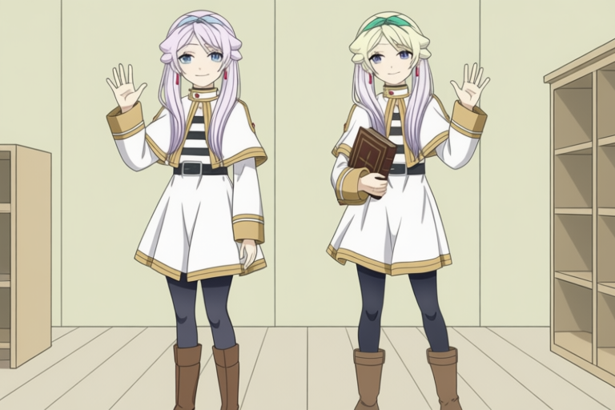 |  |

### live-01-wave-r1

[共同要求](assets/multichar-reference-20260913/cases/live-01-wave-r1/prompt.txt) · [H3實際prompt](assets/multichar-reference-20260913/cases/live-01-wave-r1/h3-prompt.txt)

| Codex | Qwen | H3首幀 |
|---|---|---|
|  | 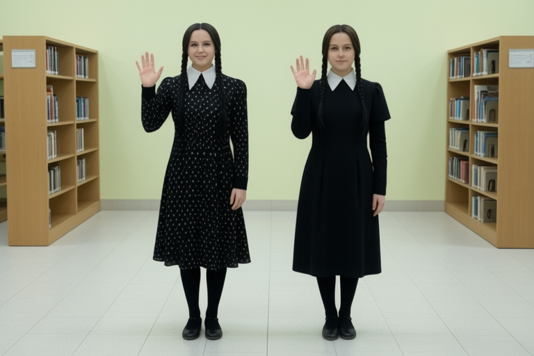 |  |

### anime-02-wave-r1

[共同要求](assets/multichar-reference-20260913/cases/anime-02-wave-r1/prompt.txt) · [H3實際prompt](assets/multichar-reference-20260913/cases/anime-02-wave-r1/h3-prompt.txt)

| Codex | Qwen | H3首幀 |
|---|---|---|
|  |  |  |

### live-02-wave-r1

[共同要求](assets/multichar-reference-20260913/cases/live-02-wave-r1/prompt.txt) · [H3實際prompt](assets/multichar-reference-20260913/cases/live-02-wave-r1/h3-prompt.txt)

| Codex | Qwen | H3首幀 |
|---|---|---|
|  |  |  |

### anime-03-wave-r1

[共同要求](assets/multichar-reference-20260913/cases/anime-03-wave-r1/prompt.txt) · [H3實際prompt](assets/multichar-reference-20260913/cases/anime-03-wave-r1/h3-prompt.txt)

| Codex | Qwen | H3首幀 |
|---|---|---|
|  |  |  |

### live-03-wave-r1

[共同要求](assets/multichar-reference-20260913/cases/live-03-wave-r1/prompt.txt) · [H3實際prompt](assets/multichar-reference-20260913/cases/live-03-wave-r1/h3-prompt.txt)

| Codex | Qwen | H3首幀 |
|---|---|---|
|  |  |  |

### anime-04-wave-r1

[共同要求](assets/multichar-reference-20260913/cases/anime-04-wave-r1/prompt.txt) · [H3實際prompt](assets/multichar-reference-20260913/cases/anime-04-wave-r1/h3-prompt.txt)

| Codex | Qwen | H3首幀 |
|---|---|---|
|  | 未產出／待執行 |  |

### live-04-wave-r1

[共同要求](assets/multichar-reference-20260913/cases/live-04-wave-r1/prompt.txt) · [H3實際prompt](assets/multichar-reference-20260913/cases/live-04-wave-r1/h3-prompt.txt)

| Codex | Qwen | H3首幀 |
|---|---|---|
|  | 未產出／待執行 |  |

### anime-05-wave-r1

[共同要求](assets/multichar-reference-20260913/cases/anime-05-wave-r1/prompt.txt) · [H3實際prompt](assets/multichar-reference-20260913/cases/anime-05-wave-r1/h3-prompt.txt)

| Codex | Qwen | H3首幀 |
|---|---|---|
|  | 未產出／待執行 |  |

### live-05-wave-r1

[共同要求](assets/multichar-reference-20260913/cases/live-05-wave-r1/prompt.txt) · [H3實際prompt](assets/multichar-reference-20260913/cases/live-05-wave-r1/h3-prompt.txt)

| Codex | Qwen | H3首幀 |
|---|---|---|
|  | 未產出／待執行 |  |

### anime-01-book-r1

[共同要求](assets/multichar-reference-20260913/cases/anime-01-book-r1/prompt.txt) · [H3實際prompt](assets/multichar-reference-20260913/cases/anime-01-book-r1/h3-prompt.txt)

| Codex | Qwen | H3首幀 |
|---|---|---|
|  | 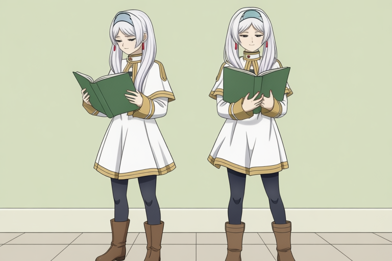 |  |

### live-01-book-r1

[共同要求](assets/multichar-reference-20260913/cases/live-01-book-r1/prompt.txt) · [H3實際prompt](assets/multichar-reference-20260913/cases/live-01-book-r1/h3-prompt.txt)

| Codex | Qwen | H3首幀 |
|---|---|---|
|  | 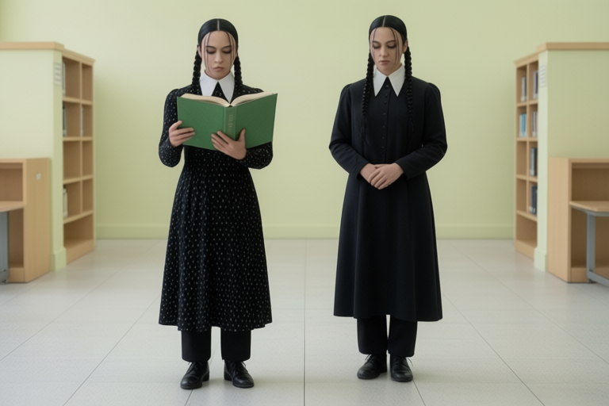 | 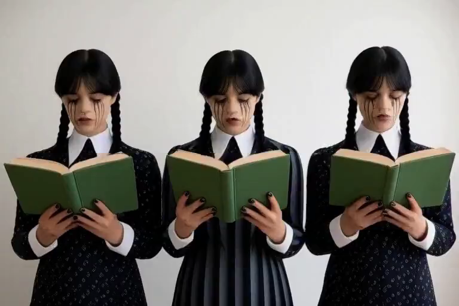 |

### anime-02-book-r1

[共同要求](assets/multichar-reference-20260913/cases/anime-02-book-r1/prompt.txt) · [H3實際prompt](assets/multichar-reference-20260913/cases/anime-02-book-r1/h3-prompt.txt)

| Codex | Qwen | H3首幀 |
|---|---|---|
|  |  |  |

### live-02-book-r1

[共同要求](assets/multichar-reference-20260913/cases/live-02-book-r1/prompt.txt) · [H3實際prompt](assets/multichar-reference-20260913/cases/live-02-book-r1/h3-prompt.txt)

| Codex | Qwen | H3首幀 |
|---|---|---|
|  |  |  |

### anime-03-book-r1

[共同要求](assets/multichar-reference-20260913/cases/anime-03-book-r1/prompt.txt) · [H3實際prompt](assets/multichar-reference-20260913/cases/anime-03-book-r1/h3-prompt.txt)

| Codex | Qwen | H3首幀 |
|---|---|---|
|  |  |  |

### live-03-book-r1

[共同要求](assets/multichar-reference-20260913/cases/live-03-book-r1/prompt.txt) · [H3實際prompt](assets/multichar-reference-20260913/cases/live-03-book-r1/h3-prompt.txt)

| Codex | Qwen | H3首幀 |
|---|---|---|
|  |  |  |

### anime-04-book-r1

[共同要求](assets/multichar-reference-20260913/cases/anime-04-book-r1/prompt.txt) · [H3實際prompt](assets/multichar-reference-20260913/cases/anime-04-book-r1/h3-prompt.txt)

| Codex | Qwen | H3首幀 |
|---|---|---|
|  | 未產出／待執行 |  |

### live-04-book-r1

[共同要求](assets/multichar-reference-20260913/cases/live-04-book-r1/prompt.txt) · [H3實際prompt](assets/multichar-reference-20260913/cases/live-04-book-r1/h3-prompt.txt)

| Codex | Qwen | H3首幀 |
|---|---|---|
|  | 未產出／待執行 |  |

### anime-05-book-r1

[共同要求](assets/multichar-reference-20260913/cases/anime-05-book-r1/prompt.txt) · [H3實際prompt](assets/multichar-reference-20260913/cases/anime-05-book-r1/h3-prompt.txt)

| Codex | Qwen | H3首幀 |
|---|---|---|
|  | 未產出／待執行 |  |

### live-05-book-r1

[共同要求](assets/multichar-reference-20260913/cases/live-05-book-r1/prompt.txt) · [H3實際prompt](assets/multichar-reference-20260913/cases/live-05-book-r1/h3-prompt.txt)

| Codex | Qwen | H3首幀 |
|---|---|---|
|  | 未產出／待執行 |  |

### anime-01-contact-r1

[共同要求](assets/multichar-reference-20260913/cases/anime-01-contact-r1/prompt.txt) · [H3實際prompt](assets/multichar-reference-20260913/cases/anime-01-contact-r1/h3-prompt.txt)

| Codex | Qwen | H3首幀 |
|---|---|---|
|  | 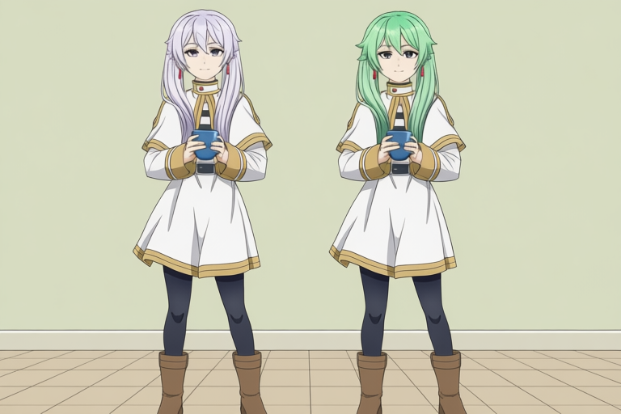 |  |

### live-01-contact-r1

[共同要求](assets/multichar-reference-20260913/cases/live-01-contact-r1/prompt.txt) · [H3實際prompt](assets/multichar-reference-20260913/cases/live-01-contact-r1/h3-prompt.txt)

| Codex | Qwen | H3首幀 |
|---|---|---|
| 未產出／待執行 | 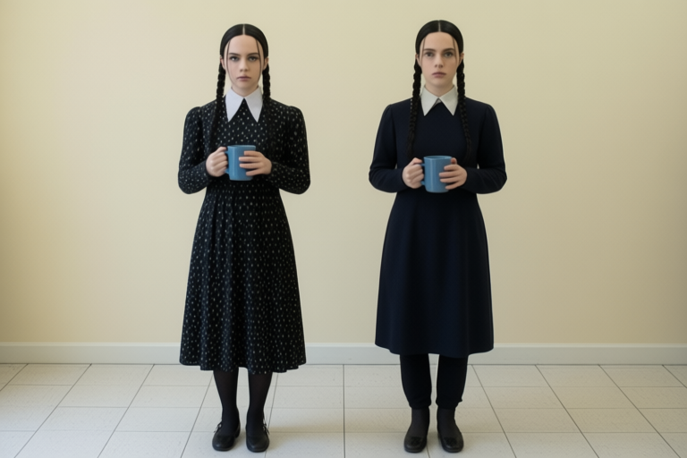 | 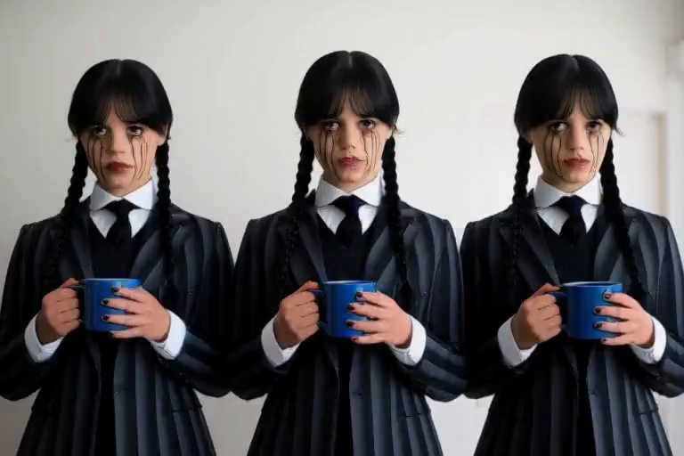 |

### anime-02-contact-r1

[共同要求](assets/multichar-reference-20260913/cases/anime-02-contact-r1/prompt.txt) · [H3實際prompt](assets/multichar-reference-20260913/cases/anime-02-contact-r1/h3-prompt.txt)

| Codex | Qwen | H3首幀 |
|---|---|---|
|  |  |  |

### live-02-contact-r1

[共同要求](assets/multichar-reference-20260913/cases/live-02-contact-r1/prompt.txt) · [H3實際prompt](assets/multichar-reference-20260913/cases/live-02-contact-r1/h3-prompt.txt)

| Codex | Qwen | H3首幀 |
|---|---|---|
|  |  |  |

### anime-03-contact-r1

[共同要求](assets/multichar-reference-20260913/cases/anime-03-contact-r1/prompt.txt) · [H3實際prompt](assets/multichar-reference-20260913/cases/anime-03-contact-r1/h3-prompt.txt)

| Codex | Qwen | H3首幀 |
|---|---|---|
|  |  |  |

### live-03-contact-r1

[共同要求](assets/multichar-reference-20260913/cases/live-03-contact-r1/prompt.txt) · [H3實際prompt](assets/multichar-reference-20260913/cases/live-03-contact-r1/h3-prompt.txt)

| Codex | Qwen | H3首幀 |
|---|---|---|
|  |  |  |

### anime-04-contact-r1

[共同要求](assets/multichar-reference-20260913/cases/anime-04-contact-r1/prompt.txt) · [H3實際prompt](assets/multichar-reference-20260913/cases/anime-04-contact-r1/h3-prompt.txt)

| Codex | Qwen | H3首幀 |
|---|---|---|
|  | 未產出／待執行 |  |

### live-04-contact-r1

[共同要求](assets/multichar-reference-20260913/cases/live-04-contact-r1/prompt.txt) · [H3實際prompt](assets/multichar-reference-20260913/cases/live-04-contact-r1/h3-prompt.txt)

| Codex | Qwen | H3首幀 |
|---|---|---|
|  | 未產出／待執行 |  |

### anime-05-contact-r1

[共同要求](assets/multichar-reference-20260913/cases/anime-05-contact-r1/prompt.txt) · [H3實際prompt](assets/multichar-reference-20260913/cases/anime-05-contact-r1/h3-prompt.txt)

| Codex | Qwen | H3首幀 |
|---|---|---|
|  | 未產出／待執行 |  |

### live-05-contact-r1

[共同要求](assets/multichar-reference-20260913/cases/live-05-contact-r1/prompt.txt) · [H3實際prompt](assets/multichar-reference-20260913/cases/live-05-contact-r1/h3-prompt.txt)

| Codex | Qwen | H3首幀 |
|---|---|---|
|  | 未產出／待執行 |  |

### anime-01-wave-r2

[共同要求](assets/multichar-reference-20260913/cases/anime-01-wave-r2/prompt.txt) · [H3實際prompt](assets/multichar-reference-20260913/cases/anime-01-wave-r2/h3-prompt.txt)

| Codex | Qwen | H3首幀 |
|---|---|---|
|  | 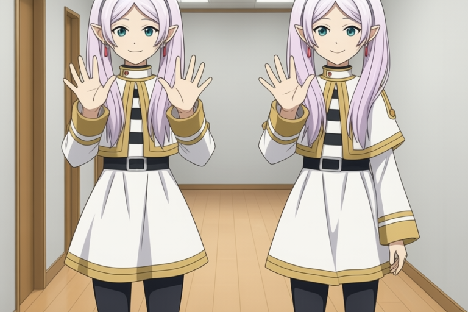 |  |

### live-01-wave-r2

[共同要求](assets/multichar-reference-20260913/cases/live-01-wave-r2/prompt.txt) · [H3實際prompt](assets/multichar-reference-20260913/cases/live-01-wave-r2/h3-prompt.txt)

| Codex | Qwen | H3首幀 |
|---|---|---|
|  |  | 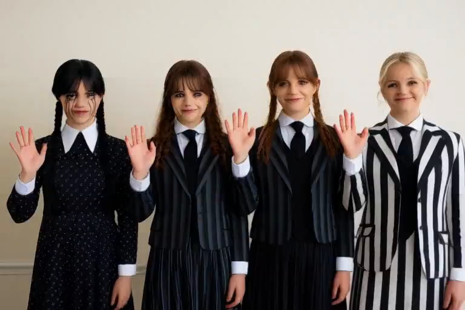 |

### anime-02-wave-r2

[共同要求](assets/multichar-reference-20260913/cases/anime-02-wave-r2/prompt.txt) · [H3實際prompt](assets/multichar-reference-20260913/cases/anime-02-wave-r2/h3-prompt.txt)

| Codex | Qwen | H3首幀 |
|---|---|---|
|  |  |  |

### live-02-wave-r2

[共同要求](assets/multichar-reference-20260913/cases/live-02-wave-r2/prompt.txt) · [H3實際prompt](assets/multichar-reference-20260913/cases/live-02-wave-r2/h3-prompt.txt)

| Codex | Qwen | H3首幀 |
|---|---|---|
|  |  |  |

### anime-03-wave-r2

[共同要求](assets/multichar-reference-20260913/cases/anime-03-wave-r2/prompt.txt) · [H3實際prompt](assets/multichar-reference-20260913/cases/anime-03-wave-r2/h3-prompt.txt)

| Codex | Qwen | H3首幀 |
|---|---|---|
|  |  |  |

### live-03-wave-r2

[共同要求](assets/multichar-reference-20260913/cases/live-03-wave-r2/prompt.txt) · [H3實際prompt](assets/multichar-reference-20260913/cases/live-03-wave-r2/h3-prompt.txt)

| Codex | Qwen | H3首幀 |
|---|---|---|
|  |  |  |

### anime-04-wave-r2

[共同要求](assets/multichar-reference-20260913/cases/anime-04-wave-r2/prompt.txt) · [H3實際prompt](assets/multichar-reference-20260913/cases/anime-04-wave-r2/h3-prompt.txt)

| Codex | Qwen | H3首幀 |
|---|---|---|
|  | 未產出／待執行 |  |

### live-04-wave-r2

[共同要求](assets/multichar-reference-20260913/cases/live-04-wave-r2/prompt.txt) · [H3實際prompt](assets/multichar-reference-20260913/cases/live-04-wave-r2/h3-prompt.txt)

| Codex | Qwen | H3首幀 |
|---|---|---|
|  | 未產出／待執行 |  |

### anime-05-wave-r2

[共同要求](assets/multichar-reference-20260913/cases/anime-05-wave-r2/prompt.txt) · [H3實際prompt](assets/multichar-reference-20260913/cases/anime-05-wave-r2/h3-prompt.txt)

| Codex | Qwen | H3首幀 |
|---|---|---|
|  | 未產出／待執行 |  |

### live-05-wave-r2

[共同要求](assets/multichar-reference-20260913/cases/live-05-wave-r2/prompt.txt) · [H3實際prompt](assets/multichar-reference-20260913/cases/live-05-wave-r2/h3-prompt.txt)

| Codex | Qwen | H3首幀 |
|---|---|---|
|  | 未產出／待執行 |  |

### anime-01-book-r2

[共同要求](assets/multichar-reference-20260913/cases/anime-01-book-r2/prompt.txt) · [H3實際prompt](assets/multichar-reference-20260913/cases/anime-01-book-r2/h3-prompt.txt)

| Codex | Qwen | H3首幀 |
|---|---|---|
|  | 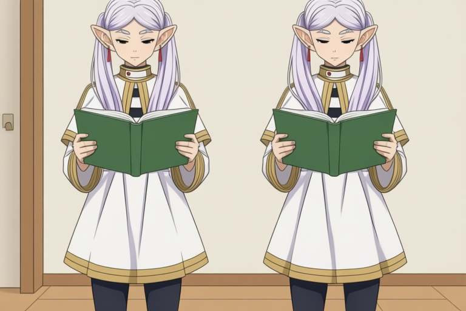 |  |

### live-01-book-r2

[共同要求](assets/multichar-reference-20260913/cases/live-01-book-r2/prompt.txt) · [H3實際prompt](assets/multichar-reference-20260913/cases/live-01-book-r2/h3-prompt.txt)

| Codex | Qwen | H3首幀 |
|---|---|---|
| 未產出／待執行 |  |  |

### anime-02-book-r2

[共同要求](assets/multichar-reference-20260913/cases/anime-02-book-r2/prompt.txt) · [H3實際prompt](assets/multichar-reference-20260913/cases/anime-02-book-r2/h3-prompt.txt)

| Codex | Qwen | H3首幀 |
|---|---|---|
|  | 未產出／待執行 |  |

### live-02-book-r2

[共同要求](assets/multichar-reference-20260913/cases/live-02-book-r2/prompt.txt) · [H3實際prompt](assets/multichar-reference-20260913/cases/live-02-book-r2/h3-prompt.txt)

| Codex | Qwen | H3首幀 |
|---|---|---|
|  | 未產出／待執行 |  |

### anime-03-book-r2

[共同要求](assets/multichar-reference-20260913/cases/anime-03-book-r2/prompt.txt) · [H3實際prompt](assets/multichar-reference-20260913/cases/anime-03-book-r2/h3-prompt.txt)

| Codex | Qwen | H3首幀 |
|---|---|---|
|  | 未產出／待執行 |  |

### live-03-book-r2

[共同要求](assets/multichar-reference-20260913/cases/live-03-book-r2/prompt.txt) · [H3實際prompt](assets/multichar-reference-20260913/cases/live-03-book-r2/h3-prompt.txt)

| Codex | Qwen | H3首幀 |
|---|---|---|
|  | 未產出／待執行 |  |

### anime-04-book-r2

[共同要求](assets/multichar-reference-20260913/cases/anime-04-book-r2/prompt.txt) · [H3實際prompt](assets/multichar-reference-20260913/cases/anime-04-book-r2/h3-prompt.txt)

| Codex | Qwen | H3首幀 |
|---|---|---|
|  | 未產出／待執行 | 未產出／待執行 |

### live-04-book-r2

[共同要求](assets/multichar-reference-20260913/cases/live-04-book-r2/prompt.txt) · [H3實際prompt](assets/multichar-reference-20260913/cases/live-04-book-r2/h3-prompt.txt)

| Codex | Qwen | H3首幀 |
|---|---|---|
|  | 未產出／待執行 | 未產出／待執行 |

### anime-05-book-r2

[共同要求](assets/multichar-reference-20260913/cases/anime-05-book-r2/prompt.txt) · [H3實際prompt](assets/multichar-reference-20260913/cases/anime-05-book-r2/h3-prompt.txt)

| Codex | Qwen | H3首幀 |
|---|---|---|
|  | 未產出／待執行 | 未產出／待執行 |

### live-05-book-r2

[共同要求](assets/multichar-reference-20260913/cases/live-05-book-r2/prompt.txt) · [H3實際prompt](assets/multichar-reference-20260913/cases/live-05-book-r2/h3-prompt.txt)

| Codex | Qwen | H3首幀 |
|---|---|---|
|  | 未產出／待執行 | 未產出／待執行 |

### anime-01-contact-r2

[共同要求](assets/multichar-reference-20260913/cases/anime-01-contact-r2/prompt.txt) · [H3實際prompt](assets/multichar-reference-20260913/cases/anime-01-contact-r2/h3-prompt.txt)

| Codex | Qwen | H3首幀 |
|---|---|---|
|  | 未產出／待執行 | 未產出／待執行 |

### anime-02-contact-r2

[共同要求](assets/multichar-reference-20260913/cases/anime-02-contact-r2/prompt.txt) · [H3實際prompt](assets/multichar-reference-20260913/cases/anime-02-contact-r2/h3-prompt.txt)

| Codex | Qwen | H3首幀 |
|---|---|---|
|  | 未產出／待執行 | 未產出／待執行 |

### live-02-contact-r2

[共同要求](assets/multichar-reference-20260913/cases/live-02-contact-r2/prompt.txt) · [H3實際prompt](assets/multichar-reference-20260913/cases/live-02-contact-r2/h3-prompt.txt)

| Codex | Qwen | H3首幀 |
|---|---|---|
|  | 未產出／待執行 | 未產出／待執行 |

### anime-03-contact-r2

[共同要求](assets/multichar-reference-20260913/cases/anime-03-contact-r2/prompt.txt) · [H3實際prompt](assets/multichar-reference-20260913/cases/anime-03-contact-r2/h3-prompt.txt)

| Codex | Qwen | H3首幀 |
|---|---|---|
|  | 未產出／待執行 | 未產出／待執行 |

### live-03-contact-r2

[共同要求](assets/multichar-reference-20260913/cases/live-03-contact-r2/prompt.txt) · [H3實際prompt](assets/multichar-reference-20260913/cases/live-03-contact-r2/h3-prompt.txt)

| Codex | Qwen | H3首幀 |
|---|---|---|
|  | 未產出／待執行 | 未產出／待執行 |

### anime-04-contact-r2

[共同要求](assets/multichar-reference-20260913/cases/anime-04-contact-r2/prompt.txt) · [H3實際prompt](assets/multichar-reference-20260913/cases/anime-04-contact-r2/h3-prompt.txt)

| Codex | Qwen | H3首幀 |
|---|---|---|
|  | 未產出／待執行 | 未產出／待執行 |

### live-04-contact-r2

[共同要求](assets/multichar-reference-20260913/cases/live-04-contact-r2/prompt.txt) · [H3實際prompt](assets/multichar-reference-20260913/cases/live-04-contact-r2/h3-prompt.txt)

| Codex | Qwen | H3首幀 |
|---|---|---|
|  | 未產出／待執行 | 未產出／待執行 |

### anime-05-contact-r2

[共同要求](assets/multichar-reference-20260913/cases/anime-05-contact-r2/prompt.txt) · [H3實際prompt](assets/multichar-reference-20260913/cases/anime-05-contact-r2/h3-prompt.txt)

| Codex | Qwen | H3首幀 |
|---|---|---|
|  | 未產出／待執行 | 未產出／待執行 |

### live-05-contact-r2

[共同要求](assets/multichar-reference-20260913/cases/live-05-contact-r2/prompt.txt) · [H3實際prompt](assets/multichar-reference-20260913/cases/live-05-contact-r2/h3-prompt.txt)

| Codex | Qwen | H3首幀 |
|---|---|---|
|  | 未產出／待執行 | 未產出／待執行 |

## 單變因對照：第一張參考圖的裁切

此分支不更動產品。只將 Qwen 正／負文字編碼節點的 image1 改接完整第一張載入圖，輸出 latent 的尺寸／裁切保持不變。相同場景的 prompt、參考檔案與順序、seed、steps、CFG 不變。這些是額外對照，不計入上述原生流程的分母。

[預登記對照](assets/multichar-reference-20260913/controls.json)

| 場景 | 原流程 | 完整第一參考圖 | 觀察 |
|---|---|---|---|
| anime-02-wave-r1 |  |  | Two distinct characters correctly ordered and each waving one open five-fingered hand. Frieren has visible pointed ears, silver hair, greenish eyes and red earrings; Fern retains purple hair/eyes and black robe over white dress. Full-reference control improves the observed first-character cues relative to this one paired baseline; one seed does not establish causality or population quality. Framing remains wider than waist-up. |

## 額外對照：只反轉畫面左右排列

參考圖順序、角色編號、持書／指向／擊掌等動作角色與生成參數均維持原值，只改左右排列一句。目標是測試模型是否能脫離參考圖輸入順序排人；並非變更參考圖的上傳順序。Codex 沒有可控制seed，因此單張差異仍有隨機因素。這些額外對照不計入固定矩陣分母。

[預登記與固定條件](assets/multichar-reference-20260913/position-control-index.json)

### anime-02-book-r1-reverse-position

[對照prompt](assets/multichar-reference-20260913/cases/anime-02-book-r1-reverse-position/prompt.txt) · [原始條件](assets/multichar-reference-20260913/cases/anime-02-book-r1/prompt.txt)

| 模型 | 原始排列 | 反轉排列 | 觀察 |
|---|---|---|---|
| Codex built-in |  |  | Requested reversed spatial order achieved: Fern left, Frieren right while reference upload order unchanged. Frieren still holds book both hands and Fern points, so action roles did not swap. Exact reader-right-page contact remains partly obscured at upper edge. Distinct appearance cues retained. |
| Qwen Edit 2511 |  | not_executed |  |
| H3 Ref2VA 5 frames |  | not_executed |  |

### live-02-book-r1-reverse-position

[對照prompt](assets/multichar-reference-20260913/cases/live-02-book-r1-reverse-position/prompt.txt) · [原始條件](assets/multichar-reference-20260913/cases/live-02-book-r1/prompt.txt)

| 模型 | 原始排列 | 反轉排列 | 觀察 |
|---|---|---|---|
| Codex built-in |  |  | Enid left, Wednesday right as requested despite unchanged upload order. Wednesday still holds book both hands; Enid points toward page, both look down. Exact page contact partly hidden. Enid jacket cropped relative to reference; broad faces/hair/makeup retained, hands plausible. |
| Qwen Edit 2511 |  | not_executed |  |
| H3 Ref2VA 5 frames |  | not_executed |  |

### anime-03-book-r1-reverse-position

[對照prompt](assets/multichar-reference-20260913/cases/anime-03-book-r1-reverse-position/prompt.txt) · [原始條件](assets/multichar-reference-20260913/cases/anime-03-book-r1/prompt.txt)

| 模型 | 原始排列 | 反轉排列 | 觀察 |
|---|---|---|---|
| Codex built-in |  |  | Reversed Loid/Fern/Frieren order correct while Frieren retains book-holder role and Fern points. Loid glove absent on exposed wrist/hand and hand in pocket rather than lowered. Page target partly hidden; broad appearance retained, visible hands plausible. |
| Qwen Edit 2511 |  | not_executed |  |
| H3 Ref2VA 5 frames |  | not_executed |  |

### live-03-book-r1-reverse-position

[對照prompt](assets/multichar-reference-20260913/cases/live-03-book-r1-reverse-position/prompt.txt) · [原始條件](assets/multichar-reference-20260913/cases/live-03-book-r1/prompt.txt)

| 模型 | 原始排列 | 反轉排列 | 觀察 |
|---|---|---|---|
| Codex built-in |  |  | Reversed Bianca/Enid/Wednesday order correct with unchanged reference upload order. Wednesday holds single green book and Enid points, Bianca looks down. Bianca necklace absent and uniform details simplified. Exact page contact obscured at edge, visible hands plausible. |
| Qwen Edit 2511 |  | not_executed |  |
| H3 Ref2VA 5 frames |  | not_executed |  |

### anime-05-book-r1-reverse-position

[對照prompt](assets/multichar-reference-20260913/cases/anime-05-book-r1-reverse-position/prompt.txt) · [原始條件](assets/multichar-reference-20260913/cases/anime-05-book-r1/prompt.txt)

| 模型 | 原始排列 | 反轉排列 | 觀察 |
|---|---|---|---|
| Codex built-in |  |  | Five reversed positions Anya/Yor/Loid/Fern/Frieren correct; Frieren holds green book and Fern points. Some gazes remain forward rather than book, exact page contact hidden. Loid gloves absent, Yor short glove/dress drift, broad identities distinct. Visible hands plausible. |
| Qwen Edit 2511 | 尚未產出 | unsupported |  |
| H3 Ref2VA 5 frames |  | not_executed |  |

### live-05-book-r1-reverse-position

[對照prompt](assets/multichar-reference-20260913/cases/live-05-book-r1-reverse-position/prompt.txt) · [原始條件](assets/multichar-reference-20260913/cases/live-05-book-r1/prompt.txt)

| 模型 | 原始排列 | 反轉排列 | 觀察 |
|---|---|---|---|
| Codex built-in |  |  | Five reversed positions Dort/Tyler/Bianca/Enid/Wednesday correct. Wednesday holds book, Enid points, other figures lean toward it. Bianca necklace absent, Tyler outfit altered and exact page contact partly hidden. No obvious hand fusion, broad reference cues preserved. |
| Qwen Edit 2511 | 尚未產出 | unsupported |  |
| H3 Ref2VA 5 frames |  | not_executed |  |

### anime-02-contact-r1-reverse-position

[對照prompt](assets/multichar-reference-20260913/cases/anime-02-contact-r1-reverse-position/prompt.txt) · [原始條件](assets/multichar-reference-20260913/cases/anime-02-contact-r1/prompt.txt)

| 模型 | 原始排列 | 反轉排列 | 觀察 |
|---|---|---|---|
| Codex built-in |  |  | Fern left and Frieren right as requested, with apparent Fern left/Frieren right palms correctly touching. Unused arms lowered, anatomy plausible. Contact remains near face and above shoulder rather than specified height. Appearance cues retained. |
| Qwen Edit 2511 |  | not_executed |  |
| H3 Ref2VA 5 frames |  | not_executed |  |

### live-02-contact-r1-reverse-position

[對照prompt](assets/multichar-reference-20260913/cases/live-02-contact-r1-reverse-position/prompt.txt) · [原始條件](assets/multichar-reference-20260913/cases/live-02-contact-r1/prompt.txt)

| 模型 | 原始排列 | 反轉排列 | 觀察 |
|---|---|---|---|
| Codex built-in |  |  | Enid left and Wednesday right, apparent Enid left/Wednesday right palms correctly contact with other arms lowered. Broad appearance/costume retained. Contact remains above shoulder height near face; otherwise plausible hand anatomy. Spatial reversal successful. |
| Qwen Edit 2511 |  | not_executed |  |
| H3 Ref2VA 5 frames |  | not_executed |  |

### anime-03-contact-r1-reverse-position

[對照prompt](assets/multichar-reference-20260913/cases/anime-03-contact-r1-reverse-position/prompt.txt) · [原始條件](assets/multichar-reference-20260913/cases/anime-03-contact-r1/prompt.txt)

| 模型 | 原始排列 | 反轉排列 | 觀察 |
|---|---|---|---|
| Codex built-in |  |  | Loid/Fern/Frieren reversed order correct. Fern left palm meets Frieren right, Loid watches hands down, unused arms lowered. Contact above shoulder, Loid gloves missing. Broad appearance cues preserved and hands plausible. |
| Qwen Edit 2511 |  | not_executed |  |
| H3 Ref2VA 5 frames |  | not_executed |  |

### live-03-contact-r1-reverse-position

[對照prompt](assets/multichar-reference-20260913/cases/live-03-contact-r1-reverse-position/prompt.txt) · [原始條件](assets/multichar-reference-20260913/cases/live-03-contact-r1/prompt.txt)

| 模型 | 原始排列 | 反轉排列 | 觀察 |
|---|---|---|---|
| Codex built-in |  |  | Bianca/Enid/Wednesday reversed order correct, Enid left palm meets Wednesday right, Bianca watches with arms down. Contact above shoulder height. Bianca necklace absent and uniform details altered; broad identities distinct. Visible hands plausible. |
| Qwen Edit 2511 |  | not_executed |  |
| H3 Ref2VA 5 frames |  | not_executed |  |

### anime-05-contact-r1-reverse-position

[對照prompt](assets/multichar-reference-20260913/cases/anime-05-contact-r1-reverse-position/prompt.txt) · [原始條件](assets/multichar-reference-20260913/cases/anime-05-contact-r1/prompt.txt)

| 模型 | 原始排列 | 反轉排列 | 觀察 |
|---|---|---|---|
| Codex built-in |  |  | Anya/Yor/Loid/Fern/Frieren reverse order correct with requested two pairings and Anya watching. Contacts above shoulder, some arm laterality ambiguous under turned poses. Loid only one glove, Yor short gloves/dress drift. Palm geometry plausible, unused arms mostly lowered. |
| Qwen Edit 2511 | 尚未產出 | unsupported |  |
| H3 Ref2VA 5 frames |  | not_executed |  |

### live-05-contact-r1-reverse-position

[對照prompt](assets/multichar-reference-20260913/cases/live-05-contact-r1-reverse-position/prompt.txt) · [原始條件](assets/multichar-reference-20260913/cases/live-05-contact-r1/prompt.txt)

| 模型 | 原始排列 | 反轉排列 | 觀察 |
|---|---|---|---|
| Codex built-in |  |  | Dort/Tyler/Bianca/Enid/Wednesday reverse order correct, two requested pairings and Dort watching. Contact above shoulder, some apparent arm laterality differs under turned poses. Bianca necklace missing, Tyler costume altered. Contacts and hand ownership visibly coherent, unused hands down. |
| Qwen Edit 2511 | 尚未產出 | unsupported |  |
| H3 Ref2VA 5 frames |  | not_executed |  |

## 額外對照：單人提示詞改用單數措辭

僅替換預登記的整組單數措辭，保持角色、參考圖 bytes／順序、動作及場景；不是單一字詞因果實驗。Codex seed 不可控，原始 Codex 單人組本來就成功，不能用本對照宣稱修好 Qwen／H3 的重複人物問題。GPU 對照若未提交就標示未執行，亦不計入固定矩陣分母。

[替換清單與基準雜湊](assets/multichar-reference-20260913/singular-control-index.json)

### anime-01-wave-r1-singular-wording

[單數prompt](assets/multichar-reference-20260913/cases/anime-01-wave-r1-singular-wording/prompt.txt) · [原始prompt](assets/multichar-reference-20260913/cases/anime-01-wave-r1/prompt.txt)

| 模型 | 原始 | 單數措辭 | 觀察 |
|---|---|---|---|
| Codex built-in |  |  | 一名 Frieren，銀髮尖耳、綠眼、紅耳飾與頸部紅寶石及白金服裝保留。單手空掌揮手，另一臂垂下，無原圖書本道具；可見手部清楚。 |
| Qwen Edit 2511 |  | not_executed |  |
| H3 Ref2VA 5 frames |  | not_executed |  |

### live-01-wave-r1-singular-wording

[單數prompt](assets/multichar-reference-20260913/cases/live-01-wave-r1-singular-wording/prompt.txt) · [原始prompt](assets/multichar-reference-20260913/cases/live-01-wave-r1/prompt.txt)

| 模型 | 原始 | 單數措辭 | 觀察 |
|---|---|---|---|
| Codex built-in |  | failed | No image returned. Preserve provider refusal; no retry or bypass. Not a visual quality failure. |
| Qwen Edit 2511 |  | not_executed |  |
| H3 Ref2VA 5 frames |  | not_executed |  |

## 兩次重複的評分一致性

只配對相同模型、角色組、人數與動作的第1／2輪。每項指標各自排除沒有成果或未評估的配對，未完成／不支援不算0分。相同分數也可能是兩次都失敗，故另列兩次皆明確符合。只有兩次重複，不作可靠度或顯著性結論；Codex seed 未知，本地模型兩轮 seed 不同。

| 模型 | 指標 | 已評估配對／預登記配對 | 相同分數 | 不同分數 | 兩次皆明確符合 |
|---|---|---:|---:|---:|---:|
| Codex built-in | exact_count | 28/30 | 28 | 0 | 28 |
| Codex built-in | appearance_preserved | 28/30 | 27 | 1 | 8 |
| Codex built-in | reference_binding | 28/30 | 28 | 0 | 28 |
| Codex built-in | action_obedience | 28/30 | 25 | 3 | 9 |
| Codex built-in | hands_and_contacts | 28/30 | 28 | 0 | 28 |
| Qwen Edit 2511 | exact_count | 8/30 | 8 | 0 | 4 |
| Qwen Edit 2511 | appearance_preserved | 8/30 | 8 | 0 | 0 |
| Qwen Edit 2511 | reference_binding | 8/30 | 7 | 1 | 1 |
| Qwen Edit 2511 | action_obedience | 8/30 | 5 | 3 | 0 |
| Qwen Edit 2511 | hands_and_contacts | 8/30 | 5 | 3 | 5 |
| H3 Ref2VA 5 frames | exact_count | 16/30 | 15 | 1 | 12 |
| H3 Ref2VA 5 frames | appearance_preserved | 16/30 | 15 | 1 | 0 |
| H3 Ref2VA 5 frames | reference_binding | 16/30 | 15 | 1 | 12 |
| H3 Ref2VA 5 frames | action_obedience | 16/30 | 11 | 5 | 1 |
| H3 Ref2VA 5 frames | hands_and_contacts | 16/30 | 11 | 5 | 9 |

[每組配對案例與分數](assets/multichar-reference-20260913/repeat-summary.json)

## 耗時與硬體紀錄

以下只含固定矩陣成功項目，不混入額外對照。每格為中位秒數 [最小–最大]；括號n是該欄有值的樣本數。缺失階段不填0。參考圖數與角色組合一起改變，因此不能把差值全歸因於圖數。

| 模型 | 人數／參考圖 | GPU工作流執行 | 採樣節點觀測（可能含載模） | 首步至末步 | runner總耗時 |
|---|---:|---|---|---|---|
| Qwen Edit 2511 | 1 | 64.80 [64.62–111.31] (n=10) | 63.29 [62.88–94.35] (n=10) | 61.47 [60.96–61.69] (n=10) | 77.44 [75.10–135.74] (n=10) |
| Qwen Edit 2511 | 2 | 117.72 [116.43–118.08] (n=8) | 115.31 [113.76–115.59] (n=8) | 112.46 [110.97–112.75] (n=8) | 129.45 [128.70–131.55] (n=8) |
| Qwen Edit 2511 | 3 | 181.57 [181.03–181.90] (n=8) | 178.05 [177.71–178.23] (n=8) | 173.41 [173.06–173.60] (n=8) | 194.60 [194.36–198.69] (n=8) |
| Qwen Edit 2511 | 4 | 未知 (n=0) | 未知 (n=0) | 未知 (n=0) | 未知 (n=0) |
| Qwen Edit 2511 | 5 | 未知 (n=0) | 未知 (n=0) | 未知 (n=0) | 未知 (n=0) |
| H3 Ref2VA 5 frames | 1 | 119.58 [118.90–168.01] (n=10) | 16.31 [16.02–47.23] (n=10) | 15.07 [14.90–15.22] (n=10) | 127.57 [126.44–189.77] (n=10) |
| H3 Ref2VA 5 frames | 2 | 155.68 [153.68–203.59] (n=10) | 23.19 [22.92–56.06] (n=10) | 21.64 [21.43–21.82] (n=10) | 164.40 [161.76–224.54] (n=10) |
| H3 Ref2VA 5 frames | 3 | 407.34 [399.37–464.17] (n=10) | 30.31 [30.18–65.02] (n=10) | 28.48 [28.26–28.63] (n=10) | 416.70 [408.93–481.70] (n=10) |
| H3 Ref2VA 5 frames | 4 | 547.42 [520.97–585.59] (n=8) | 119.76 [119.61–155.30] (n=8) | 113.45 [113.28–113.93] (n=8) | 557.41 [537.07–601.29] (n=8) |
| H3 Ref2VA 5 frames | 5 | 584.12 [576.72–592.35] (n=8) | 124.92 [124.81–125.59] (n=8) | 118.37 [118.25–118.90] (n=8) | 595.68 [587.57–609.83] (n=8) |

Codex另表：只有工具牆鐘時間，沒有相同GPU／階段／解析度控制，不能由下表得出等算力速度比。

| 人數／參考圖 | 內建工具牆鐘秒數 |
|---:|---|
| 1 | 25.00 [21.30–47.60] (n=9) |
| 2 | 38.00 [25.30–48.00] (n=12) |
| 3 | 38.65 [28.20–56.80] (n=12) |
| 4 | 41.50 [38.00–46.80] (n=12) |
| 5 | 42.90 [39.50–45.40] (n=12) |

[逐筆階段耗時 CSV](assets/multichar-reference-20260913/timings.csv) · [JSON](assets/multichar-reference-20260913/timings.json) · [推導腳本](assets/multichar-reference-20260913/summarize_timings.py)

provider_execution_seconds 取同一 prompt_id 的 execution_start 至 execution_success；provider_queue_seconds 取服務收件 create_time 至 execution_start。sampling_node_seconds 是採樣節點觀測區間，可能包含載模，並非純 CUDA kernel 時間；first_to_last_step_seconds 不含第一步之前的準備。collection_to_saved_seconds 只在兩事件都存在時提供。Codex 僅有內建工具牆鐘時間，沒有相同階段或硬體資訊，不作等算力速度排名。VRAM 是提交前快照，不是峰值；未知值保留 null。

## 重現與失敗歸類

內建生圖拒絕、基礎設施錯誤、成功成像但品質不符是不同結果。`failure_category=provider_output_moderation_blocked` 表示服務輸出階段拒絕，沒有可評分圖片；不得算成人物一致性零分，也不自動改寫提示詞繞過或切換API。完整錯誤代碼與request ID保留在該筆result.json。

場景與角色對應可由 [prepare_cases.py](assets/multichar-reference-20260913/prepare_cases.py) 重建；[gpu_runner.py](assets/multichar-reference-20260913/gpu_runner.py) 使用現有 Veritas adapter、PostgreSQL 的自有 schema 與本機清理 journal，需自行提供本地服務配置（此PR不含env或密鑰）。腳本含作者環境路徑，移植時須調整，不能當作通用一鍵執行套件。Codex 使用內建 image_gen 逐張呼叫，實際prompt与來源順序保存在各run.json，不宣稱可由seed重現。

H3 5幀取圖保存原始MP4；若音軌0.20秒短於5/24秒，現有一般影片collector會拒絕影音等長檢查。此時分別記錄provider成功與catalog失敗，從已驗證的本機journal影片取圖；不重試、不補幀、不放寬產品校驗。只有實際解出5幀才記為取圖成功。所有已完成實验的遠端輸入／輸出需有hash比對與清理收據，不能用刪整個資料夾代替。

