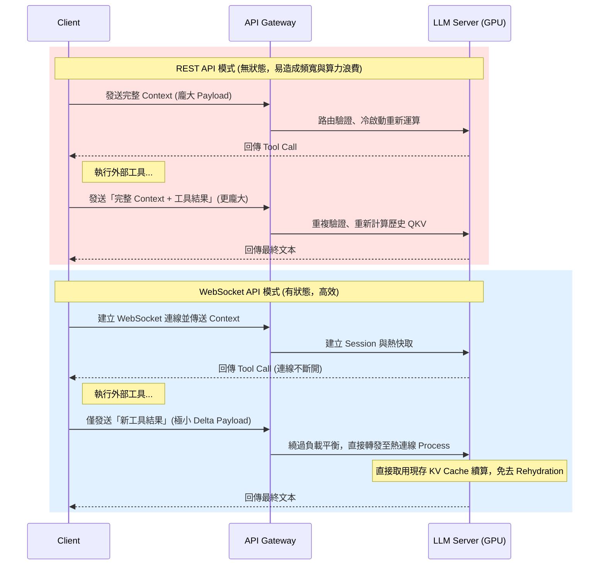
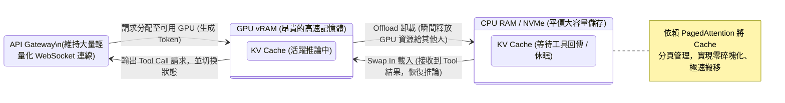

# 研究筆記：OpenAI WebSocket API 升級與底層推論架構分析

**研究動機**
近期 OpenAI 將 API 從傳統的 REST 架構轉向支援 WebSocket。雖然表面上看似單純的傳輸協定更改，但針對需要大量、連續呼叫外部工具（Tool Calls）的 AI Agent 來說，這牽涉到整個上下文狀態管理與底層 GPU 運算資源的重新配置。我需要釐清這對系統效能、控制權以及運算成本的具體影響。

### 一、 網路傳輸架構的典範轉移：從無狀態到有狀態

過去使用 REST API 開發 Agent 存在嚴重的效能瓶頸。當模型觸發工具呼叫並暫停時，API 伺服器是不會保留記憶的。

- **REST 的痛點：** 一旦工具執行完畢，我必須將「包含所有歷史對話與工具執行結果」的巨大 Context 重新發送給 API。 這不僅造成高達 90% 的頻寬浪費，也讓 API Gateway 必須反覆執行權限驗證與請求路由。
- **WebSocket 的解法：** 透過建立持久連線（Stateful 連線），伺服器端得以保留目前的對話狀態。在後續的工具輪詢中，我只需要傳輸「新增的工具結果」或「新指令」。對於動輒 20 次以上 Tool Calls 的複雜任務，這能顯著降低網路 I/O 延遲。

#### 比較圖解：REST 對比 WebSocket 呼叫流程

### 二、 核心運算優勢：KV Cache 效益最大化

維持有狀態連線帶來最大的突破，在於大幅降低 Transformer 底層的注意力機制（Attention Mechanism）計算量。

- **避免重複計算 QKV：** 在語言模型中，已經處理過的歷史 Context 其 Key (K) 和 Value (V) 矩陣是固定的。
- **熱連線（Hot Connection）：** WebSocket 確保了同一批任務的連續請求，能夠無縫對接到已載入歷史上下文的狀態。當 Agent 將工具結果傳回時，模型只需針對「新輸入的 Delta 資料」計算 QKV，並直接與記憶體中「熱著」的歷史 KV Cache 進行運算，徹底消除 REST 架構下頻繁的重新載入（Rehydration）與冷啟動延遲。

### 三、 架構挑戰與解法：連線狀態與 GPU 計算解耦

我最初的疑問是：如果透過 WebSocket 長時間綁定連線，當 Agent 等待外部工具（如爬蟲、程式碼編譯）耗時數十秒時，是否會導致昂貴的 GPU vRAM 被閒置佔用？而現代推論伺服器（如 vLLM）採用了高度解耦的架構來解決這個問題：

- **Gateway 負責連線，GPU 負責運算：** WebSocket 連線實際上是維持在 API 的路由層（Gateway），而不是將 Session 鎖死在單一實體 GPU 上。
- **動態記憶體卸載（Swapping / Offloading）：** 當模型輸出 Tool Call 進入等待狀態時，系統會立即將該 Session 龐大的 KV Cache 從 GPU 的 vRAM 搬移到 CPU RAM 甚至是高速 NVMe SSD 中。 這瞬間釋放了 GPU 資源去處理其他用戶的請求。等工具回傳結果後，再迅速將 Cache「Swap In」回 GPU 繼續生成。
- **PagedAttention 記憶體分頁機制：** 為了讓 Swap 過程極度順暢，系統將 KV Cache 切割成固定大小的區塊（Pages），這解決了連續記憶體分配造成的碎片化問題，讓大容量資料在 vRAM 與 RAM 之間的搬移效率最大化。

#### 圖解：連線維持與 GPU 資源解耦 (Swapping / Offloading) 架構

### 四、 系統邊界與取捨

- **動態篩檢的代價：** 如果我在 Client 端實作了動態歷史篩檢（例如 RAG 重組、刪減過期對話），這會改變上下文的 Hash 值。一旦歷史被修改，伺服器端的 Cache 就會失效（Compaction breaks the cache），WebSocket 的狀態延續優勢便不復存在。
- **降級容錯（Graceful Degradation）：** 伺服器不會無限期等待工具回傳。如果外部工具執行過久超時（Timeout），伺服器會主動丟棄 Swap 狀態。此時若再度連線，系統會平滑降級回無狀態模式，重新計算前文的 KV Cache。
