# Qwen Image Edit 2511：RTX 5090 編輯品質與批次效能實驗

實驗日期：2026-09-13。單輪工程實驗，評估多參考圖合成、人物／物體編輯品質、
VL 編碼裝置與異質批次效能。結果限於本報告的模型版本、硬體、參數與樣本。

## 摘要

- **編碼裝置是主要延遲因素。** 同一 normal-VRAM 容器內，CPU 編碼單張為 152.608 秒，
  GPU 編碼暖單張為 54.891 秒，時間減少 64.0%；採樣均約 53 秒。
- **異質 batch 可執行，尚無顯著採樣加速證據。** GPU 編碼 batch 4 為 215.807 秒，
  平均 53.952 秒／張；其中編碼 4.113 秒、採樣 210.379 秒。
  缺少四組完全配對的串行單張基準，不能宣稱 batch 4 的加速比。
- **配置改善不等於批次加速。** CPU 編碼配置的 batch 4 為 600.680 秒；
  GPU 編碼配置縮短 64.1%，主要來自編碼。CPU 配置 batch 2 對配對暖單張只縮短 0.93%。
- **指定編輯多能成立，身份與幾何細節仍會漂移。** 35 張人物／物體研究與獨立五張合照／
  局部編輯實驗，觀察到構圖拉近、臉部／服裝／眼鏡細節變動；CFG 沒有通用最佳值。
- **限制：** 單輪、有限 seed、512px、無盲評或身份分數；部分視角測試受 glasses 模板措辭干擾。
  不據此作模型排名、FP8 品質歸因或正式部署驗收。

### 實驗分組與閱讀順序

| 分組 | 配置／樣本 | 主要問題 | 章節 |
|---|---|---|---|
| CPU 編碼批次基準 | lowvram＋reserve 6；batch 1／2／4 | 異質採樣與耗時分解 | 1–6 |
| VL 裝置對照與 GPU 批次 | normal VRAM；CPU／GPU 單張與 GPU batch 4 | 編碼成本及批次效益 | 7 |
| 品質判讀與方法依據 | prompt 干擾、證據索引、官方實作與文獻 | 結果有效性與解釋界線 | 8–10 |
| 人物／物體編輯 | 6 張參考＋29 張編輯，batch 1 | CFG、角度、背景、服裝及眼鏡 | 11 |
| 雙人物合照與局部編輯 | 2 張參考＋3 張編輯，batch 1 | 多參考圖合成與身份保留 | 12 |
| 結論與待驗證項目 | 已測範圍及限制 | 可採用結論與後續實驗 | 13 |

## 1. Batch 指的是什麼

本實驗的 heterogeneous batch（異質批次）是每張各自帶入 prompt、ordered references 與 seed，
將編碼後的條件／latent 沿 batch 維度合併，呼叫一次 sampler，再依索引分離輸出。

- Batch 2：兩組不同輸入，輸出兩張；不是兩張參考圖合成一張。
- Batch 4：四組不同輸入，輸出四張；不是同一個 prompt 重複四次。
- 不是同時送出四個 HTTP request，也不是用 RepeatLatentBatch 冒充異質批次。
- API／sampler 的 batch 大小與底層每次模型 forward 的有效 batch 大小，是不同的驗證層級。

目前自訂節點支援 1–4 筆、每筆 1–3 張參考圖，但這輪**每筆只用一張參考圖**。
各筆必須有相同尺寸、steps、CFG、參考圖張數，以及相容的 reference latent shape；不相容就拒絕，
不偷偷裁掉參考圖或退回逐張採樣。不同 CFG 的原始研究條件不能硬湊成同一批。

## 2. CPU 編碼批次基準：環境與固定參數

| 項目 | 本輪設定／證據 |
|---|---|
| GPU | 一張 NVIDIA GeForce RTX 5090，32,607 MiB 可見 VRAM |
| 主模型 | Qwen Image Edit 2511 FP8 mixed |
| 文字／影像編碼器 | Qwen 2.5 VL 7B FP8 scaled，明確設 `device=cpu` |
| ComfyUI 記憶體參數 | `--lowvram --reserve-vram 6`；GPU 編碼配置見第 7 節 |
| VAE | Qwen image VAE |
| 生成尺寸 | 512 × 512 |
| Steps／CFG | 40／4 |
| Sampler／scheduler | Euler／simple |
| Denoise | 1.0 |
| Model sampling shift／CFGNorm | 沿用原 Qwen builder：3.1／1 |
| 額外 LoRA | 無 |
| PyTorch／runtime CUDA | 2.7.1+cu128／12.8 |
| NVIDIA driver | 595.58.03；nvidia-smi 顯示 CUDA 13.2，與 PyTorch runtime 版本分開記錄 |
| 實際部署 | 既有 ComfyUI Docker 容器；本機經 SSH tunnel 接 API |
| 容器 CPU／RAM | CPU quota 無上限、可见 CPU 0–15、查詢時 nr_throttled=0；無容器 RAM 上限 |
| 候選程式版本 | vision-flow `be705fe`，基於 Qwen prerequisite `1549d8a` |

Vision-flow 同時有 `make pod-deploy`、K3s 與 HAMi／Volcano 部署路徑，
**但本輪沒有走 Pod 路徑**。不能把 Docker 的限制檢查當成 Pod 配額驗證，
也不能把本輪數字當成正式 Pod 環境的 benchmark。

實驗自訂節點只安裝在既有 container writable layer；可隨容器 restart 保留，
container recreate 不保證保留。這不是完成正式 image／IaC 發布的證據。

## 3. CPU 編碼批次基準：輸入與測試順序

| 識別 | 內容與修改目標 | Seed | 使用範圍 |
|---|---|---:|---|
| A | 2D 動畫人物，向畫面右方轉約 45 度 | 2026091360 | 單張、batch 2、batch 4 |
| B | 電影風格人物，向畫面左方轉成側臉 | 2026091362 | 單張、batch 2、batch 4 |
| C | 3D 動畫人物，向右轉約 45 度 | 2026091361 | batch 4 |
| D | 古裝人物，向右轉約 45 度 | 2026091363 | batch 4 |

每個身份跨批次保持原 prompt、參考圖與 seed。輸入圖的 SHA256、原始提示詞與輸出映射保存在本機證據中。
噪聲先以各筆 seed 生成 singleton，再 concatenate，避免批次位置改變初始噪聲。
這不保證不同 batch 的最終像素完全相同。

執行順序：

1. 單張 A 冷啟動：ComfyUI restart 後第一張，包含模型載入成本。
2. 單張 B 暖機：不重啟服務。
3. Batch 2：A＋B。
4. 再生成單張 A 暖機對照，避免使用冷啟動 A 做不公平比較。
5. 上述輸出下載與清理完成後，batch 4 自動接著執行 A＋B＋C＋D。

「暖機」只指服務已跑過任務，不代表所有模型保證常驻 VRAM，也不代表編碼快取命中。
本輪未做多輪隨機化、誤差區間，也沒有 C、D 的配對單張測速。
Batch 3 未測量。

## 4. CPU 編碼批次基準：時間結果

單位均為秒；平均值按該批輸出張數計算。

| 測試 | 張數 | Provider 全程 | 編碼 | 採樣 | 平均全程／張 | 平均採樣／張 |
|---|---:|---:|---:|---:|---:|---:|
| 單張 A 冷啟動 | 1 | 161.745 | 101.401 | 57.464 | 161.745 | 57.464 |
| 單張 B 暖機 | 1 | 153.335 | 99.453 | 53.529 | 153.335 | 53.529 |
| Batch 2：A＋B | 2 | 303.429 | 199.480 | 103.365 | 151.715 | 51.682 |
| 單張 A 暖機 | 1 | 152.946 | 99.637 | 53.081 | 152.946 | 53.081 |
| 暖機 A＋B 合計 | 2 | 306.281 | 199.090 | 106.610 | 153.141 | 53.305 |
| Batch 4：A＋B＋C＋D | 4 | 600.680 | 399.046 | 200.226 | 150.170 | 50.057 |

Batch 2 配對比較：

```text
全程時間減少 = (306.281 - 303.429) / 306.281 = 0.93%
採樣時間減少 = (106.610 - 103.365) / 106.610 ≈ 3.04%
```

不能把時間減少百分比與 throughput 增加百分比混用；本篇以上均指時間減少。
Batch 4 平均每張與 batch 2 接近，但案例組成不同，只能作描述性比較。

### 計時邊界

- Provider 全程：ComfyUI `execution_start` 到 `execution_success`，不含本機下載、遠端清理與前置排隊。
- 編碼：native reference VAE／文字與影像編碼路徑的觀測總和，含 CPU encoder 工作；不是純文字 tokenization。
- 採樣：`comfy.sample.sample` 呼叫前後同步 CUDA 計時，可能包含必要模型載入，不是純 kernel 時間。
- Pack/noise 另有紀錄：batch 2 約 0.209 秒、batch 4 約 0.391 秒，不是主要瓶頸。
- 完整 queue trace、provider history 與 node timing receipt 分開保留；cached UI receipt 不計成新計算。

## 5. CPU 編碼批次基準：GPU／VRAM 觀察

| 觀察時點 | GPU 使用率 | 顯存／其他數據 | 能說明什麼 |
|---|---:|---|---|
| Batch 4 CPU 編碼中 | 0% | nvidia-smi 約 21,956 MiB | 此刻 GPU 在等編碼，不代表採樣閒置 |
| Batch 4 GPU 採樣中 | 100% | 24,708 MiB，474／475 W，63°C | 當下 GPU 忙且接近設定功耗上限 |
| Batch 2 採樣結束 | 未連續採集 | PyTorch reserved 22,048 MiB；device free 9,356 MiB | 結束快照，不是每 job peak |
| Batch 4 採樣結束 | 未連續採集 | PyTorch reserved 24,000 MiB；device free 7,404 MiB | 四筆在本設定下成功完成，無 OOM |

PyTorch allocated、reserved、裝置整體使用量是不同口徑。
receipt 的 `process_lifetime_peak_allocated_bytes` 是程序存續期間峰值，不可標成單筆任務峰值。
GPU utilization 100% 也不等同於已證明 Tensor Core FLOPS 飽和；沒有 profiler 不能據此完成瓶頸歸因。

## 6. CPU 編碼批次基準：效能分析

### 已確認：編碼仍然串行

每張各跑正／負兩次 native encode。Batch 2 四次、batch 4 八次，每次約 49–51 秒。
所以編碼由約 100 秒／張線性增長到約 200／400 秒。
這版只將採樣批次化，並未批次化整條生成流程。

### 已確認：計時識別污染快取

`build_batch` 對含 output prefix 的完整 graph 產生 batch_id，
再把 batch_id 放進 `VisionQwenTimedEncode` 的輸入。
換批次或輸出名稱就會讓內容相同的編碼無法重用快取。
這是實作的效能缺口，不應成為正式版本的默認行為。

本輪單張與 batch 都受到這個設計影響，所以表中可以比較這版 adapter 的未命中編碼成本，
但不能代表原生工作流跨任務快取命中時的效能。修快取也不等於已解釋採樣只有約 3% 的收益。

### 已確認的採樣證據，以及還缺什麼

採樣輸入 latent shape 分別為 `[1,16,1,64,64]`、`[2,16,1,64,64]`、`[4,16,1,64,64]`。
程式將不同條件沿 batch 軸合併、以整數 binary attention mask 補齊文字長度，
reference latents 按 slot 合併，且只呼叫一次 sampler。

這支持「不是外層逐張呼叫 sampler」，**不保證底層執行方式已最佳化**。
現場 ComfyUI sampler 原始碼會依條件相容性與可用記憶體決定是否合併 CFG 条件；
尚未追蹤本次實際 forward 的 shape、次數與拆分狀況。

可能解釋包括單張已接近有效算力上限、CFG 條件拆分、attention／矩陣 kernel 效率或記憶體搬運。
它們目前都只是待驗證假設，不是已確認的根因；不能用一般「batch 不一定快」的說法替代 profiling。

## 7. VL 裝置對照與 GPU 編碼批次效能

lowvram 組的 Docker 參數含 `--lowvram --reserve-vram 6`，即使 CLIPLoader 選 `default`，實際 load device
仍是 CPU。不能憑請求 enum 或檔名含 gpu 就宣稱 GPU 編碼。
同映像臨時容器移除這兩旗標後，日誌確認 VL `load device=cuda:0, offload device=cpu`；
初始 `current=cpu` 不代表推論仍在 CPU。移除顯式 reserve 使用預設策略，並不是完全零預留。

| 配置／測試 | 張數 | Provider 秒 | 編碼秒 | 採樣秒 |
|---|---:|---:|---:|---:|
| lowvram 配置 default 第一張（實際 CPU） | 1 | 154.507 | 100.235 | 52.894 |
| lowvram 配置 default 第二張（實際 CPU） | 1 | 153.060 | 99.815 | 53.018 |
| lowvram 配置強制 CPU | 1 | 155.218 | 101.141 | 53.029 |
| normal-VRAM 配置 GPU 第一張 | 1 | 63.738 | 3.284 | 57.538 |
| normal-VRAM 配置 GPU 暖單張 | 1 | 54.891 | 1.040 | 53.627 |
| 同一 normal-VRAM 容器強制 CPU 對照 | 1 | 152.608 | 98.680 | 53.125 |
| normal-VRAM 批次實驗：單張 A 冷啟動暖機 | 1 | 63.388 | 3.185 | 57.262 |
| normal-VRAM 批次實驗：暖批次 A/B/C/D | 4 | 215.807 | 4.113 | 210.379 |

單張固定 A 的 prompt／參考圖／seed 2026091360；batch 4 沿用第 3 節四組 prompt／圖片／seed。
全部 512×512、40 steps、CFG 4、相同模型／採樣設定／計時節點，不命中跨 job 編碼快取。
兩種配置容器同映像 `sha256:a4efd9f52036b324ae46b873b7dbee58b738a5722e2f626f7eaf5f4392544f45`。

- 同一 normal-VRAM 容器暖 GPU／CPU 單張比較約 **2.78 倍速、時間減少 64.0%**，主要差異在編碼，採樣仍約 53 秒。
- GPU batch 4 平均 **53.952 秒／張**；比 CPU 編碼 lowvram 配置 600.680 秒縮短 64.1%，但這是配置改善，不能當作 batch 加速比。
- GPU batch 4 採樣 210.379 秒，沒有比 lowvram 配置 200.226 秒更快；單輪非隨機化結果不能判定穩定退步或原因。
- `4 × 54.891 = 219.564` 秒只是單張 A 的外推，不是 A/B/C/D 四組實測串行基準。
  尚未測量四組匹配單張、GPU batch 2、多次重複與 kernel profiling；不能宣稱批次有顯著優勢。
- GPU 單張裝置對照實驗的最高觀察值為 29,636 MiB／32,607 MiB 是約五秒取樣最大值，非真實逐 job 峰值，亦不是 GPU batch 4 的峰值。
- CPU 編碼不是模型必要限制。跨兩種配置容器同時移除兩旗標，無法分離各旗標的獨立效果；同一 normal-VRAM 容器 CPU 對照比較有助歸因。

證據目錄：`isuper/sample/qwen-vl-gpu-20260913/`（歷史檔名含 gpu，但實際 CPU）、
`qwen-vl-normalvram-20260913/`（三組設備對照）與 `qwen-vl-gpu-batch4-20260913/`（GPU batch 4）。
均保存 request／receipt／GPU 取樣／放置日誌。Batch 4 曾短暫 unknown，沿原 job identity 恢復成功，沒有重送。
GPU batch 4 與暖機共五張已下載驗證，遠端五個 output／四個 input／兩筆 history 清理完成；
實驗後移除臨時容器並還原 lowvram／reserve 6 服務。配置變更僅限實驗容器。

## 8. 批次輸出品質與 prompt 干擾

CPU 編碼批次基準的人工目視評估涵蓋 A、B 單張與 batch 2，以及 batch 4 四張成品：不同角色／畫風沒有明顯互換。
A 保留銀髮、紅眼、貓耳、黑色星形髮飾與深色服裝；A、B 的單張與 batch 輸出看起來相近。
Batch 4 另有 3D 卡通人物與古裝人物，輸出檔與 item ID 一一對應；這不是完整身份保留評分。
PIL RGB 比較確認 A、B 單張與 batch 2 不是逐像素完全相同。

**眼鏡案例存在 prompt 干擾，不能單獨歸因於模型。**
原 B 參考圖沒有眼鏡，但單張／batch 輸出新增眼鏡；測試模板卻含有：

```text
Preserve ... all accessories including any glasses ...
```

雖然字面是「保留原有眼鏡」，不是命令新增，但原圖沒有的物件本就不該被模板額外提及。
模板可能誘導新增眼鏡。由於缺少去除此措辭的對照，不能將該結果歸因於模型身份保持能力，
也不能視為 batch 特有問題。原始 prompt、seed 與輸出保留作為干擾證據。

未來此類測試應只要求改變視角並保留人物外觀、服裝與原有配件，避免列出不存在的物件。
此建議不是本輪真正送出的 prompt，不能覆寫歷史輸入。

## 9. CPU 編碼批次基準：證據與清理

原始資料保留在研究工作區 `isuper/sample/qwen-batch-benchmark-20260913/`，
不複製機器絕對路徑、連線憑證或完整 runtime dump 到本 repo。
批次成品及完整 JSON 保存在實驗資料夾；品質對照圖收錄於本 repo 的 assets。

| 證據 | 相對於上述實驗資料夾的檔案 |
|---|---|
| A／B 原始 prompt、seed、reference SHA | `inputs.json` |
| 四筆原始輸入 | `batch-four/inputs.json` |
| 完整 ComfyUI graph 與輸出映射 | 各測試 `*.plan.json`；其中 `request.prompt` 才是實際 graph |
| Provider 原始事件 | 各測試 `*.history.json`、`*.trace.json` |
| 階段耗時／GPU／參數 | 各測試 `*.receipt.json` |
| Batch 4 最終結果 | `batch-four/05-batch-four-warm.receipt.json` |
| 圖檔 SHA 與 cleanup receipts | `status.json`、`batch-four/status.json` |
| 程式 | `run.py`、`run_four.py` |

單張／batch 2 共保存五張 PNG，batch 4 保存四張 PNG。
兩輪相應遠端九張輸出、六個上傳輸入與五筆 provider history 已清除；task 輸出目录不存在。
同一參考圖不同輪次重新上傳按不同檔計數。既有服務、公開模型与 runtime 自訂節點不是此次成品暫存，仍保留。
原有 SSH tunnel 未移除。未知 job 狀態曾短暫出現後恢復成功，腳本沿用原 job identity 查詢，沒有盲目重送。

第 11 節的 35 張品質研究使用原生單張工作流，與九張 CPU 批次基準輸出分開計數。

## 10. 官方實作與相關研究：同圖多候選與異質 batch

查核日期：2026-09-13。以下是外部文件／原始碼的證據，不是新增 GPU 實驗；
不可用來回填本轮尚未量測的效能或解釋成已證明的瓶頸。

### 官方 Qwen pipeline 的兩種 batch 語意

[Qwen 2511 模型卡](https://huggingface.co/Qwen/Qwen-Image-Edit-2511) 使用
`QwenImageEditPlusPipeline`，其多張 `image` 範例是同一個編輯任務的多個參考來源，
不是每張圖片各自配一個獨立 prompt 的異質 batch。

查核的 [Diffusers 固定版本原始碼](https://github.com/huggingface/diffusers/blob/0d32f8054438fd38204ae2d46155d2c971c90da5/src/diffusers/pipelines/qwenimage/pipeline_qwenimage_edit_plus.py)
在 `__call__` 中依 prompt 數量決定 `batch_size`，明確拒絕 `batch_size > 1`；
同時另有 `num_images_per_prompt` 控制同一條件產生幾個候選。
`encode_prompt` 先取得 embedding，再依候選數重複 embedding／mask；
`prepare_latents` 也有參考圖 latent 編碼後複製到有效 batch 的路徑。

因此，「同一張／組參考圖＋同一 prompt，只換 seed」具有共用編碼的原始碼依據。
這與本輪自訂 ComfyUI adapter 的「不同 prompt＋不同參考圖」不是同一條官方支援路徑。
多 prompt 的限制是此 pipeline 版本的實作限制，不等於模型架構在原理上不能接受異質條件。
候選參數與複製路徑存在，也不代表本實驗已測量該官方組合或證明它會加速。

### 同一張圖，但 prompt 不同，能共用什麼？

[ComfyUI Qwen 編碼原始碼](https://github.com/Comfy-Org/ComfyUI/blob/ca1622ca24bbdbbc19721b0577ffab98cf64eb4d/comfy_extras/nodes_qwen.py)
的 `TextEncodeQwenImageEditPlus` 會分別執行圖片縮放／VAE encode，
再把圖片與文字一起送入多模態編碼。因此以下是依程式結構作出的判讀：

| 條件 | 可研究重用的部分 | 不能直接假定的部分 |
|---|---|---|
| 同圖＋同 prompt，只改 seed | 固定模型／前處理下的圖片與正負條件編碼 | 去噪結果仍依噪聲而不同，不能省略各候選採樣 |
| 同圖＋不同 prompt | 圖片縮放、VAE reference latents 等圖像側計算 | 整份多模態 conditioning 不可只按圖片 ID 共用 |
| 不同圖＋不同 prompt | 可在張量／模型契約相容時批次採樣 | 不可假設前處理或條件編碼相同 |

僅修改 CFG 可不改變輸入條件編碼，但本實驗 adapter 明確要求同批相同 CFG；
不能將「可重用編碼」推導成「現有 sampler 已支援每筆不同 CFG」。
快取鍵還必須包含模型、prompt、參考內容／順序及前處理設定，不能只看 seed 或圖片檔名。

### KATZ：diffusion 批次增加、延遲近乎等比例增加的實測

[KATZ: Efficient Workflow Serving for Diffusion Models with Many Adapters（USENIX ATC 2025）](https://cse.hkust.edu.hk/~weiwa/papers/katz-atc25.pdf)
§3.3、Figure 8 在 NVIDIA A10、A100、H800 上測試 SDXL，觀察到 batch 加倍時，
服務延遲也近乎加倍，吞吐量收益有限。作者將其連結到高計算負載：單張生成已可大量使用 GPU 計算資源。
論文亦分析 CFG 條件／無條件運算，指出合併為 latent batch 不必然帶來顯著收益。

這是「diffusion batch 不一定明顯加速」的直接研究例證，**不是本實驗 Qwen＋5090 的根因證明**。
模型、解析度、硬體與軟體路徑不同，不能引用其數字代替本實驗的 profiler、或據此宣布自訂實作沒有問題。

另一方面，[Diffusers 通用 batch inference 文件](https://huggingface.co/docs/diffusers/main/using-diffusers/batched_inference)
說明批次可改善原本未充分使用 GPU 的吞吐量，也增加記憶體需求與整批等待時間。
其一般 image-to-image 多圖／多 prompt 說明不能覆蓋上面 Qwen Edit Plus 的特定限制。
兩份資料並不矛盾：效益取決於原本資源利用情況及實際 pipeline，不是只由 batch 數字決定。

本輪更精確的後續問題是：**同圖＋同 prompt、不同 seed，將編碼只算一次，
與保留快取的逐張生成相比，端到端與採樣各能改善多少？**
必須同時比較 cache miss／hit，不能刻意讓單張重算全部編碼再把差距全算成 GPU batching 的收益。

## 11. 人物與物體編輯品質：35 張逐圖比較

樣本包含 15 張基準與 20 張進階結果，全部使用原生單張工作流，經下載驗證與逐圖人工目視評估。
本節與批次效能實驗分開計數；Queue 耗時與 provider 事件區間分開報告。

### 設計、計時與評分邊界

- 五組虛構成年人物：2D 動畫、3D 動畫、電影偵探、古裝人物、科幻人物；不指向特定演員。
- 六張參考圖（五人＋眼鏡物體）：Krea2 RedCraft hybrid，512×512、12 steps、CFG 1。
- 29 張編輯：Qwen 2511 FP8 mixed、CPU encoder、512×512、40 steps、Euler/simple、
  denoise 1、shift 3.1、CFGNorm 1、空字串 negative、無額外 LoRA；CFG 依下表。
- 每次編輯直接讀原始參考圖，不把上一張編輯結果當下一張參考，避免累積漂移。
- CFG 2／4／6 僅在動畫與真人偵探三分之二視角做同 prompt／seed／參考圖對照。
- 本節「執行秒」是 Queue 提交到確認完成，包含 provider 排隊、載入、編碼、採樣、解碼及輪詢。
  **不是前面 batch 表的 provider 全程或純採樣秒數**。
- 原生工作流可以重用編碼快取：例如真人 CFG 4／6 約 58 秒，不能推論 CFG 越高越快。
- 以下是單 seed、512px 的人工目視判讀，沒有身份識別分數、盲評、多輪統計或精確角度量測。
  以「修改是否達成」「外觀與細節」「構圖／非目標變動」「風格」分開觀察，不提供虛假的通過率。

### 五組背景／服裝對照

修改目標分別為：燈籠街景／酒紅外套、叢林遺跡／綠背心、雨夜霓虹／深藍外套、
竹林石橋／紫色刺繡袍、太空船儀表／白色工作飛行服。

#### 2D 動畫

| 原圖 | 換背景 | 換服裝 |
|---|---|---|
| 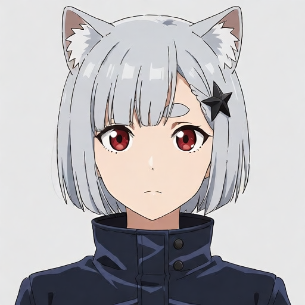 | 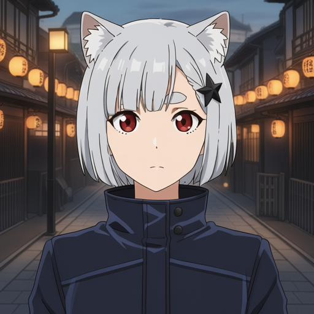 | 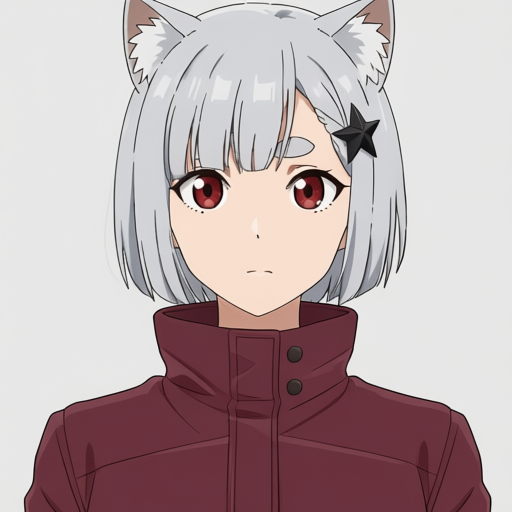 |

- 背景：燈籠街景符合要求，人物主要特徵保留；構圖稍拉遠、頭身比例與髮絲有變化。
- 服裝：外套改為酒紅，灰背景與主要特徵保留；頭部稍放大、上緣貓耳裁切，並非只換顏色。

#### 3D 動畫

| 原圖 | 換背景 | 換服裝 |
|---|---|---|
| 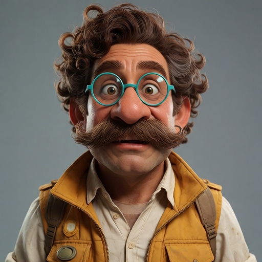 |  | 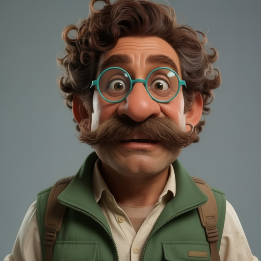 |

- 背景：叢林遺跡與原配色保留；臉部、眼睛與鬍鬚細節有重繪，仍可辨為同一設計。
- 服裝：背心改綠，眼鏡／鬍鬚／灰背景保留；臉形與表情略變，近景裁切略有變化。

#### 電影偵探

| 原圖 | 換背景 | 換服裝 |
|---|---|---|
| 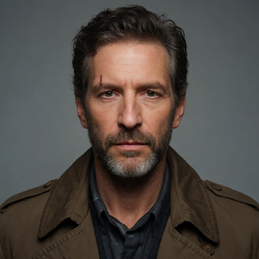 | 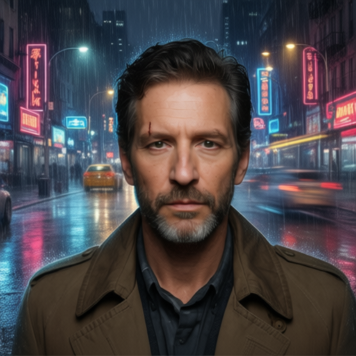 | 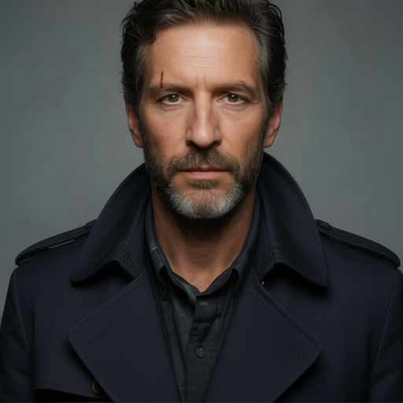 |

- 背景：雨夜霓虹街景符合，傷痕及棕外套保留；人物縮小、臉部與質感略變。
- 服裝：深藍外套符合；人物仍相近，但構圖明顯拉近並裁掉頭頂，衣領細節也重繪。

#### 古裝人物

| 原圖 | 換背景 | 換服裝 |
|---|---|---|
| 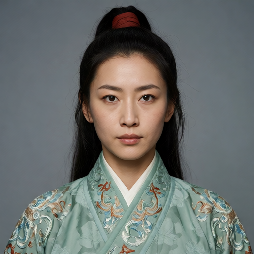 | 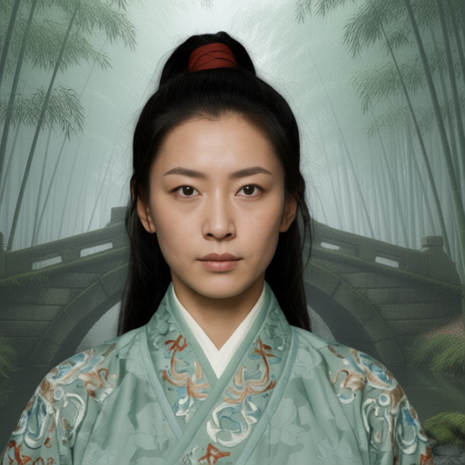 | 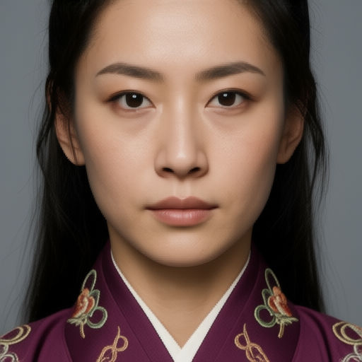 |

- 背景：竹林石橋符合，髮帶與袍服保留；刺繡和臉部細節改變，非像素級背景替換。
- 服裝：紫袍符合，但變成臉部特寫，馬尾／髮帶與多數服裝被裁出畫面，刺繡重繪。

#### 科幻人物

| 原圖 | 換背景 | 換服裝 |
|---|---|---|
| 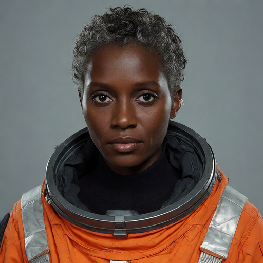 | 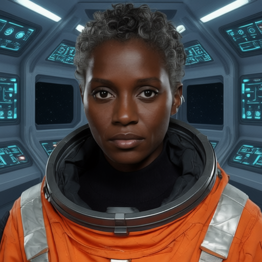 | 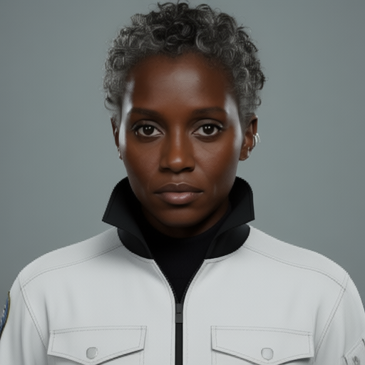 |

- 背景：太空船藍色儀表背景符合；臉與橘色服裝可辨，眼睛／領圈細節有變化。
- 服裝：白色服裝黑立領符合，但厚太空領圈／肩帶也被改掉；prompt 指定 utility flight suit 與原圖太空服結構有落差，不能全算非預期缺陷。

### CFG／多角度對照

45° 測試要求臉朝畫面右方；側面要求朝畫面左方。不是只要有轉頭就算符合方向。

#### 動畫：同 seed 的 CFG 2／4／6 與側面

| CFG 2・45° | CFG 4・45° | CFG 6・45° | CFG 4・左側面 |
|---|---|---|---|
|  |  | 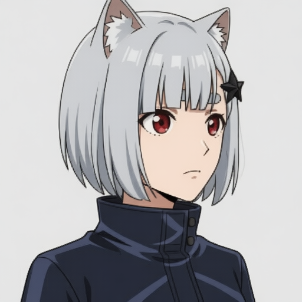 | 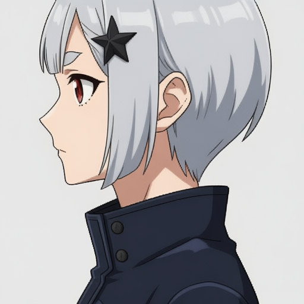 |

#### 真人偵探：同 seed 的 CFG 2／4／6 與側面

| CFG 2・45° | CFG 4・45° | CFG 6・45° | CFG 4・左側面 |
|---|---|---|---|
| 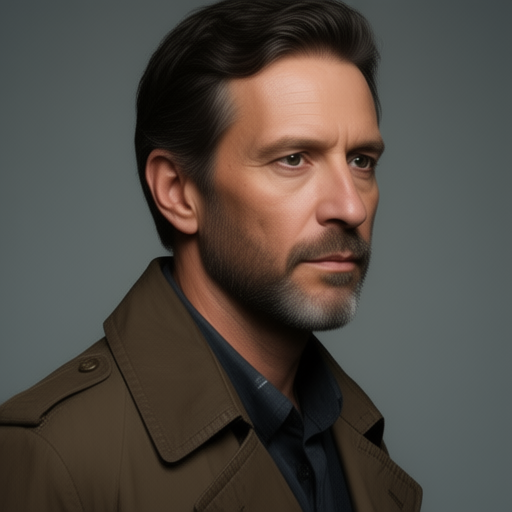 | 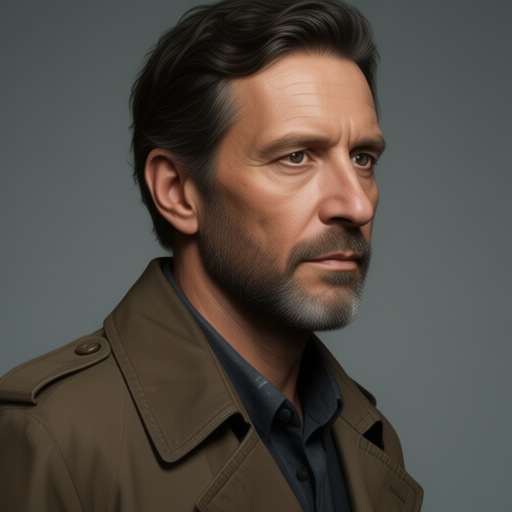 | 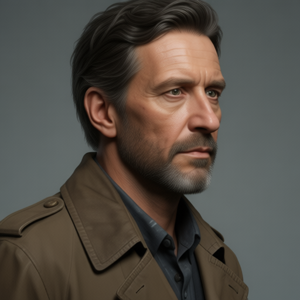 | 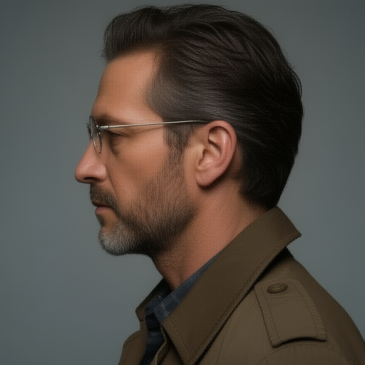 |

| 角色 | 45°／CFG 4 | 左側面／CFG 4 |
|---|---|---|
| 3D 動畫 | 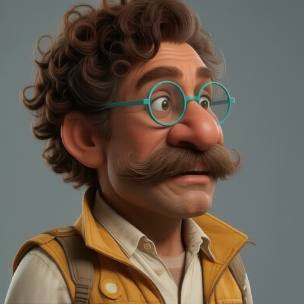 | 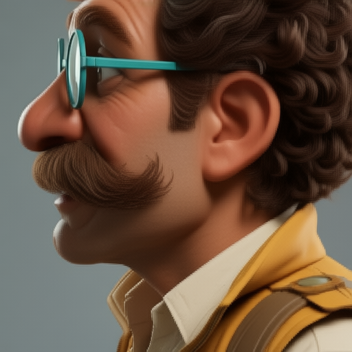 |
| 古裝 | 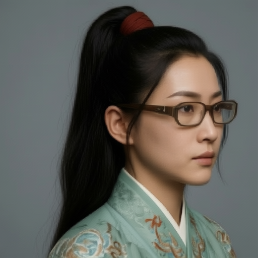 | 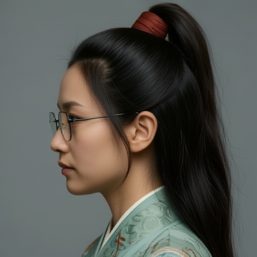 |
| 科幻 | 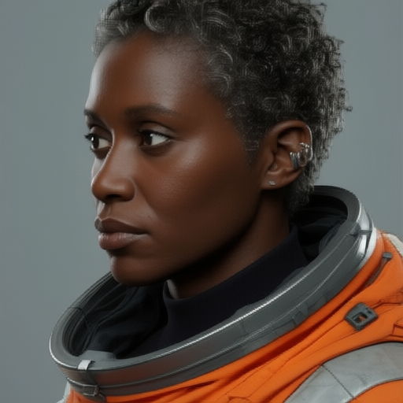 | 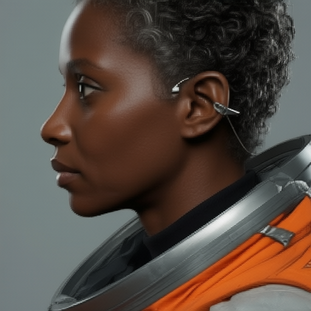 |

判讀摘要：

- 動畫 CFG 2 的臉較接近正面，沒有明確完成向右轉頭；CFG 4／6 較符合要求，兩者沒有明確全面優劣。
- 真人 CFG 2／4／6 都朝右，但髮色、髮型、皮膚質感與傷痕細節有變化；CFG 6 灰鬢更明顯不等於身份最佳。
- 3D 側面與動畫側面明顯拉近，局部頭頂／頭髮被裁；動畫貓耳因畫框限制不能直接判定為被刪除。
- 科幻 45° 結果朝左而不是指定向右；側面方向正確，但構圖与耳部細節仍變動。
- 無眼鏡的動畫／真人／古裝／科幻參考圖，在部分角度條件出現眼鏡或類似細線配件，
  **均受模板 glasses 措辭干擾，排除其模型缺陷歸因，不據此排名 CFG**。
- 不能宣稱 CFG 4 是通用最佳值；本次只支持它是可用的測試起點，缺少多 seed 與乾淨 prompt 對照。

### 眼鏡操作：明確要求的編輯與非目標變動

3D 人物原圖本來就有青色圓框眼鏡，此處明確要求換黑色方框／移除，
不同於前述「無眼鏡原圖被通用模板提到眼鏡」的干擾案例。

| 原人物 | 換黑色方框 | 移除眼鏡 |
|---|---|---|
|  | 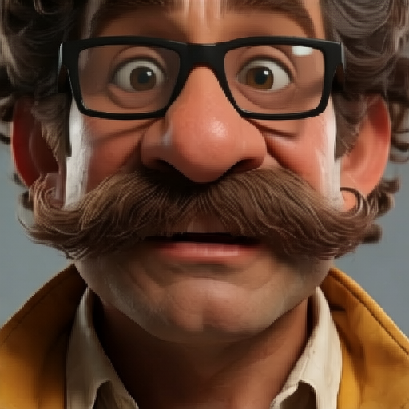 | 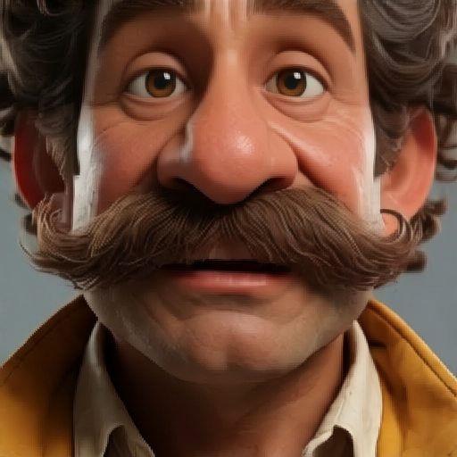 |

兩個指定操作都有發生，移除圖未見明顯鏡框殘留；但都變成極近特寫，
臉／眼睛細節也改變，不能稱為「只改眼鏡、其他完全不動」。

| 眼鏡原圖 | 45° | 側面 | 銀色材質 |
|---|---|---|---|
| 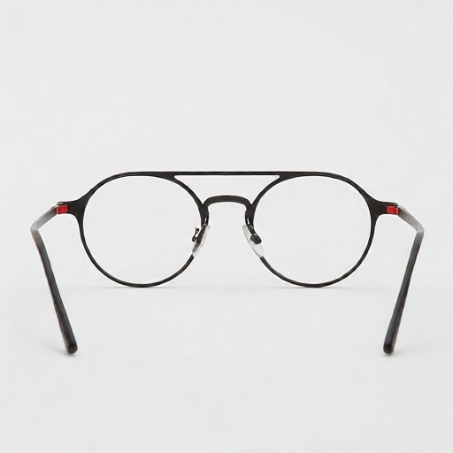 | 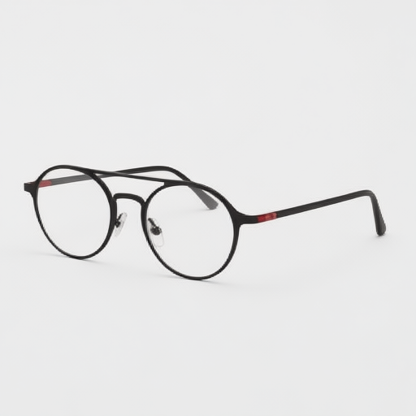 | 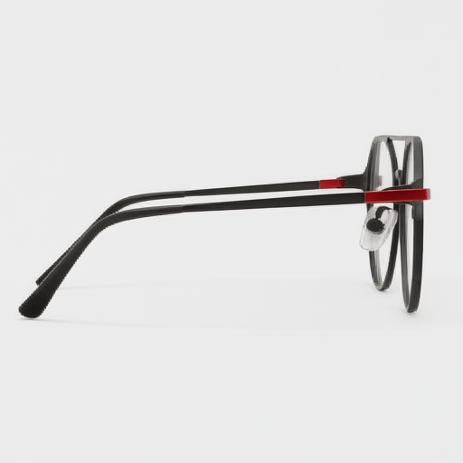 | 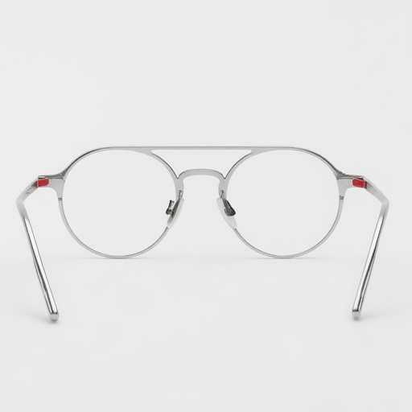 |

轉向與換銀色基本符合，紅鉸鏈保留；但換材質圖缺少原本上方直橫橋，雙橋結構未完整保留。
這個 prompt 明確要求保留雙橋，所以可記為本案例的非目標結構變動。
45°／側面僅證明視角改變，沒有3D真值，不能宣稱產品幾何精確一致。

### 35 張逐項參數、耗時與觀察

點成品名稱可開啟本 repo 內的圖片。參考圖使用 Krea2，其他列使用 Qwen；所有列 batch=1、512×512。

| 成品 | CFG | Steps | Seed | 執行秒 | 人工觀察 |
|---|---:|---:|---:|---:|---|
| [01-anime-reference](assets/qwen-image-edit-2511/01-anime-reference.png) | 1 | 12 | 2026091320 | 102.425 † | 原圖：銀髮紅眼、貓耳、圓眉與星形髮飾清楚，作為後續視覺基準。 |
| [02-animation3d-reference](assets/qwen-image-edit-2511/02-animation3d-reference.png) | 1 | 12 | 2026091321 | 23.074 | 原圖：捲髮、大鼻、鬍鬚、青色圓框眼鏡與黃背心可辨。 |
| [03-noir-reference](assets/qwen-image-edit-2511/03-noir-reference.png) | 1 | 12 | 2026091322 | 23.091 | 原圖：短髮短鬍、棕色外套、眉上傷痕可辨，沒有眼鏡。 |
| [04-period-reference](assets/qwen-image-edit-2511/04-period-reference.png) | 1 | 12 | 2026091323 | 23.022 | 原圖：高馬尾紅髮帶、玉綠刺繡袍與完整頭部構圖，沒有眼鏡。 |
| [05-scifi-reference](assets/qwen-image-edit-2511/05-scifi-reference.png) | 1 | 12 | 2026091324 | 23.086 | 原圖：銀色短捲髮、深膚色、橘色太空服與厚領圈；應依此生成圖而非文字理想設定判斷保留。 |
| [01-anime-background](assets/qwen-image-edit-2511/01-anime-background.png) | 4 | 40 | 2026091330 | 188.418 | 燈籠街景符合要求，人物主要特徵保留；構圖稍拉遠、頭身比例與髮絲有變化。 |
| [01-anime-outfit](assets/qwen-image-edit-2511/01-anime-outfit.png) | 4 | 40 | 2026091330 | 107.601 | 外套改為酒紅，灰背景與主要特徵保留；頭部稍放大、上緣貓耳裁切，並非只換顏色。 |
| [02-animation3d-background](assets/qwen-image-edit-2511/02-animation3d-background.png) | 4 | 40 | 2026091331 | 157.905 | 叢林遺跡與原配色保留；臉部、眼睛與鬍鬚細節有重繪，仍可辨為同一設計。 |
| [02-animation3d-outfit](assets/qwen-image-edit-2511/02-animation3d-outfit.png) | 4 | 40 | 2026091331 | 107.700 | 背心改綠，眼鏡／鬍鬚／灰背景保留；臉形與表情略變，近景裁切略有變化。 |
| [03-noir-background](assets/qwen-image-edit-2511/03-noir-background.png) | 4 | 40 | 2026091332 | 157.619 | 雨夜霓虹街景符合，傷痕及棕外套保留；人物縮小、臉部與質感略變。 |
| [03-noir-outfit](assets/qwen-image-edit-2511/03-noir-outfit.png) | 4 | 40 | 2026091332 | 107.616 | 深藍外套符合；人物仍相近，但構圖明顯拉近並裁掉頭頂，衣領細節也重繪。 |
| [04-period-background](assets/qwen-image-edit-2511/04-period-background.png) | 4 | 40 | 2026091333 | 157.672 | 竹林石橋符合，髮帶與袍服保留；刺繡和臉部細節改變，非像素級背景替換。 |
| [04-period-outfit](assets/qwen-image-edit-2511/04-period-outfit.png) | 4 | 40 | 2026091333 | 107.692 | 紫袍符合，但變成臉部特寫，馬尾／髮帶與多數服裝被裁出畫面，刺繡重繪。 |
| [05-scifi-background](assets/qwen-image-edit-2511/05-scifi-background.png) | 4 | 40 | 2026091334 | 157.707 | 太空船藍色儀表背景符合；臉與橘色服裝可辨，眼睛／領圈細節有變化。 |
| [05-scifi-outfit](assets/qwen-image-edit-2511/05-scifi-outfit.png) | 4 | 40 | 2026091334 | 107.675 | 白色服裝黑立領符合，但厚太空領圈／肩帶也被改掉；prompt 指定 utility flight suit 與原圖太空服結構有落差，不能全算非預期缺陷。 |
| [06-glasses-reference](assets/qwen-image-edit-2511/06-glasses-reference.png) | 1 | 12 | 2026091350 | 53.875 | 物體原圖：圓黑框、雙橋、紅鉸鏈、透明鏡片與展開鏡腳可辨。 |
| [01-anime-threequarter-cfg2](assets/qwen-image-edit-2511/01-anime-threequarter-cfg2.png) | 2 | 40 | 2026091360 | 161.489 | 頭部未明確朝指定畫面右方，身體轉動而臉更接近正面；新增眼鏡有 prompt 干擾，排除該項歸因。 |
| [01-anime-threequarter-cfg4](assets/qwen-image-edit-2511/01-anime-threequarter-cfg4.png) | 4 | 40 | 2026091360 | 56.309 | 臉朝右，主要特徵保留；不是量測所得精確45度，仍有髮絲／耳形變化。 |
| [01-anime-threequarter-cfg6](assets/qwen-image-edit-2511/01-anime-threequarter-cfg6.png) | 6 | 40 | 2026091360 | 157.783 | 臉朝右，與CFG 4相近；耳形及髮量不同，無證據支持整體優於CFG 4。 |
| [01-anime-profile-cfg4](assets/qwen-image-edit-2511/01-anime-profile-cfg4.png) | 4 | 40 | 2026091360 | 107.687 | 朝左側臉符合，但構圖拉近且頭頂被裁切，貓耳無法完整驗證；不能直接判定貓耳消失。 |
| [02-animation3d-threequarter-cfg4](assets/qwen-image-edit-2511/02-animation3d-threequarter-cfg4.png) | 4 | 40 | 2026091361 | 154.331 | 朝右三分之二視角，青色圓框眼鏡、鬍鬚、黃背心保留；局部造型變化。 |
| [02-animation3d-profile-cfg4](assets/qwen-image-edit-2511/02-animation3d-profile-cfg4.png) | 4 | 40 | 2026091361 | 107.759 | 朝左側臉，眼鏡鏡腳可見；明顯變成特寫，頭髮與軀幹裁切，未維持相近構圖。 |
| [03-noir-threequarter-cfg2](assets/qwen-image-edit-2511/03-noir-threequarter-cfg2.png) | 2 | 40 | 2026091362 | 157.835 | 朝右視角符合；頭髮／鬍鬚較深、皮膚較平滑，原眉上傷痕不清楚；身份細節非精確保留。 |
| [03-noir-threequarter-cfg4](assets/qwen-image-edit-2511/03-noir-threequarter-cfg4.png) | 4 | 40 | 2026091362 | 57.711 | 朝右視角符合；髮型與傷痕細節有變化，與CFG2相近，未見明確全面優勢。 |
| [03-noir-threequarter-cfg6](assets/qwen-image-edit-2511/03-noir-threequarter-cfg6.png) | 6 | 40 | 2026091362 | 57.759 | 朝右視角符合；灰鬢較明顯，但傷痕仍難核對，不能憑較多灰髮判為最佳。 |
| [03-noir-profile-cfg4](assets/qwen-image-edit-2511/03-noir-profile-cfg4.png) | 4 | 40 | 2026091362 | 107.753 | 朝左側臉符合；髮型／鬍鬚細節改變；新增眼鏡屬受污染指標，不能判模型或batch缺陷。 |
| [04-period-threequarter-cfg4](assets/qwen-image-edit-2511/04-period-threequarter-cfg4.png) | 4 | 40 | 2026091363 | 157.798 | 朝右視角，馬尾／紅髮帶／綠袍可辨；新增眼鏡受prompt干擾，不作身份失敗證據。 |
| [04-period-profile-cfg4](assets/qwen-image-edit-2511/04-period-profile-cfg4.png) | 4 | 40 | 2026091363 | 107.755 | 朝左側臉與馬尾符合；髮型／臉部／刺繡細節變化；眼鏡同樣排除歸因。 |
| [05-scifi-threequarter-cfg4](assets/qwen-image-edit-2511/05-scifi-threequarter-cfg4.png) | 4 | 40 | 2026091364 | 157.804 | 有轉成三分之二視角，但朝畫面左方，與要求向右相反；耳部配件／服裝细节也有改變。 |
| [05-scifi-profile-cfg4](assets/qwen-image-edit-2511/05-scifi-profile-cfg4.png) | 4 | 40 | 2026091364 | 107.775 | 朝左側臉符合但裁切放大，耳周多出細線狀配件；涉及glasses措辭，不作乾淨的配件保留對照。 |
| [02-animation3d-glasses-replace](assets/qwen-image-edit-2511/02-animation3d-glasses-replace.png) | 4 | 40 | 2026091370 | 153.976 | 青色圓框換成黑色方框，目標達成；但變成極近特寫，大小／構圖與眼睛細節未維持。 |
| [02-animation3d-glasses-remove](assets/qwen-image-edit-2511/02-animation3d-glasses-remove.png) | 4 | 40 | 2026091370 | 107.785 | 眼鏡移除且未見明顯框架殘留，目標達成；極近特寫、眼神／眉毛改變，未達只改眼鏡。 |
| [06-glasses-threequarter](assets/qwen-image-edit-2511/06-glasses-threequarter.png) | 4 | 40 | 2026091375 | 153.824 | 物體視角有轉，黑圓框與紅鉸鏈可辨；双橋／鏡腳投影需幾何核對，單圖不能證明精確3D一致。 |
| [06-glasses-side](assets/qwen-image-edit-2511/06-glasses-side.png) | 4 | 40 | 2026091375 | 107.803 | 側面基本符合、鏡腳展開且紅鉸鏈可見；單視角不足驗證完整設計幾何。 |
| [06-glasses-material](assets/qwen-image-edit-2511/06-glasses-material.png) | 4 | 40 | 2026091375 | 107.795 | 銀色材質與紅鉸鏈符合，但原本上方直橫橋不見，雙橋結構未完整保留。 |

† 第一張原圖的 Queue 時間包含缺失 history 的人工恢復等待，排除於速度比較。
短暫 unknown 狀態沿用原 job identity 恢復，沒有重送生成。

### 驗證與結論

35 張來源圖的檔案 SHA256／PNG 解碼／512×512 尺寸與生成紀錄逐筆核對；
本 repo 附同一批原圖，沒有重生成、裁切或美化結果。完整 request／prompt／trace 仍在本機
`isuper/sample/qwen-edit-five-groups-20260913/` 與其 `advanced/`。
逐圖評估保存在 `visual-review.json`。遠端暫存分批清理，分別保留各批次 cleanup receipt；
圖像與評估結果保留於本機實驗資料及本 repo。

這輪的實用結論是：**模型能完成多種局部修改與視角改變，但構圖、細節和幾何保留不能直接假設成立**。
背景／顏色修改相對容易目視確認，換服裝與局部配件操作尤其要檢查額外拉近。
CFG 沒有單調改善，也沒有證据支持所有問題來自 FP8；本輪沒有 BF16／FP8 對照。
保留 prompt 干擾的歸因限制，不把不乾淨的案例包裝成模型能力定論。

## 12. 雙人物合照與局部編輯品質

兩張參考圖為 Krea2 生成的虛構成年人。Qwen 接收 ordered image 1／image 2，
輸出一張合照（batch 1）。
這驗證的是「兩張人物參考 → 同一張場景」，不是把兩個人的外貌融合成一個人。

### 原圖與結果

| 女人人物參考（image 1） | 男人人物參考（image 2） | Qwen 雙人合照 |
|---|---|---|
|  |  | 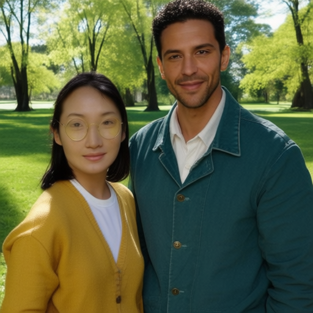 |

| 只換咖啡館背景 | 只換深藍外套 |
|---|---|
|  |  |

人工目視觀察：合照確實有兩人，女人在左、男人在右，公園背景成立，髮型和服裝顏色可對應。
但女人眼鏡明顯變大、鏡片／框色改變；兩人的臉部比例、衣領與衣服剪裁有漂移。
因此是多圖輸入與合照流程成功，**不是精確身份保留通過**。換背景與換外套的目標也達成，
但構圖從近臉拉遠、臉部細節改變，不能稱為只改指定區域。

### 實際合照 prompt（原文，未重寫）

```text
Create a photorealistic waist-up portrait of two adult friends standing side by side in a sunlit park. The woman from image 1 stands on the left, the man from image 2 on the right. Preserve each distinct facial identity, hairstyle, skin tone and clothing: woman with round gold glasses and mustard cardigan; man with curly hair, short beard and teal jacket. Both look toward the camera. Exactly two people, do not merge their faces, natural proportions, no text.
```

### 參數與耗時

| 輸出 | 模型 | Seed | Steps／CFG | Queue 執行秒 |
|---|---|---:|---|---:|
| 女人參考 | Krea2 | 2026091301 | 12／1 | 62.452 |
| 男人參考 | Krea2 | 2026091302 | 12／1 | 23.022 |
| 換咖啡館背景 | Qwen Edit 2511 | 2026091310 | 40／4 | 192.337 |
| 換深藍外套 | Qwen Edit 2511 | 2026091311 | 40／4 | 107.696 |
| 雙人物合照 | Qwen Edit 2511 | 2026091312 | 40／4 | 261.362 |

全部 512×512、batch 1。Qwen 為 FP8 mixed＋Qwen 2.5 VL 7B FP8 scaled（CPU）＋Qwen VAE，
Euler/simple、denoise 1、shift 3.1、CFGNorm 1，無外部 LoRA。指定尺寸，不是官方自動尺寸測量。
本表為 Queue 執行時間（含載入、編碼、採樣、解碼及輪詢），**不是第 4 節的 provider 純事件區間**；
不含排隊。首張另等既有工作 45.473 秒，其餘排隊約 0.45–0.47 秒。
雙人物 GPU 編碼未測量；單人物測速不能直接套用為合照速度。

來源：`isuper/sample/qwen-edit-validation-20260913/`；每張保留原始 prompt、request、trace，
`status.json` 記錄 seed／SHA256／尺寸與 cleanup。本 repo 五張 PNG 與來源逐一 hash／解碼核對，
沒有重生成或美化。遠端五個輸出、兩個 input 已清理，本機原件仍保留。
本組共五張，與第 11 節的 35 張分開計數。

## 13. 結論與待驗證項目

1. 將 tracing identity 與內容快取分離；比較編碼 cache miss／hit，保留正確的計時歸屬。
2. 實測每個 step 的模型 forward 次數、有效 batch shape、CFG 分組及 kernel／搬運時間。
3. 在已測 GPU 編碼配置下，評估共用 reference VAE 計算或編碼批次化；保持 prompt／seed／輸出配對不變。
4. 在正式 Pod 路徑重做有界配對測試，記錄 CPU、GPU 配額與同卡競爭，不混用環境數據。
5. 增加同圖／同 prompt／不同 seed 的候選生成對照，分開量測共用編碼與採樣收益。
6. 多輪重複測量後再決定預設 batch；當前資料不足以推薦以 batch 4 作為加速策略。

結論：GPU 編碼在測試條件下明顯降低單張與四張任務延遲；異質 batch 能成功產圖，
但尚無證據支持其相對配對串行生成有顯著吞吐量收益。品質測試支持局部修改與雙人物合成可行，
不支持精確身份／幾何保留保證。快取、編碼裝置與採樣效率是不同因素，須分別量測。
