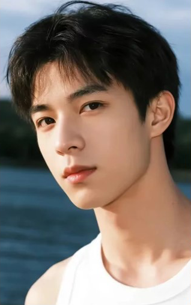
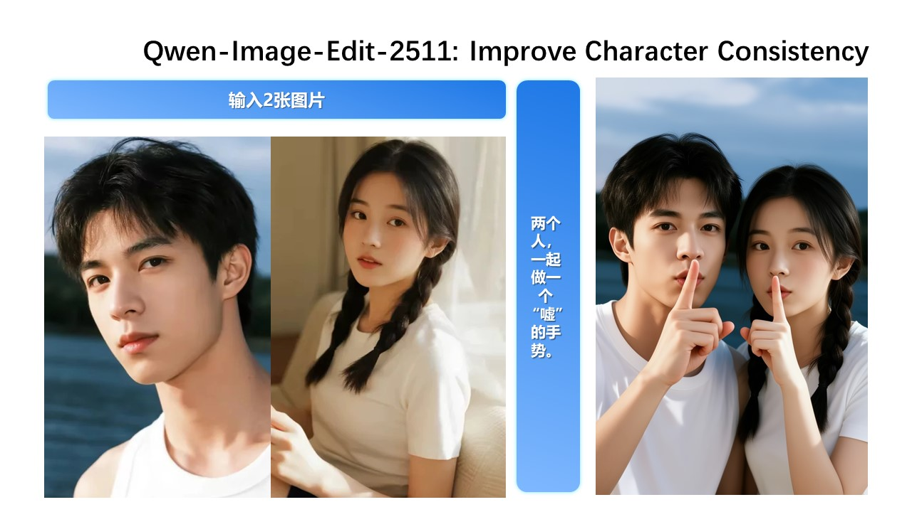

# 官方男女參考圖：Qwen Image Edit 2511／Codex／H3 比較

## 來源與輸入

- [官方模型頁](https://huggingface.co/Qwen/Qwen-Image-Edit-2511)
- [官方第 5 張展示圖](https://qianwen-res.oss-cn-beijing.aliyuncs.com/Qwen-Image/edit2511/%E5%B9%BB%E7%81%AF%E7%89%875.JPG)
- `official-slide-5.jpg` 是下載的官方拼圖；兩張參考圖僅做像素裁切並存為 PNG，沒有重新生成、修臉或放大。
- 原始拼圖為 1280×720。裁切座標採左上原點、右下不包含：男性 `(62,192,380,700)`；女性 `(380,192,710,700)`。已目視確認不包含右側官方合照或文字。

| Image 1：男性，318×508 | Image 2：女性，330×508 |
|---|---|
|  |  |

官方展示（右侧是官方結果，**不是本次輸出**）：



## 重測條件

使用官方展示圖上的指令，不自行補寫外貌：

```text
两个人，一起做一个“嘘”的手势。
```

| 項目 | 設定 |
|---|---|
| 模型 | 現有 Qwen Image Edit 2511 FP8 mixed |
| 編碼器 | Qwen 2.5 VL 7B FP8 scaled，device=default |
| 採樣 | Euler/simple，40 steps，CFG 4，denoise 1 |
| Shift／CFGNorm | 3.1／1 |
| 尺寸 | 640×1024，接近男性參考圖比例；既有 adapter 的第一圖縮放流程保留 |
| Seed | 20260913，本次指定，不是已知官方 seed |
| 候選／外部 LoRA | batch 1／無 |
| 服務 | 5090 現有 ComfyUI，等待其他工作完成，不中斷其他任務 |

40 steps／CFG 4 來自官方模型頁的通用範例；該展示案例本身沒有公開完整 seed／參數。輸入也是展示 JPEG 的裁切，而非官方未壓縮原件。因此這是同素材重測，不是精確復現，也不是與官方工作流的配對 A/B。

## 結果與紀錄

Qwen 執行成功，輸出 640×1024。ComfyUI provider 執行區間 173.473 秒；sampler 節點觀察區間 155.957 秒（可能包含模型載入，不稱純採樣）；runner 至結果保存 202.218 秒，不含前置等待既有 H3 工作結束的時間。

`verify.py` 使用隔離資料庫 schema，保存 request/events／本機成品。清理憑證確認本次兩個遠端 input、一個 output 已移除，本機原件保留，隔離 schema 已刪除；未清除其他任務檔案。

### Qwen 與 Codex 並排

| Qwen Image Edit 2511 FP8 mixed | Codex 內建生圖 |
|---|---|
|  |  |
| 640×1024，40 steps／CFG 4；runner 202.218 秒 | 1007×1562；工具呼叫約 22.3 秒 |

Qwen 目視：兩個主體完整出現，兩人都以食指靠近嘴唇；黑色短髮男性與雙辮女性、白色服裝能對應參考。女性在左、男性在右，背景偏向男性原圖的水面；原 prompt 沒有指定左右與背景，因此這些變化不算違反明示要求。臉部質感較平滑，角度與五官比例有變化，不能稱精確身份保留。

兩邊本次都達成雙人與手勢。Codex 圖目視有較多頭髮／衣物細節，但解析度不同，沒有盲評或身份分數，不能以單張建立模型排名。這次雙人結果也不能證明三參考圖問題已解決，或證明上一輪失敗就是 12 steps／裁切造成；素材、指令、參考數量、尺寸與步數均有變動。

## Codex 內建生圖對照

依使用者要求追加一次 imagegen skill 的內建工具測試；未改用 CLI/API，也未把官方右側成品當作參考。輸入順序與 Qwen 相同，完整工具 prompt 同為：`两个人，一起做一个“嘘”的手势。` 沒有追加外貌、構圖或身份提示。


目視：兩個人都有出現，兩人食指靠近嘴唇，符合「噓」手勢；深色短髮／雙辮子與白色服裝可對應參考。背景偏向女性原圖的室內場景，人物角度及構圖改變。這不是量化身份分數，也不代表精確保留所有面部特徵。

工具呼叫約 22.3 秒，包含工具端處理，不能當成純 GPU 推理耗時。工具沒有提供可核實的底層模型版本、seed、steps 或 CFG；實際輸出 1007×1562，未與 Qwen 鎖定。因此只能比較此介面的單次任務效果，不是等算力或等參數基準。原圖直接保留，沒有後製。

## H3 Ref2VA：最短 5 幀取圖

同一組男女裁切圖，以 H3 Ref2VA 生成極短片段後擷取圖片。沒有使用官方合成圖、Qwen 結果或 Codex 結果作為輸入。

| Qwen Image Edit 2511 | Codex 內建生圖 | H3 Ref2VA 第 1 幀 |
|---|---|---|
|  |  |  |

### 實際參數與耗時

| 項目 | H3 設定／實測 |
|---|---|
| 模型 | minimax_h3_ref2va_pruned_int8_convrot，standard，無 Turbo LoRA |
| 編碼器 | qwen3vl_32b_minimax_h3_int8_convrot，device=default；runtime 日誌為 CPU |
| 參考圖 | 2 張，男性 Picture 1／女性 Picture 2，ref_image_size=match |
| 輸出 | 640×1024，明確 length=5，實際 5 幀、24 fps、0.208333 秒 |
| 採樣 | Euler／linear_quadratic，20 steps，denoise 1，BasicGuider |
| Seed／batch | 20260913／1 |
| GPU 策略 | RTX 5090 31.36 GiB，H3 low-VRAM，reserve 6 GiB |
| Provider 執行 | 178.075 秒，依本次 prompt 的 history 起訖；無 cached nodes |
| 採樣節點區間 | 約 50.560 秒，可能含模型載入；第 1 步到第 20 步回報約 17.483 秒 |
| Runner 總耗時 | 201.783 秒，含提交、等待與收集失敗處理，結尾清理另計 |

H3 依 director skill 使用六欄 Ref2VA 格式，明確將 Subject 1／2 對應 Picture 1／2；固定男左女右、室內眼平中近景，兩人從首幀就保持「噓」手勢，無對白。完整內容見 [H3 實際 prompt](assets/h3-five-frame-couple-20260913/prompt.txt)。**這不是與前兩組完全相同的文字 prompt**：H3 有額外的角色保留、構圖和背景要求，不能宣稱嚴格 A/B 或普遍的模型勝率。

### 成果與限制

全部 5 幀均已檢查並保留：[1](assets/h3-five-frame-couple-20260913/frame-01.png)、[2](assets/h3-five-frame-couple-20260913/frame-02.png)、[3](assets/h3-five-frame-couple-20260913/frame-03.png)、[4](assets/h3-five-frame-couple-20260913/frame-04.png)、[5](assets/h3-five-frame-couple-20260913/frame-05.png)。[原始 MP4](assets/h3-five-frame-couple-20260913/h3-output.mp4)。

兩人均出現且完成手勢，男性無袖白上衣、女性雙辮子及白色短袖保留。臉部仍有柔化與形狀變化，不能稱精確身份保留；幀間存在亮度及細節變化。結果支持「H3 最短片段取圖」的可行性，但未驗證三人合成，也不足以證明全面強於 Qwen。H3 provider 178.075 秒與先前 Qwen 173.473 秒相近，這次沒有顯示明顯速度優勢；5 幀仍有前處理、編碼與載入成本。

**推論成功，但一般影片 collector 拒絕了結果。** 原始視頻足 5 幀；原生音軌只有 0.200000 秒，比目標短約 8.333 毫秒，因此產品的影音長度檢查回報 `result_corrupt`（SUP-8FEB1B77）。已從本機保留的原始 MP4 取圖，未重跑、補幀或修改產品檢查。若要產品化，應新增專用靜態圖片收集流程。

2 個遠端輸入與 1 個遠端輸出已精確清理，自有測試 schema 已移除；本機原始素材與結果均保留。完整工作流、收據與分階段時間见 [H3 實驗紀錄](assets/h3-five-frame-couple-20260913/README.md)。

## 其他候選模型（未在本組測試）

- 雲端：FLUX.2 [max]/[pro] 有官方多人物、多參考圖合成展示；Gemini 3 Pro Image（Nano Banana Pro）有角色參考支援。這是功能證據，不是與本組 Qwen 的配對勝率。
- 本機開放權重：FLUX.2 [klein] 9B 可作下一個獨立模型對照，官方列多參考圖支援；9B 是非商業授權，不應統稱 Apache 開源或保證一定勝過 Qwen。
- [BFL 模型比較](https://docs.bfl.ai/flux_2/flux2_overview)、[Google 圖片生成文件](https://ai.google.dev/gemini-api/docs/image-generation)。
