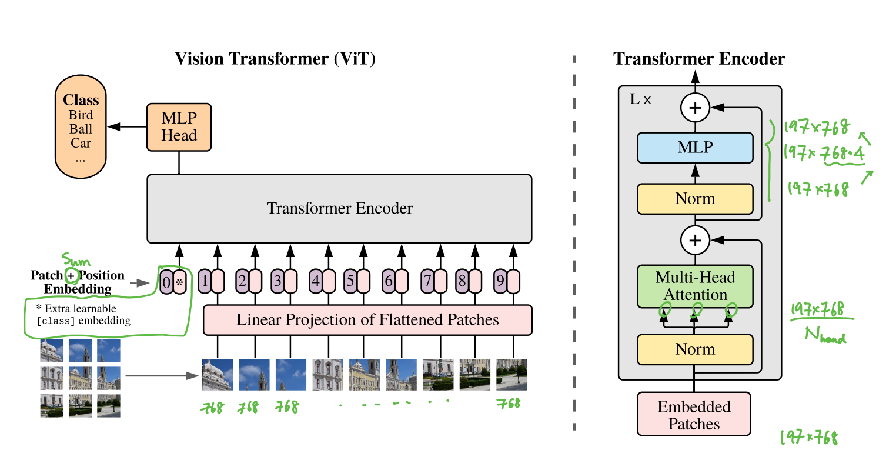

| Property  | Data |
|-|-|
| Created | 2023-02-22 |
| Updated | 2023-02-22 |
| Author | [@YiTing](https://github.com/yiting-tom), [@Aiden](https://github.com/Aidenzich) |
| Tags | #study |

# ViT: Transformer for image recognition at scale
| Title | Venue | Year | Code |
|-|-|-|-|
| [ViT: Transformer for image recognition at scale](https://arxiv.org/abs/2103.14030) | ICLR | '21 |  [✓](https://github.com/google-research/vision_transformer), [✓](https://github.com/lucidrains/vit-pytorch) |

- [Paper with note made with ⭐️ by YiTing](./assets/ViT.pdf)
## Abstract
In vision, attention is either applied in conjunction with `convolutional networks`, or used to replace certain components of convolutional networks while keeping their overall structure in place. 
We show that this reliance on CNNs **is not necessary** and a pure transformer applied directly to sequences of image patches can perform very well on image classification tasks. 
This is the first paper applys transformer in CV with scalability.

## Introduction
Thanks to Transformers’ computational efficiency and scalability, it has become possible to train models of unprecedented size, with the models and datasets growing, there is still no sign of saturating performance.

This paper experiment with applying a standard `Transformer` **directly** to images, with the fewest possible modifications by split an image into patches and provide the sequence of linear embeddings of these patches as an input to a Transformer:
- Image patches are treated the same way as tokens (words) in an NLP application. 
- The model be trained on **image classification in supervised fashion**.

### Transformers lack some of the inductive biases inherent to CNNs
- `Locality`: closer object would have similar features
- `Translastion equivariance`:
    $$
    (fog)(x) \equiv (gof)(x)
    $$
    - `equivariance`: if the input is changed in a certain way, the output will change in the same way, maintaining the relationship between the input and output. 

Therefore, transformer don't generalize well when trained on insufficient amounts of data. 
However, if the models are trained on larger datasets (14M-300M images). Finding that large scale training trumps inductive bias. ( ${\color{red}\text{ Large dataset} > \text{CNN's inductive biases}}$ )

## Proposed Method

The training resolution is 224, so the shape of a image is 224 ⨉ 224 ⨉ 3, and then patching the image by 16 ⨉ 16 ⨉ 3, we get 196 patched images.
$$
\begin{aligned}
&[ 224 \times 224 \times 3 ] \\ 
&\rightarrow  [16 \times 16 \times 3 ] \times 196 \text{  pathed images} \\
&\rightarrow_\text{flatten} {\color{pink}[768]} \times 196 \text{  pathed images} \\
\end{aligned}
$$
With the extra learnable `[class]` embedding, so the sequence shape is ${\color{green} 197 \times 768}$