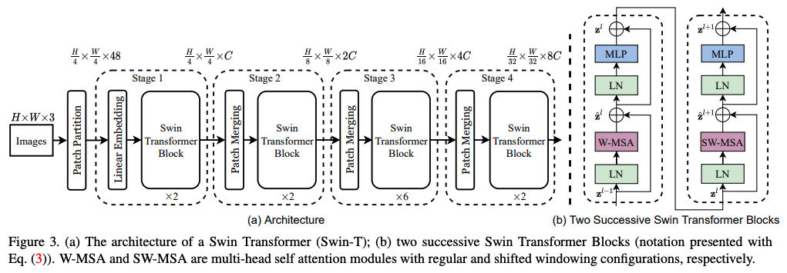
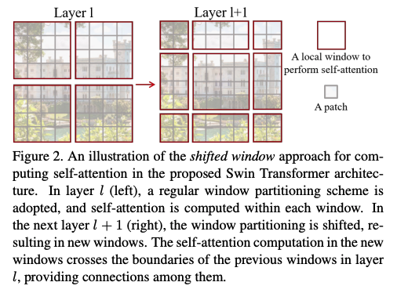
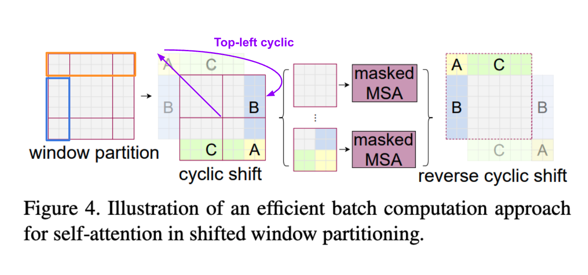
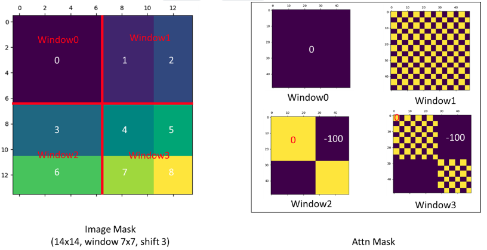
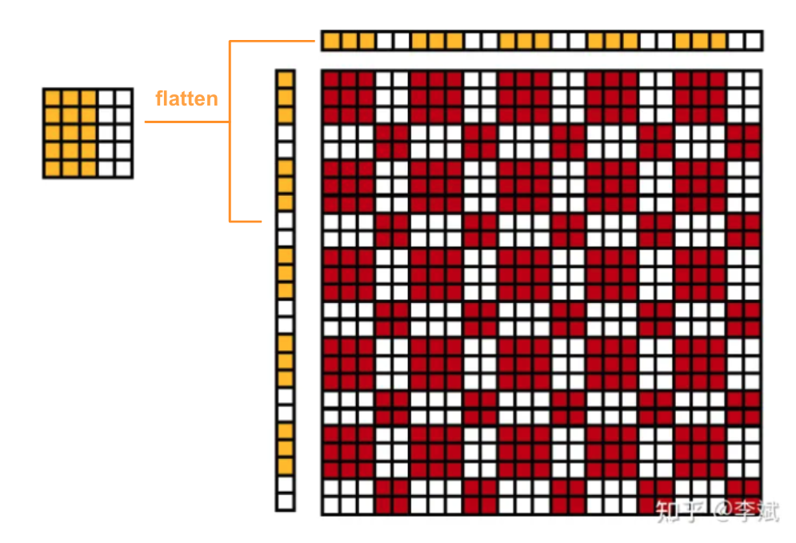
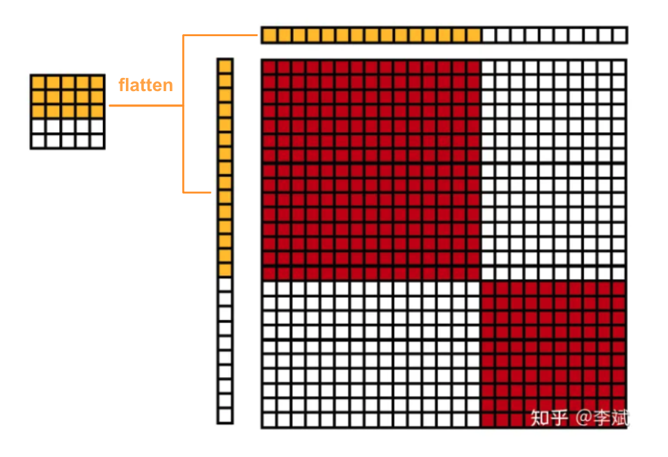
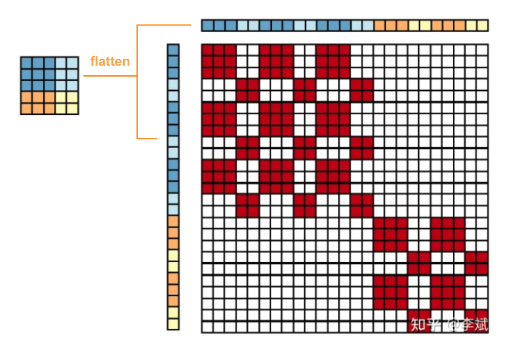

# Swin Transformer: Hierarchical Vision Transformer using Shifted Windows
## Abstract
`Swin Transformer`, that capably serves as a **general-purpose backbone** for computer vision. 
Challenges in adapting `Transformer` from language to vision arise from differences between the two domains, such as: 
- large variations in the scale of visual entities 
- The high resolution of pixels in images compared to words in text.

This paper propose a `hierarchical Transformer` whose representation is computed with `Shifted windows` To address these differences.

The shifted windowing scheme brings greater efficiency by **limiting self-attention computation** to `non-overlapping` `local windows` while also allowing for `cross-window` connection.

This hierarchical architecture has the flexibility to model at various scales and has linear computational complexity with respect to image size. The `hierarchical design` and the `shifted window approach` also prove beneficial for all-MLP architectures.

## Proposed Method

| Property | Definition |
|-|-|
| $C$ | A linear embedding layer is applied on this raw-valued feature to project it to an arbitrary dimension (denoted as $C$). |

### Shifted Window

A key design element of Swin Transformer is its shift of the window partition between consecutive(連續的) self-attention layers. 
Earlier `sliding window based self-attention` approaches suffer from low latency on general hardware due to diffrent `key` sets for different `query` pixels, therefore, Swin-T let all query patches within a window share the same `key` set, which facilitates memroy access in hardware. The experiments show that the proposed `shifted window` has the followning advantages when compared with `sliding windows` :
- much lower latency
- yet is similar in modeling power
- Proven beneficial for all-MLP architectures

#### Challenges of Shifted Window
An issue with shifted window partitioning is that it will result in **more windows**, and some of the windows will be smaller than $M \times M$.

So, this paper proposed a method name `Efficient Batch Computition Approach`

- `cyclic-shifting` toward the `top-left` direction. After the shift, a `batched window` may be composed of several sub-windows that **are not adjacent(鄰近的)** in the feature map.
    - Therefore, we have to use `masking mechanism` to **limit** `self-attention computation` to within each `sub-window`

## Masking mechanism

- A batched `window` can be composed of several `sub-windows`, i.e:

$$
\begin{aligned}
\text{Window } 0 &= \text{SubWindow} 0 \\
\text{Window } 1 &= \text{SubWindow} 1 + \text{SubWindow} 2 \\
\text{Window } 2 &= \text{SubWindow} 3 + \text{SubWindow} 5 \\
\text{Window } 3 &= \text{SubWindow} 4 + \text{SubWindow} 5 + \text{SubWindow} 7 + \text{SubWindow} 8
\end{aligned}
$$

- And the attention mask can be shown below situations (the window of the feature map needs to be flattened): 
    | Situation | Diagram |
    |-|-|
    | One Left One Right |  |
    | One Up One Down |  |
    | One window with 4 part |  |
    

## Reference 
- [Issue 38: The Question about the mask of window attention](https://github.com/microsoft/Swin-Transformer/issues/38)
- [The attention mask diagram example](https://zhuanlan.zhihu.com/p/542675669)
