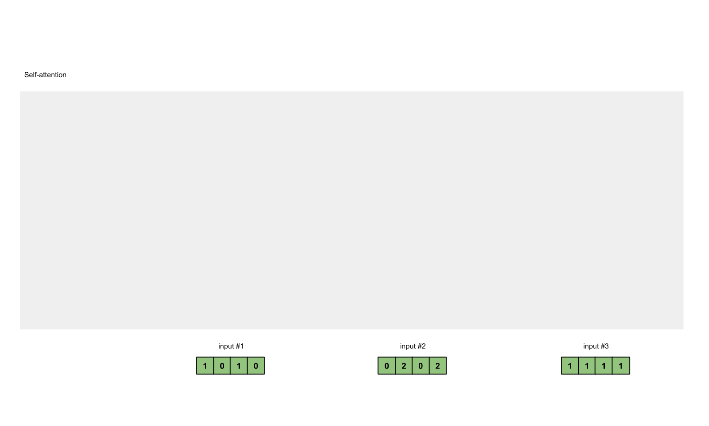

# Attention is All You Need


## Keywords
### Attention
#### Illustration

#### Python Code
```python
import math
import torch
import torch.nn.functional as F

def attention(query, key, value, mask=None, dropout=None):
    "Compute 'Scaled Dot Product Attention'"
    d_k = query.size(-1)
    scores = torch.matmul(query, key.transpose(-2, -1)) \
             / math.sqrt(d_k)
    if mask is not None:
        scores = scores.masked_fill(mask == 0, -1e9)
    p_attn = F.softmax(scores, dim = -1)
    if dropout is not None:
        p_attn = dropout(p_attn)
    return torch.matmul(p_attn, value), p_attn
```
#### Attention vs Fully Connected Network
- 單純使用 full connected network 會有極限：
- If we use a window covers the whole sequence for fully connected network to condsider the whole swquence...
    - FC requires a lot of parameters, the amount of calculation is large, and it may also be overfitting.
- 因此使用 Attention 讓模型能夠考慮到整個 sequence 但是又不把所有的資訊，所以我們有一個特別的機制。這個機制是根據 a 換個系統，
### Multi-Head Attention
### Positional Encoding
### Transformer Encoder
### Transformer Decoder
- `t0` 先輸入`起始符(S)`
- 通過n層 `Decoder Layer`計算masked自注意力與交互注意力(由decoder得到的q與encoder輸出的k，v計算)
- 最終在第n層`Decoder Layer`得到當前的預測結果projection（可以理解成“I love you”中的“I”）；在t1時刻，將t0時刻得到的輸出“I”輸入至decoder，重複t0的過程（計算masked自註意力與交互注意力），最終在第n層decoder layer得到輸出“love”。最後經過多次計算，得到完整輸出結果“I love you E”（E為終止符，由“you”輸入decoder得到）
