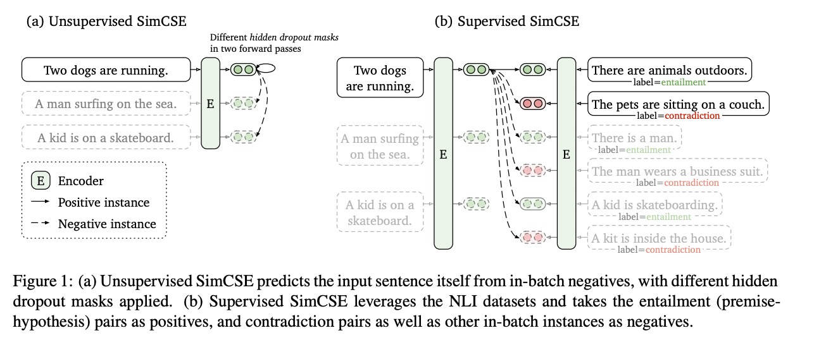

#  SimCSE: Simple Contrastive Learning of Sentence Embeddings
- [paper](https://arxiv.org/abs/2104.08821)

## Core Illustration

## Idea
使用 Contrastive Learning 的方式運又在 NLP 上使用，可以區分為 Unsupervised 與 Supervised 兩種任務：
### Unsupervised
- 將一 vector 透過 Encoder Model 中輸出兩次，將這兩個不同的向量視為一個 postive pair
  - Encoder Model 是一個具 dropout 的 Transformer 模型
## Reference
- [中文說明](https://fcuai.tw/2021/05/13/simcsecontrastive-learning-nlp-sentence-embedding-sota/)