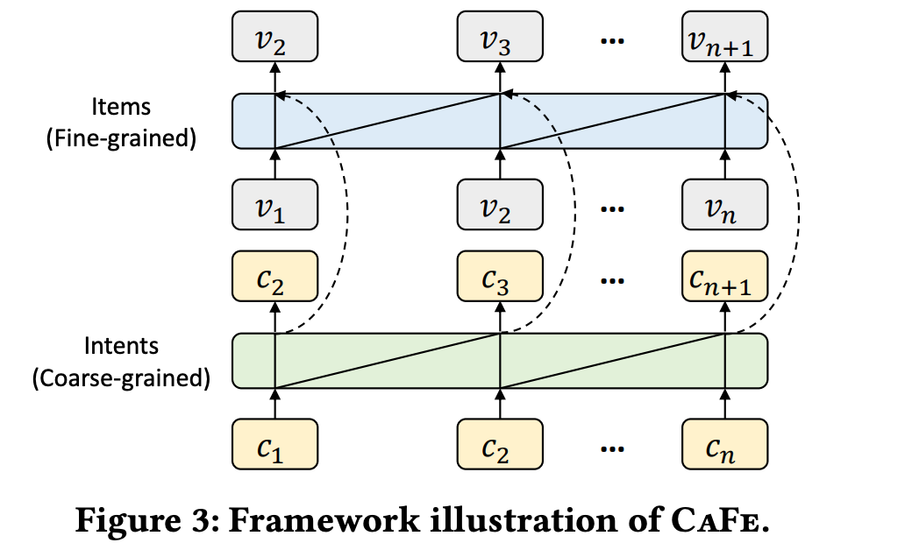

# CaFe: Coarse-to-Fine Sparse Sequential Recommendation
Self-attentive methods still struggle to `model sparse data`, on which they struggle to learn high-quality item representations. 
This paper proposes to model user `dynamics` from `shopping intents` and `interacted items` simultaneously. The learned intents are `coarse-grained` and work as `prior knowledge` for item recommendation. 
This paper presents a coarse-to-fine self-attention framework, namely `CaFe`, which explicitly learns `coarse-grained` and `fine-grained` sequential dynamics. 
- Specifically, `CaFe` first learns intents from `coarse-grained` sequences which are `dense` and hence provide high-quality user intent representations. 
- Then, `CaFe` fuses intent representations into item encoder outputs to obtain improved item representations. 

Finally, infer recommended items based on representations of items and corresponding intents.

## Problem Definition
To explore why `self-attentive models` fail on `sparse sequences` and validate our motivation, we first conduct two motivating experiments (Section 2.3) with a representative self-attentive recommender (BERT4Rec [17]). 

Results reveal that main reasons: 
- (1) although self-attentive models directly attend on all interactions, they
tend to focus on `recent items` when trained on (item-)sparse datasets.
- (2) embeddings of `long-tail (infrequent) items` are under-trained
while models represent frequent items well.

## Methods

To address the above problems, we can employ another `dense sequence` (called an `intent sequence`) to provide `prior knowledge` and `well-trained representations` for items. 
As shown in Figure 1, although a user interacts with many items (including infrequent
items) in the item sequence, several fall under the same shopping intent. 
- For example, the laptop and the mouse belong to the category `Laptops & Accessories` , and are often purchased together.

Hence, if we view categories as `intents` and `explicitly` model the intent sequence to predict the next intent, `infrequent items` can be better understood by their corresponding intent.  `Intents` in our paper could be categories, taxonomies, or sellers which can reveal high-level `semantics` of items. 

Critically, `intent sequences` are relatively dense and make it easy to capture long-term preferences of users. 

Note that some previous works also modeled user shopping intents by implicitly inferring them from items [ [3](https://arxiv.org/pdf/1908.10171.pdf) , [11](), [19](https://cseweb.ucsd.edu/~jmcauley/pdfs/www20.pdf) ] or feature fusion into item representations [14, 25].  However, we find that these implicit intent methods do not improve recommendation performance especially on highly-sparse datasets. 

In contrast, our method explicitly learns `intent sequences` and `item sequences` which can improve sequential recommendation on sparse datasets.

### Intent Encoder
Intent sequences are usually `dense` because $|C|$ is much smaller than $|\mathcal{V}|$. This paper use [SASRec](../SASRec/) as an encoder for Intent sequence.

| Property | Definition |
|-|-|
| $\|C\|$ | Total number of Intent(Categories) |
| $\|\mathcal{V}\|$ | Total number of items |
| $M^c$ | Intent embeddings given to SASRec |
| $R^c \in \mathbb{R}^{d \times n}$ | Intent sequence representations, which are the outputs of SASRec  |

### Item Encoder
Basically is a directional Transformer but focus on recent items. Inspired by [Locker: Locally Constrained Self-Attentive Sequential Recommendation, CIKM'21](https://cseweb.ucsd.edu/~jmcauley/pdfs/cikm21.pdf)

$$
\begin{aligned}
f_{\text{att}}(Q_i, K_j) &= \frac{\exp(w_{ij}) \cdot {\color{red}\theta_{ij}}}{\sum^n_{k=1} \exp(w_{ik}) \cdot {\color{red}\theta_{ik}}}, \, w_{ij} = {\color{orange}\frac{Q_i K_j^T}{\sqrt{d}}} \\
{\exp(w_{ij}) \cdot \theta_{ij}} &= \exp(w_{ij} + \ln \theta_{ij}) \\
{\ln \theta_{ij}} &= (H^j_i W^{(m)}_Q + H^l_j W_K^{(m)} + d_{ij}) W_L^{(m)} + b_L {\color{cyan}\text{  We learn } \ln\theta_{ij} \text{ from } H^l_i, H^l_j \text{ the distance between items } v_i \text{ and } v_j}
\end{aligned}
$$

> Note: I do not fully understand the implementation of this equation, need to dig into the implementation code

| Property | Definition |
|-|-|
| $\theta_{ij}, \theta_{ik}$ | masking score |
| $v_i, v_j$ | item i and item j |

