# Proposed Method
## The pain point of VAE
However, `conventional VAE` suffers from posterior collapse issues [ [21](../VAECF/), [46](https://arxiv.org/abs/2005.10242)]. 
Concretely, if the `decoder` is sufficiently expressive, the estimated `posterior distributions` of latent factors tend to resemble the standard Gaussian distributions, i.e., these estimations are indistinguishable from each other as they follow the same distribution [ [2](https://arxiv.org/abs/2002.05709), [21](../VAECF/) ]. 

Furthermore, VAE might collapse to point estimation for rare classes that simply memorize the locations in latent space. The highly skewed distribution of user behaviors will exaggerate these problems. 

Specifically, the sequential input data consists of long-tail items [20], which refer to the infrequent items that rarely appear in the users’ historical records. 

Such items account for a large portion of all items. These limitations prevent VAE from achieving satisfactory performance for SR tasks.

| Method | Related Research |
|-|-|
| Reducing the impact of the `KL-divergence` term by reducing its weight |  [VAECF](../VAECF/), [$\beta$-VAE](https://dl.acm.org/doi/10.1145/3459637.3482425), [RecVAE](https://arxiv.org/abs/1912.11160), [45](https://ieeexplore.ieee.org/document/9458633) |
| Introducing an additional regularization term that explicitly maximizes the mutual information between the input and latent | [2](https://arxiv.org/abs/2002.05709), [29](https://arxiv.org/abs/2110.05730), [46](https://arxiv.org/abs/2005.10242) |
| Using `Empirical Bayes` that observed data to estimate the parameters of a prior distribution | [BiVAECF](../BiVAE/) |

- The issue is much **more serious** in SR tasks as the user-item interactions are **extremely sparse**, and the user’s dynamic preferences would be hard to model. 
    - This paper find that these methods are insufficient for better performance on the SR. 
    - As a remedy, this paper address the problem from the two-view `constrastive learning` perspective, where we maximize the mutual information between two views of each sequence in latent space $I(𝑧, 𝑧')$

## The methods to solve posterior collapse
Recent advances in adopting `contrastive learning (CL)` for alleviating(減輕) representation degeneration problem [[29](https://arxiv.org/abs/2110.05730)] motivate us to resort to `contrastive learning` to mitigate the above issues. Concretely, contrastive learning encourages the uniform distribution of latent representations of different inputs [38], thus enforcing them distinguishable in latent space. 
Augmentations in CL encourage **perturbed sequences to share similar representations**, thus being robust to a large variance of the estimated posterior distribution. 

### Incorporate Contrastive learning into the framework of VAE
To incorporate `contrastive learning` into the framework of VAE, this paper first extend the conventional single-variable ELBO to the two-view case and propose `ContrastELBO`. 
Theoretically prove that optimizing `ContrastELBO` induces(誘發) a mutual information maximization term, which could be effectively optimized with CL [ [28](https://arxiv.org/abs/1905.06922), [37](https://arxiv.org/abs/1807.03748)].

To instantiate(實作) `ContrastELBO` for `Sequential Recommender`, we propose `ContrastVAE`, a **two-branched(?)** VAE model that naturally incorporates CL. `ContrastVAE` takes two augmented views of a sequence as input and follows the conventional(傳統的) encoder-sampling-decoder architecture to generate the next predicted item. 
- The model is learned through optimizing an `additional contrastive loss` between the latent representations of two views in addition to the **vanilla(having no special or extra features; ordinary or standard.)** reconstruction losses and KL-divergence terms. 
- To deal with the potential inconsistency problem led by uninformative data augmentations, we further propose two novel augmentation strategies: 
    - model augmentation and variational augmentation: which introduce perturbations in the latent space instead of the input space. 
- We conduct comprehensive experiments on four benchmark datasets, which verify the effectiveness of the proposed model for sequential recommendation tasks, especially on recommending long-tail items. 

## Methods
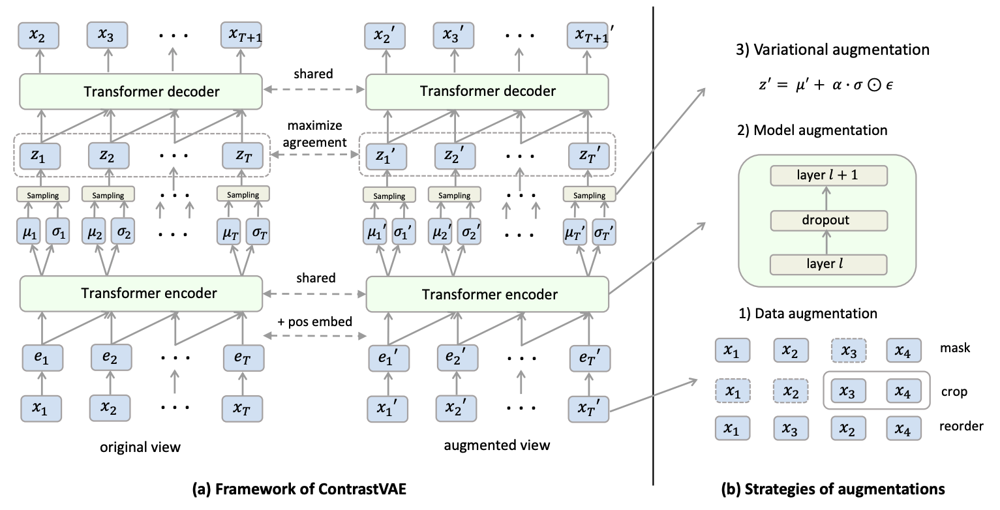

## ConstrastELBO
### Tradintional ELBO in VAE
$$
\log p(x) \geq \mathbb{E}_{q(z|x)} \log p(x|z) - D_{KL}[q(z|x)|| p(z)]
$$
### ELBO of the log joint probability of the observed variables
$$
\begin{aligned}
\log p(x, x') &\geq \mathbb{E}_{q(z|x)} \log p(x|z) - D_{KL} [q(z|x) || p(z) ] \\
&+ \mathbb{E}_{q(z'|x')} \log p(x'|z') - D_{KL} [q(z'|x')||p(z')] \\
&+ \mathbb{E}_{q(z, z' | x, x')} \log \big[ \frac{p(z,z')}{p(z)p(z')} \big]
\end{aligned}
$$
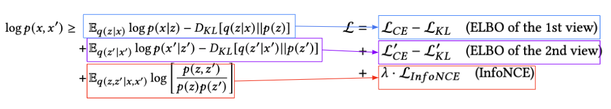

Proof Detail

#### Proof
- First, we use a variational distribution $q( z, z' | x, x' )$ to approximate the posterior distribution $p(x, x' | z, z')$, which could be factorized as:
    $$
    q(z, z'|x, x') = q(z|x)q(z'|x')
    $$
- Then:
    $$
    \begin{aligned}
    \log p(x, x') &= \log p(x) p(x') \\
    &= \log \int p(x, x', z, z') \cdot dz \cdot dz' \\
    &= \log \mathbb{E}_{q(z,z'|x,x')} \Bigg[ \frac{p(x, x', z, z')}{q(z, z' | x, x')} \Bigg] \\
    &\geq \mathbb{E}_{q(z,z'|x,x')} \log \Bigg[ \frac{p(x, x', z, z')}{q(z, z' | x, x')} \Bigg]
    \end{aligned}
    $$
- And the probability distribution of $x$ and $x'$ is only related to $z$ and $z'$, $x$ and $x'$ are independent of each other, so we can derive that:
    $$
    \begin{aligned}            
    &\geq \mathbb{E}_{q(z,z'|x,x')} \log \Bigg[ \frac{\color{orange}p(x, x', z, z')}{\color{blue}q(z, z' | x, x')} \Bigg] \\
    &= \mathbb{E}_{q(z,z'|x,x')} \log \Bigg[ \frac{\color{orange}p(x|z)p(x'|z')p(z, z')}{\color{blue}{q(z|x) q(z'|x')}} \Bigg] \\
    &= \mathbb{E_{q(z|x)}} \log [p(x|z)] + \mathbb{E_{q(z'|x')}} \log [p(x'|z')] + \color{red}{\mathbb{E}_{q(z,z'|x,x')} \log \Bigg[ \frac{p(z,z')}{q(z|x)q(z'|x')} \Bigg]}
    \end{aligned}
    $$
- The red term can be expand as:
    $$
    \begin{aligned}
    &\color{red}{\mathbb{E}_{q(z,z'|x,x')} \log \Bigg[ \frac{p(z,z')}{q(z|x)q(z'|x')} \Bigg]}  \\
    &= \mathbb{E}_{q(z,z'|x,x')} \log \Bigg[ \frac{p(z, z'){\color{orange}p(z)p(z')}}{{\color{orange}p(z)p(z')}q(z|x)q(z'|x')} \Bigg] \\
    &= \mathbb{E}_{q(z,z'|x,x')} \log \Bigg[ \frac{p(z,z')}{p(z) p(z')} \Bigg] + {\color{green} \mathbb{E}_{q(z,z'|x,x')} \log \Bigg[ \frac{p(z)p(z')}{q(z|x)q(z'|x')} \Bigg]} \\
    &= \mathbb{E}_{q(z,z'|x,x')} \log \Bigg[ \frac{p(z,z')}{p(z) p(z')} \Bigg]  \color{green}{ - \Bigg(  D_{KL} [q(z|x)||p(z)] + D_{KL}[q(z'|x')||p(z'))] \Bigg)} 
    \end{aligned}
    $$
    - The green term can be derived by the [definition](https://en.wikipedia.org/wiki/Kullback%E2%80%93Leibler_divergence) of KL divergence
- Finally, expand the red term, we get:
    $$
    \begin{aligned}
    &= \mathbb{E_{q(z|x)}} \log [p(x|z)] + \mathbb{E_{q(z'|x')}} \log [p(x'|z')] + \color{red}{\mathbb{E}_{q(z,z'|x,x')} \log \Bigg[ \frac{p(z,z')}{q(z|x)q(z'|x')} \Bigg]} \\
    &=  {
        \mathbb{E_{q(z|x)}} \log [p(x|z)]
        } + {
            \mathbb{E_{q(z'|x')}} \log [p(x'|z')]
        } + \color{red}{ \mathbb{E}_{q(z,z'|x,x')} \log \Bigg[ \frac{p(z,z')}{p(z) p(z')} \Bigg]  - \Bigg(  D_{KL} [q(z|x)||p(z)] + D_{KL}[q(z'|x')||p(z'))] \Bigg)}  \\
    &= 
        \mathbb{E_{q(z|x)}} \log [p(x|z)] - D_{KL} [q(z|x)||p(z)] 
    \\ 
    &+ 
        \mathbb{E}_{q(z'|x')} \log [p(x'|z')] - D_{KL}[q(z'|x')||p(z'))] 
    \\ 
    &+ 
        \mathbb{E}_{q(z,z'|x,x')} \log \Bigg[ \frac{p(z,z')}{p(z) p(z')} \Bigg] 
    \end{aligned}
    $$

## ConstrastVAE
### ELBO of 2 views
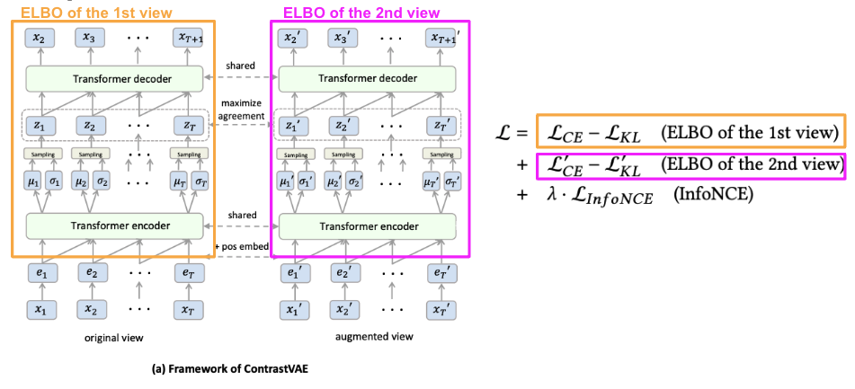

### Expected next item with cross entropy
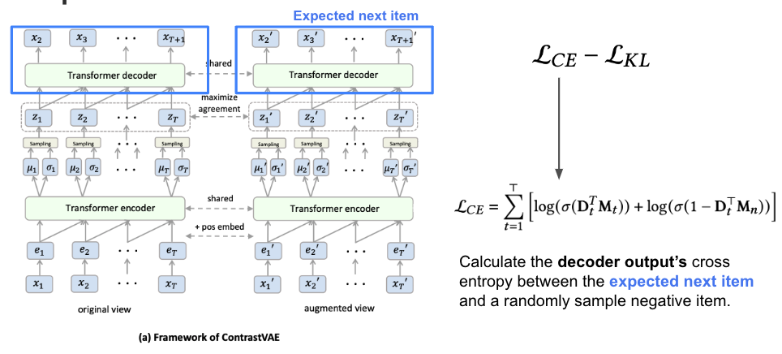

### Calculate KL Divergence between encoded distribution and prior distribution
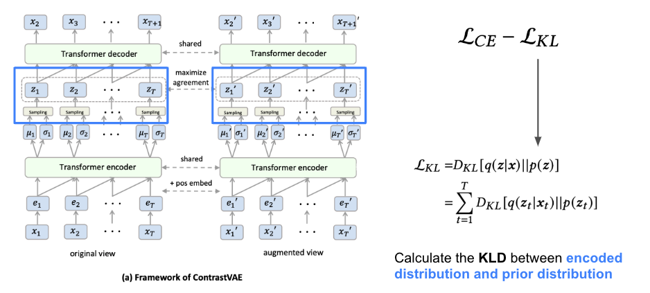

### Maximize the mutual information by InfoNCE
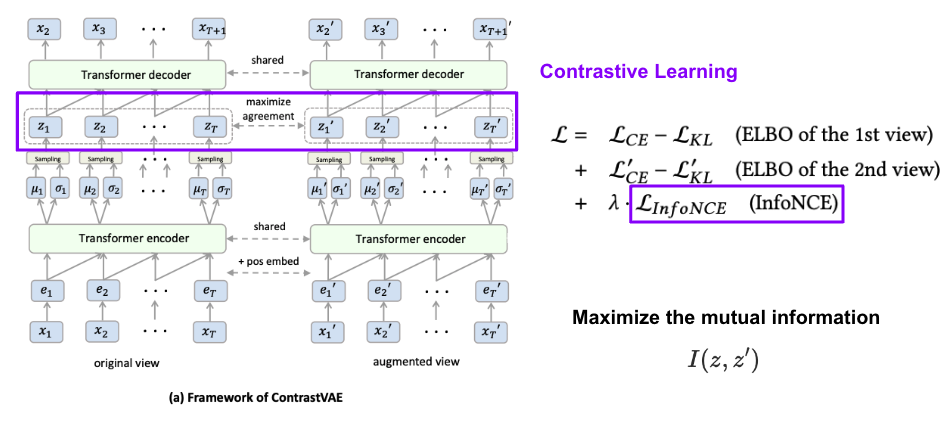

### Strategies of Augmentations

| Strategy | Description |
|-|-|
| `DA`, Data Augmentation in input space | Such as random masking, cropping, or reordering of a sequence. [Qiu et al.] argues that this may lead to inconsistency problems between 2 augmented views, especially when the sequences are very short |
| `MA`, Model Augmentation | Adding a `random dropout` in each intermediate layer of the Transformer encoder. Recent studies show that the simple dropout operation is powerful enough to generate informative views for CL. |
| `VA`, Variational Augmentation | Adding a `learnable Gaussian dropout` rate at sampling step |

#### Comparison of the performance of different augmentation strategies
To evaluate the effectiveness of different augmentation methods, this paper compare the performance when equipping different augmentation strategies to ContrastVAE, including `data augmentation (DA)`, `model augmentation (MA)`, and `variational augmentation (VA)`: 
1. For data augmentation, we follow Xie et al. [41] and adopt random cropping, masking and reordering together to generate a perturbed version for each input sequence, and use it as the input of the second branch of our model
2. For model augmentation, we simply apply the basic dropout to the encoder of the second branch; 
3. For variational augmentation, we apply variational dropout at the sampling step with reparameterization as introduced in Sec. 4.3.3.

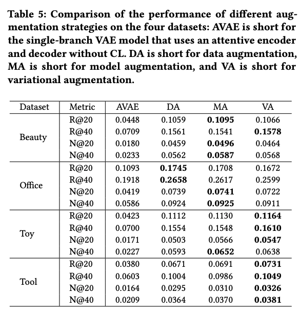
As shown in Table 5 all three augmentation strategies improve the model’s performance by a large margin, compared with the baseline method `AVAE`, which merely `uses single-branch VAE without CL`. We also have the following interesting observations: 

| Strategy | WinRate | Description |
|-|-|-|
| `DA` | 12.5% (2/16) | DA performs best on the Office dataset. This might be because the Office dataset has the largest `average sequence length` (see Table 1) and thus is less sensitive to the perturbation of data augmentations. |
| `MA` | 37.5% (6/16) | `MA` method performs competitively compared with DA but is much simpler. |
| `VA` | 50.0% (8/16) | `VA` achieves comparable or even better results, especially on Toy and Tool datasets with smaller average sequence length and testing item frequency. This shows that the proposed VA can effectively benefit the prediction of short sequences and long-tail items. |

### Analysis of ContrastVAE
#### ContrastVAE benefits the prediction of long-tail items and for short sequences
**Comparison of Item frequencies**
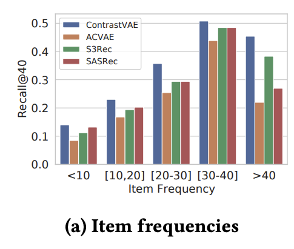
- Categorizing the user sequences into **5 groups** according to the frequencies of their last clicked items. 
- Reporting Recall@40 of `ContrastVAE` and representative baseline methods on the Toy dataset
- `ContrastVAE` achieves the highest Recall@40 sores on all groups of sequences. 
    - Specifically, on `long-tail items` (i.e., [≤ 10] and [10, 20]),  `ContrastVAE` outperforms other baseline models by a *large margin*. 

**Comparison of Sequence lengths**
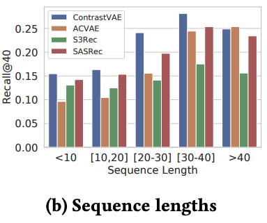
- Studying how the sequence length affects the model’s performance. 
- Reporting Recall@40 of `ContrastVAE` and representative baseline methods on the Toy dataset
- `ContrastVAE` consistently exhibits good performance on sequences with various lengths 
- `ContrastVAE` greatly improves the performance of `short sequences` (i.e., less than 20 interactions).
    - However, on longer sequences (e.g., [≥ 40] ), `ContrastVAE` doesn't show superior performance compared with other models, this may because for long sequences, the users’ preferences tend to become certain and easy to predict, in which case the `uncertainty` and `randomness` introduced by `ContrastVAE` would not help the prediction results.

#### ContrastVAE alleviates posterior collapse and point-estimation in latent space
As we know, the posterior collapse is caused by the `estimated posterior distribution` becoming too similar to the prior Standard Normal Distribution, which limited the decoder's capacity to generate diverse outputs. So there are 2 metrics to evaluate the quality of learned latent variables $z$: 
1. `Average KL Divergence`: `KLD` between the `posterior distribution` $p(z|x)$ of sequences and the standard Gaussian distribution $N(0, I)$ , which reflects the extent of `posterior collapse` problem (posterior collapse induces small KL-divergence)
2. `Variance`: The average `variance` of latent variables, which reflect the extent of `variance vanishing`.
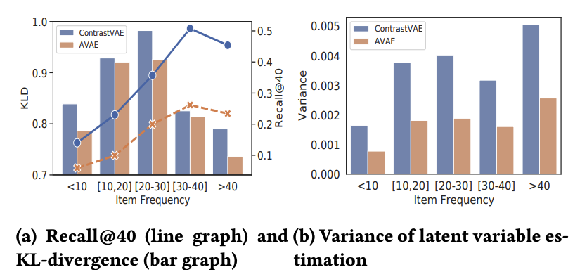

- For AVAE, the `KLD` between `latent variable` estimation and
`standard Gaussian distribution` are very low, especially for `infrequent items`, indicating that they `suffer from posterior collapse` problems.  Then, in this case, the representations of sequences that target different items would be hard to `discriminate` in `latent space`, leading to poor performance of AVAE model on infrequent items.
-  By contrast, `ContrastVAE` alleviates the `posterior degeneration`
through CL, which implicitly(?) encourages different sequences to
have `diverse latent representations`. 

An interesting observation is that the `KLD` of both `ContrastVAE` and `AVAE` decreases when the item’s frequency gets extremely large (e.g., > 30), and it might be because popular items are much easier to predict, thus, the model doesn't require a `fine-grained posterior estimation` to model it. 
From Fig. 3b we notice that AVAE model has `vanishing variance` over infrequent items, which indicates that AVAE collapses to point estimation for such infrequent items. On the contrary, `ContrastVAE` managed to increase the average variance over such sequences, thus increasing the robustness of noise.

#### Robustness analysis on the Toy dataset
Measure robustness by two corrupting strategies: 
1. randomly deleting a proportion of items in each sequence (random deletion)
2. randomly replacing proportion items with other items in each sequence (random replacement). 

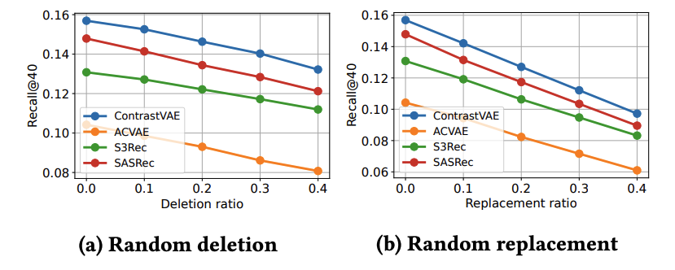
The performance of all models exhibits a drop as we increase the `corruption ratio`. However, ContrastVAE always outperforms other baseline models by a large margin whatever the corruption method and the corruption ratio, which indicates that ContrastVAE can still exhibit good performance for noisy input data.

#### Hyper-parameter sensitivity analysis 
Studying the performance variation of our model w.r.t. the intensity of the CL by tuning `the weight of Mutual Information loss` $\lambda$.

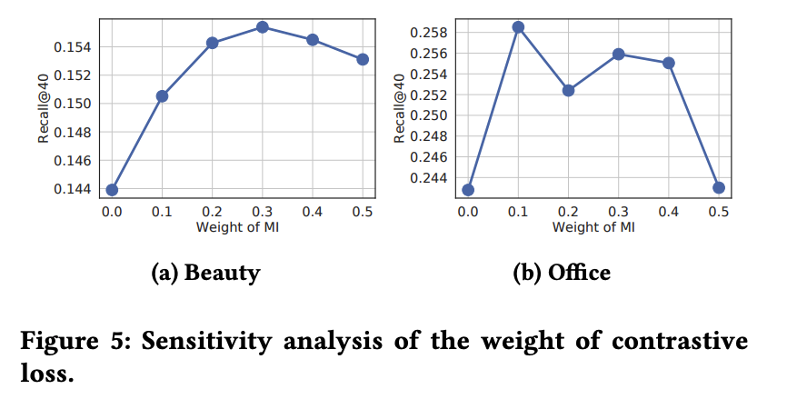

- A proper weight can lead to great improvements (up to 7.6%). 
- The weight cannot be too large otherwise, it would constrain the model’s learning from the next-item prediction tasks.