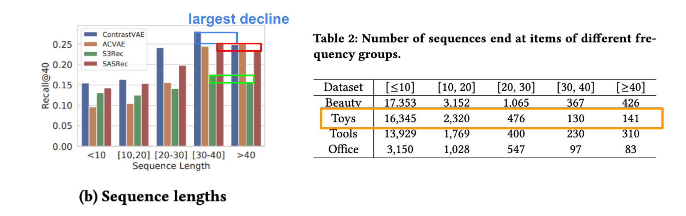
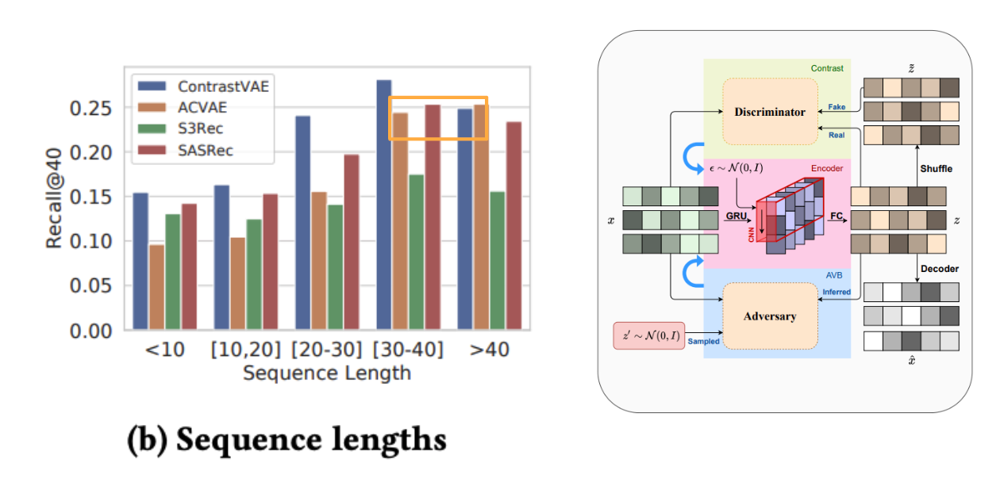

# Ponders
## Why can contrastive learning be used to alleviate posterior collapse?
$$
\begin{aligned}
\mathcal{L} &= \mathcal{L}_{CE} - \mathcal{L}_{KL} \\
&+ \mathcal{L}'_{CE} - \mathcal{L}'_{KL} \\
&+ \lambda \cdot {\color{orange}\mathcal{L}_{infoNCE}}
\end{aligned}
$$
- In the view of math function, we can quickly notice that with the regularization term from contrastive learning, the variational term can be dilution. Which may directly refer to the alleviation of posterior collapse.
- The idea of contrastive learning can be considered unsupervised clustering training, which helps models maximize the mutual information between two views of encoder-generated distribution $z$ and $z'$. This action might influence the origin distribution which was more similar to the prior `Normal Gaussian Distribution`, so the decoder can be release from the 
constraint of input.

## If the long sequences is certain and easy to predict, why the performance of other attention-based model decline together?

We know that the performance of an `attention model` is typically proportional to the size of the dataset. So if the specific sequence length is rare in the dataset, the performance on the type of sequence length may be affected.
However, the long sequences are certain and easily use to predict the user's behavior. So the performance of the long sequences might be better than shorter sequences.
So we assume the performance may be a trade-off between the benefit from the long sequences and the harm from the lack of data.

## And why ACVAE's performance risen instead of fallen?

I think this is because `ACVAE` use `GRU` as backbone model, which is typically less sensitive to the size of the dataset than attention models, as they do not rely on explicit attention mechanisms to weight the input features.
