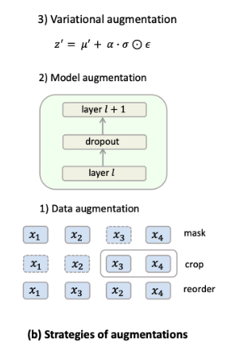

# ContrastVAE Introduction 

Using the original sequence's **`origin view`** and **`augmented view`** to VAE, and get the `latent factor` $z$ and $z'$ to maximize agreement contrastively.
- **Argumented view:**
    

## First. Introduction of the Background 
`Sequential Recommendation (SR)` has attracted increasing attention due to its ability to **model the temporal dependencies** in `users’ clicking histories`, which can help better understand user behaviors and intentions. 
Recent research *justifies(證明)* the *promising(有希望)* ability of self-attention models [SASRec](../SASRec/), [TiSASRec](../TiSASRec/), [BERT4Rec](../Bert4Rec/) in characterizing the temporal dependencies on real-world sequential recommendation tasks.
These methods encode a sequence as an embedding via an attentionbased weighted sum of items’ hidden representations. To name a few, [SASRec](../SASRec/) is a *pioneering(開創性)* work adopting the self-attention mechanism to learn transition patterns in item sequences, and [Bert4Rec](../Bert4Rec/) extends it as a bi-directional encoder to predict the next item.

## Second. The first Supporting paragraphs of background 
> "**Identifying problems** encountered in the existing branch and proposing technologies to solve them."

Despite their great representation power, both the **`Uncertainty problem`** and the **`Sparsity Issue`** impair their performance.

| Problem | Description | example |
|-|-|-|
| **`Uncertainty Problem`** | Due to the rigorous assumption of sequential dependencies, which may be destroyed by unobserved factors in real-world scenarios. | For music recommendations, the genre of music that a user listens may vary according to different circumstances. Nevertheless, those factors are unknown and cannot be fully revealed in sequential patterns. |
| **`Sparsity Issue`** | Sparsity Issue is a long-existing and not yet a wellsolved problem in recommender systems | Supposing that a user only interacts with a few items, current methods are unable to learn high-quality representations of the sequences, thus failing to characterize sequential dependencies.  |

- Moreover, the `sparsity issue` **increases** the deficiency(不足) of uncertainty in sequential recommendation. More concretely, if a user has fewer historical interactions, those uncertain factors are of higher dominance over sequential patterns. However, these 2 issues are seldom studied simultaneously.

## Third. The second Supporting paragraphs of background
> Proposing method which can solve the identified problem mentioned in the first supporting paragraphs

Therefore, we investigate the potential of adopting **`Variational AutoEncoder (VAE)`** into sequential recommendation. The reasons are threefold. 
1. VAE **can estimate the uncertainty of the input data** (really?). More specifically, it characterizes the distributions of those `hidden representations` via an encoder-decoder learning paradigm, which assumes that those representations follow a `Gaussian distribution`. Hence, the `variances` in `Gaussian Distribution` can well characterize the uncertainty of the input data. 
    - Moreover, the decoder maximizes the expected likelihood of input data conditioned on such latent variables, which can thus **reduce the deficiency from unexpected uncertainty**. 
2. The **posterior distribution estimation in VAE decreases the vulnerability to the sparsity issue**.
    - Though a sequence contains few items, we can still characterize its distribution from `learned prior` knowledge and thus generate the next item. 
3. Probabilistic modeling of those hidden representations also **enhance the robustness of sparse data against uncertainty**. 
    - Specifically, if we can ensure the `estimated posterior` of `perturbed input` still being in distribution, the decoder in `VAE` will tolerate such perturbations and yield correct next-item prediction

| Identified Problem | Method | Reason |
|-|-|-|
| `Uncertainty Problem` | VAE characterizes the distributions of the `hidden representations` via an encoder-decoder learning paradigm.  | The `variances` in `Gaussian Distribution` can well characterize the uncertainty of the input data. |
| | | The `decoder` maximizes the expected likelihood of input data **conditioned on** the latent variables. Can reduce the deficiency from unexpected uncertainty |
| `Sparsity Issue` | The posterior distribution estimation in VAE decreases the vulnerability to the sparsity issue. | Though a sequence contains few items, we can still characterize its distribution from learned prior knowledge and thus generate the next item. |

## 第四節
However, `conventional VAE` suffers from posterior collapse issues [21, 46]. 
Concretely, if the decoder is sufficiently expressive, the estimated posterior distributions of latent factors tend to resemble the standard Gaussian distributions, i.e., these estimations are indistinguishable from each other as they follow the same distribution [2, 21]. 

Furthermore, VAE might collapse to point estimation for rare classes that simply memorize the locations in latent space. The highly skewed distribution of user behaviors will exaggerate these problems. 

Specifically, the sequential input data consists of long-tail items [20], which refer to the infrequent items that rarely appear in the users’ historical records. 

Such items account for a large portion of all items. These limitations prevent VAE from achieving
satisfactory performance for SR tasks.

## 第五節
Recent advances in adopting contrastive learning (CL) for alleviating representation degeneration problem [29] motivate us to resort to contrastive learning to mitigate the above issues. Concretely, contrastive learning encourages the uniform distribution of latent representations of different inputs [38], thus enforcing them distinguishable in latent space. 
Besides, augmentations in CL encourage perturbed sequences to share similar representations, thus being robust to a large variance of the estimated posterior distribution. 
To incorporate contrastive learning into the framework of VAE, we first extend the conventional single-variable ELBO to the two-view case and propose ContrastELBO. 
We theoretically prove that optimizing ContrastELBO induces a mutual information maximization term, which could be effectively optimized with
CL [28, 37].

## 第六節
To `instantiate(實作)` `ContrastELBO` for `Sequential Recommender`, we propose `ContrastVAE`, a **two-branched(?)** VAE model that naturally incorporates CL. `ContrastVAE` takes two augmented views of a sequence as input and follows the conventional(傳統的) encoder-sampling-decoder architecture to generate the next predicted item. 
- The model is learned through optimizing an additional contrastive loss between the latent representations of two views in addition to the **vanilla(having no special or extra features; ordinary or standard.)** reconstruction losses and KL-divergence terms. 
- To deal with the potential inconsistency problem led by uninformative data augmentations, we further propose two novel augmentation strategies: 
    - model augmentation and variational augmentation: which introduce perturbations in the latent space instead of the input space. 
- We conduct comprehensive experiments on four benchmark datasets, which verify the effectiveness of the proposed model for sequential recommendation tasks, especially on recommending long-tail items. 

The contributions of this paper are summarized as follows:
- We derive `ContrastELBO`, which is an extension of conventional single-view ELBO to two-view case and naturally incorporates contrastive learning into the framework of VAE.
- We propose `ContrastVAE`, a two-branched VAE framework guided by `ContrastELBO` for sequential recommendation.
- We introduce model augmentation and variational augmentation to avoid the `semantic inconsistency problem` led by conventional data augmentation.
- We conduct comprehensive experiments to evaluate our method. The results show that our model achieves stateof-the-art performance on 4 SR benchmarks. 
- Extensive ablation studies and empirical analysis verify the effectiveness of the proposed components.