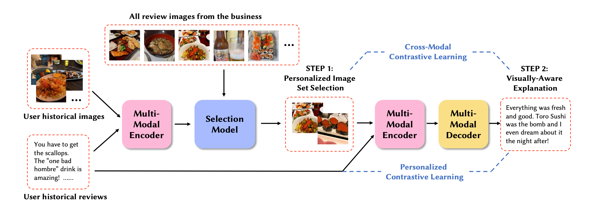
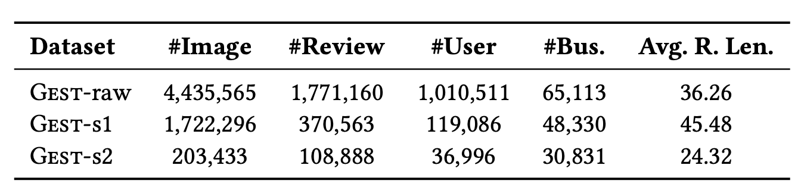
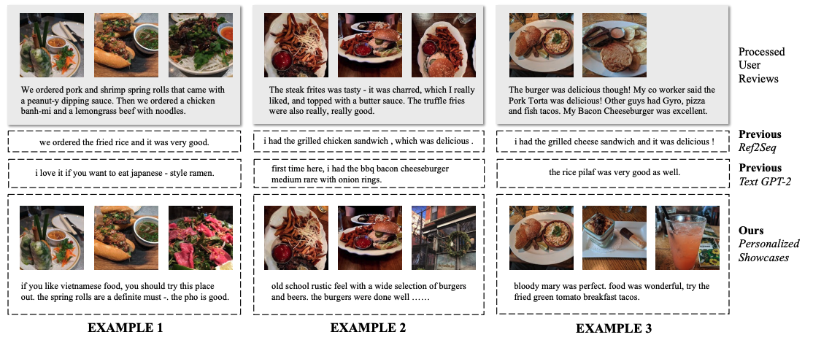

| Property  | Data |
|-|-|
| Created | 2023-02-21 |
| Updated | 2023-02-21 |
| Author | [@Aiden](https://github.com/Aidenzich) |
| Tags | #study |

# Personalized Showcases: Generating Multi-Modal Explanations for Recommendations
| Title | Venue | Year | Code |
|-|-|-|-|
| [Personalized Showcases: Generating Multi-Modal Explanations for Recommendations](https://arxiv.org/pdf/2207.00422.pdf) | pre | '22 | x |

Existing explanation models generate only text for recommendations but still struggle to produce diverse contents. 
In this paper, to further enrich explanations, this paper proposes a new task named personalized showcases, in which provides both textual and visual information to explain our recommendations. 
Specifically, the paper first selects **a personalized image set that is the most relevant to a user’s interest toward a recommended item**. Then, natural language explanations are generated accordingly given our selected images.
For this new task, we collect a large-scale dataset from Google Local (i.e., maps) and construct a high-quality subset for generating multi-modal explanations. 
We propose a personalized multi-modal framework which can generate diverse and visually-aligned explanations via contrastive learning. 
Experiments show that our framework benefits from different modalities as inputs, and is able to produce more diverse and expressive explanations compared to previous methods on a variety of evaluation metrics.
## Method

| Component | Description |
|-|-|
| `Multi-Model Encoder`  | `CLIP`, a state-fo-the-art pre-trained cross-modeal model as both `textual- and visual-encoders`  |
| `Image Selection Model` | Use [DPP]() to select the image subset |
| `Visually-Aware Explanation Generation` | Generating personalized explanations given a set of images and a user's historical reviews, with the extracted explanation dataset `GEST-s2`. build with `GPT-2` as the backbone  |

### Visually-Aware Explanation Generation
#### Multi-Modal Encoder

$$
\begin{aligned}
X_u &= \{ x_1, x_2, ..., x_K \} \quad {\color{orange}\text{User's historical reviews}} \\
R &= \{ r_1, r_2, ..., r_K \} \quad {\color{orange}\text{Review features extracted from the text encoder of CLIP}} \\
I &= \{ i_1, i_2, ..., i_n \} \quad {\color{cyan}\text{Personalized Images}} \\
V &= \{v_1, v_2, ..., v_n \} \quad {\color{cyan}\text{Visual features extracted from the visual encoder of CLIP}} \\
Z^V_i &= W^V v_i \quad {\color{magenta}\text{Latent space with } V  \text{ and learnable projection matrices } W^V} \\
Z^R_i &= W^R r_i \quad {\color{magenta}\text{Latent space with } R  \text{ and learnable projection matrices } W^R} \\
Y &= \{ y_1, ..., y_{t-1} \} \quad {\color{yellow}\text{Target explanation with decoding process at each time step } t} \\ 
\end{aligned}
$$

Then use a [multi-modal attention (MMA) module with stacked self attention layers]() to encode the input features:

$$
\big[ H^V ; H^R \big] = \text{MMA}([Z^V; Z^R])
$$

| Property | Definition |
|-|-|
| `;` | denotes concatenation |
| $H^V$, $H^R$ | aggregate features from 2 modalities |

#### Multi-Model Decoder
Use `GPT-2` as the decoder for generating explanations.

$$
\hat{y}_t = \text{Decoder}({\color{magenta}[H^V; H^R]}, {\color{yellow}Y})
$$

- The loss function is : 

$$
\mathcal{L}_\text{CE} = \sum^N_{i=1} \log p_\theta (Y^i|X^i, I^i)
$$

| Property | Definition |
|-|-|
| $N$ | Number of training samples $(X^i, I^i, Y^i)^N_{i=1}$ |
| $I$ | Use `ground truth images from the user` for training   Use image from the `image-selection model` for inference|

### Personalized Cross-Modal Contrastive Leaarning 
Unlike image captioning tasks where the caption is a short description of an image, our task **utilizes multiple images as “prompts” to express personal feelings and opinions about them**. 
To encourage generating `expressive`, `diverse` and `visual-aligned` explanations, we
propose a `Personalized Cross-Modal Contrastive Learning (𝑃𝐶2𝐿)` framework. 
We first project the `hidden representations of images`, `historical reviews`, and the `target sequence` into a latent space:

$$
\begin{aligned}
{\color{cyan} \hat{H}^V = \phi_V(H^V)} \\
{\color{orange} \hat{H}^R = \phi_R(H^R)} \\
{\color{yellow} \hat{H}^Y = \phi_Y(H^Y) }\\
\end{aligned}
$$

Then maximize the similarity between the pair of `source modality` and `target sequence`, and minimizeing the similarity between the `negative pairs` as follows:

$$
\begin{aligned}
\mathcal{L}_{CL} &= - \sum^N_{i=1} \log \frac{\exp (s_{i,j}^{X,Y})}{\exp (s_{i, i}^{X,Y}) + \sum_{j \in K} \exp({\color{red}s_{i, j}^{X,Y}})} \\
{\color{red}s_{i, j}^{X,Y}} &= sim(\hat{H}^X_i, \hat{H}^Y_j) / \mathcal{T}
\end{aligned}
$$

| Property | Definition |
|-|-|
| $\mathcal{T}$ | temperature parameter |
| $K$ | the set of negative samples for the sample $i$ |
| $i, j$ | 2 samples in the mini-batch, $j$ is a negative sample |

To ensure the visual grounding between multiple image features and output text, the paper proposed a `novel cross-modal contrastive loss`, which given a target explanation $Y$, then **randomly replace** the `entities`(extract using spacCy noun chunks) in the text with **other entities** presented in the dataset to construct a hard negative sample (i.e. "I like the *sushi*" to "I like the *burger*"):

$$
\begin{aligned}
Y &= \{ y_1, y_2, ..., y_t\} \\
Y^{\text{ent}} &= \{ y_1, y_2, ..., y_n, ..., y_t \} \\
{\color{red}Y^{\text{ent}}} &= \{ {\color{red}y'_{ent_1}}, y_2, ..., {\color{red}y'_{ent_2}}, .., y_L \} \quad \text{with randomly replace the entites} \\
{\color{red} Y'} &= \{ {\color{red} y'_1}, y_2, ...,  {\color{red} y'_n}, ..., y_t \}
\end{aligned} \\
$$

Adding the hidden representation of $Y^{\text{ent}}$ as an additional negative sample to formulate the `cross-modal contrastive loss`:

$$
\mathcal{L}_{CCL} = - \sum_{i=1}^N \log \frac{\exp(s^{{\color{cyan}{V}},Y}_{i,i})}{\exp (s^{{\color{cyan}{V}},Y}_{i,i}) + \sum_{j \in K \cup \text{\color{red}ent}} \exp(s^{{\color{cyan}{V}},Y}_{i,j}) }
$$

And, to enhance the personalization of explanation generation ...

$$
\begin{aligned}
\mathcal{L}_{PCL} &= - \sum_{i=1}^N \log \frac{ \exp (s^{{\color{orange}R},Y}_{i,i})}{\exp (s^{{\color{orange}R},Y}_{i,i}) + {\color{pink} f(i,j)} \sum_{j \in K} \exp(s^{{\color{orange}R}, Y}_{i, j}) } \\
{\color{pink} f(i, j)} &= \alpha^{(1-sim(\tilde{R}_i, \tilde{R}_j))} \quad {\color{pink} f  \text{ is a user personality similarity function to re-weight negative pairs}}
\end{aligned}
$$

- If the negative pairs with similar histories then reduce the weights. And if the negative pairs with distinct histories then increase the weights.

    | Property | Definition |
    |-|-|
    | $\alpha$ | it's a hyperparameter which $\alpha > 1$ |
    | $\text{sim}$ | the cosine similarity |
    | $\tilde{R}_i, \tilde{R}_j $ | the average features of **2 users' input historical reviews** |

## Dataset

| Dataset | Description | Details |
|-|-|-|
| *GEST-raw* | Collected reviews with images from *Google Local*. |
| *GEST-s1* | Subset of *GEST-raw*. For *personalized image set selection*. | Remove users with only one review for building a personalized dataset, then filter out reviews whose image urls are expired. |
| *GEST-s2* | Subset of *GEST-raw*. For *visually-aware explanation generation*. |

## Experiments
### Showcase

