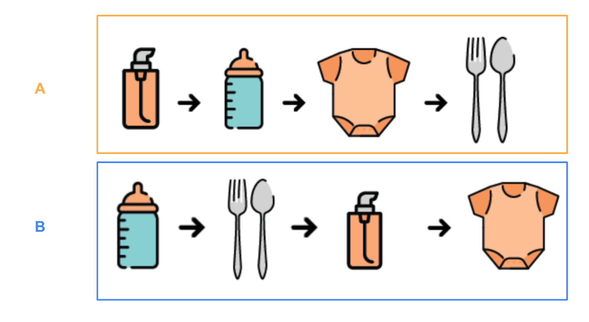
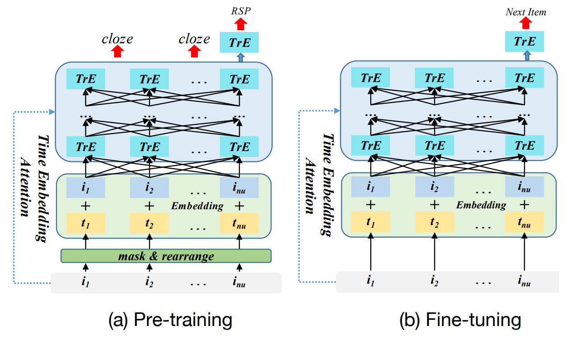
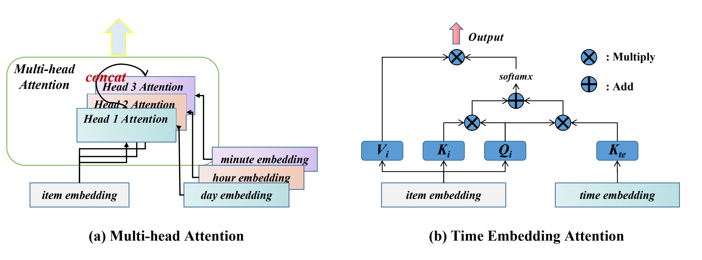
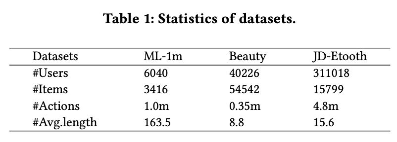
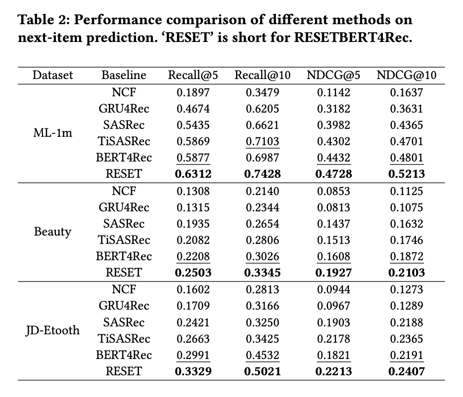

# RESETBERT4Rec: A Pre-training Model Integrating Time And User Historical Behavior for Sequential Recommendation
Despite the great success of existing sequential recommendation-based methods, they **focus too much on item-level modeling of users' click history** and **lack information about the user's entire click history (such as click order, click time, etc.)**. 

To tackle this problem, inspired by recent advances in pre-training techniques in the field of `natural language processing`, This paper builds a new pre-training task based on the original BERT pre-training framework and incorporate temporal information. 
Specifically, This paper proposes a new model called the **RE**arrange **S**equence pr**E**-training and **T**ime embedding model via BERT for sequential **R**ecommendation (RESETBERT4Rec ) 
It further captures the information of the `user's whole click history` by adding a `rearrange sequence prediction task` to the original BERT pre-training framework, while it integrates different views of time information. 

## Problem Define
1. The existing sequential recommendation methods often **pay too much attention to a single item in the user interaction history**, but cannot fully extract the information of the whole sequence level of the user interaction history, such as the `user’s click order`. 
    
    As shown in Figure 1, subfigure (a) and subfigure (b) are the browsing history sequences of two users of an online platform for the category of electric toothbrushes. 

    The items they browse are almost the same, but the click order is different, which shows that the click order of users’ items can reflect users’ preferences to a certain extent. 
    Actually, there has been some researches [9, 18] on user click order, but it still cannot make good use of order information. 

2. Another major limitation is that the existing sequence recommendation methods ignore the `interaction timestamp value` between users and items. Timestamp values are quite useful in sequential click tasks because they rife with information. Therefore, if the timestamp information can be introduced into the sequential recommendation model, it will have a great gain for the sequential recommendation task.

## Propose method
### Rearrange and Pretraining

Specifically, we `rearrange` the user’s original interaction history sequence according
to a certain probability, and let the model predict whether the input sequence is rearranged. 
In this way, the model can learn the `corresponding order preference` through the whole interaction behavior of users, the task is named **Rearrange Sequence Prediction(RSP)**. 

At the same time, the rearrange sequence prediction can better learn the `coarse-grained (sequence-level)` and `fine-grained (item-level)` information of user interaction history together with the close task focusing on a single item. 

Furthermore, to better utilize timestamp values, we propose a multi-view temporal encoding mechanism to mine user behavior patterns from different perspectives.

### Time embedding attention

Introducing a `multi-view time embedding attention mechanism` in both the pre-training and fine-tuning stages, as shown in above. 
Details as follow:
- To further model temporal information, we provide embeddings from
three different perspectives based on timestamps of user interaction history: day embeddings, hourly embeddings, and minute embeddings, and feed different embeddings to different heads of the transformer’s multi-head attention mechanism, act as different experts to improve diversity for decision-making, as shown in Figure (a). 
- At the same time, in this paper, we don't use the practice of adding `time embedding` and `item embedding` and then perform self attention, but adopt the practice of previous research [Transformer-XL](https://arxiv.org/abs/1901.02860), as shown in Figure (b).

## Experiments
### Datasets

### Comparison
