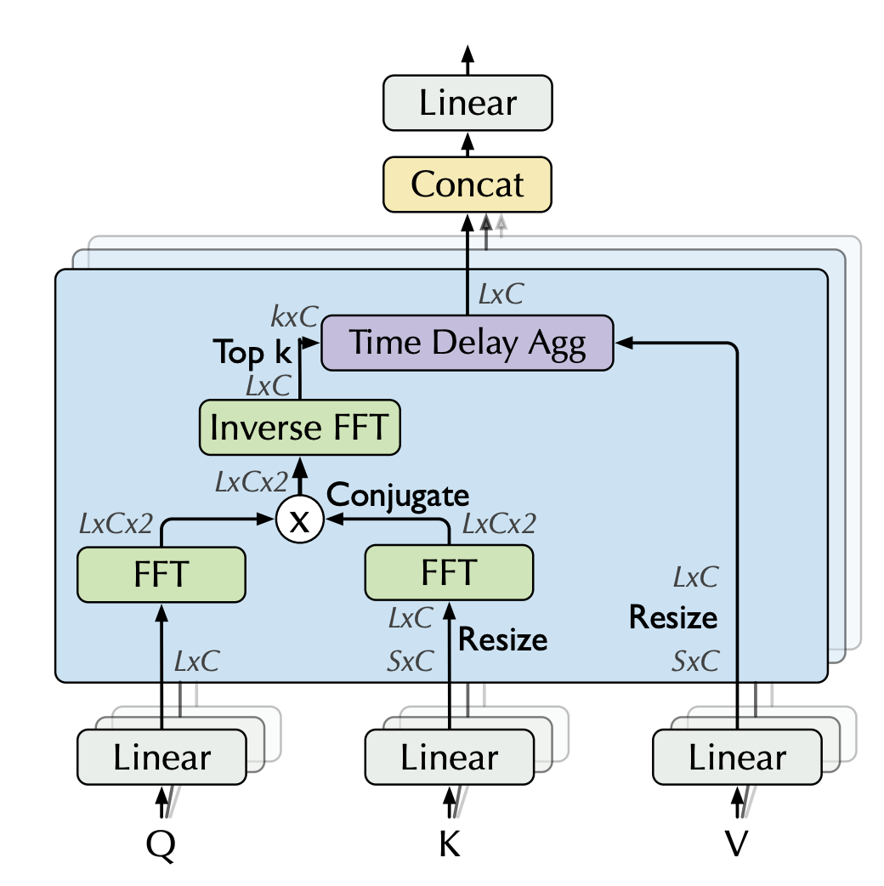

# Autoformer
| Title | Venue | Year | Code |
|-|-|-|-|
| [Autoformer: Decomposition Transformers with Auto-Correlation for Long-Term Series Forecasting](https://arxiv.org/pdf/2106.13008.pdf) | NIPS | 21 | [code](https://github.com/thuml/Autoformer) |
## Abstract
- **Cause:** intricate(錯綜複雜) temporal patterns of the long-term future prohibit(阻止) the model from finding reliable dependencies. 
    - Also, Transformers have to adopt the sparse versions of point-wise self-attentions for long series efficiency, resulting in the information utilization bottleneck. 
- **Process:** Design Autoformer as a novel decomposition architecture with an Auto-Correlation mechanism.
    - We break with the pre-processing convention of series decomposition and renovate it as a basic inner block of deep models. 
        - This design empowers Autoformer with progressive decomposition capacities for complex time series. 
        - Further, inspired by the **stochastic process theory**, we design the Auto-Correlation mechanism based on the series periodicity, which conducts the dependencies discovery and representation aggregation at the sub-series level. 
- **Effect:** Auto-Correlation outperforms self-attention in both efficiency and accuracy. 
    - In long-term forecasting, Autoformer yields stateof-the-art accuracy, with a 38% relative improvement on six benchmarks, covering five practical applications: energy, traffic, economics, weather and disease. 

## Introduction
Propose an original Autoformer in place of the Transformers for long-term time series forecasting. 

Autoformer still follows residual and encoder-decoder structure but
**renovates(翻新)** Transformer into a **decomposition(分解)** forecasting architecture. 
- By embedding our proposed decomposition blocks as the inner operators, Autoformer can progressively(逐步) separate the **long-term trend information** from predicted hidden variables. 
    - This design allows our model to alternately decompose and refine the intermediate results during the forecasting procedure. 
- Inspired by the stochastic process theory [8, 24], Autoformer introduces an Auto-Correlation mechanism in place of self-attention, which discovers the sub-series similarity based on the series:
    - periodicity and aggregates similar sub-series from underlying periods. 
This series-wise mechanism achieves O(Llog L) complexity for length-L series and breaks the information utilization bottleneck by **expanding the point-wise representation aggregation to sub-series level**.

## Methods
### AutoCorrelation

- Which can be used to replace the attention mechanism directly.

#### What is Time Delay Agg?
#### What is Fast Fourier Transforms?