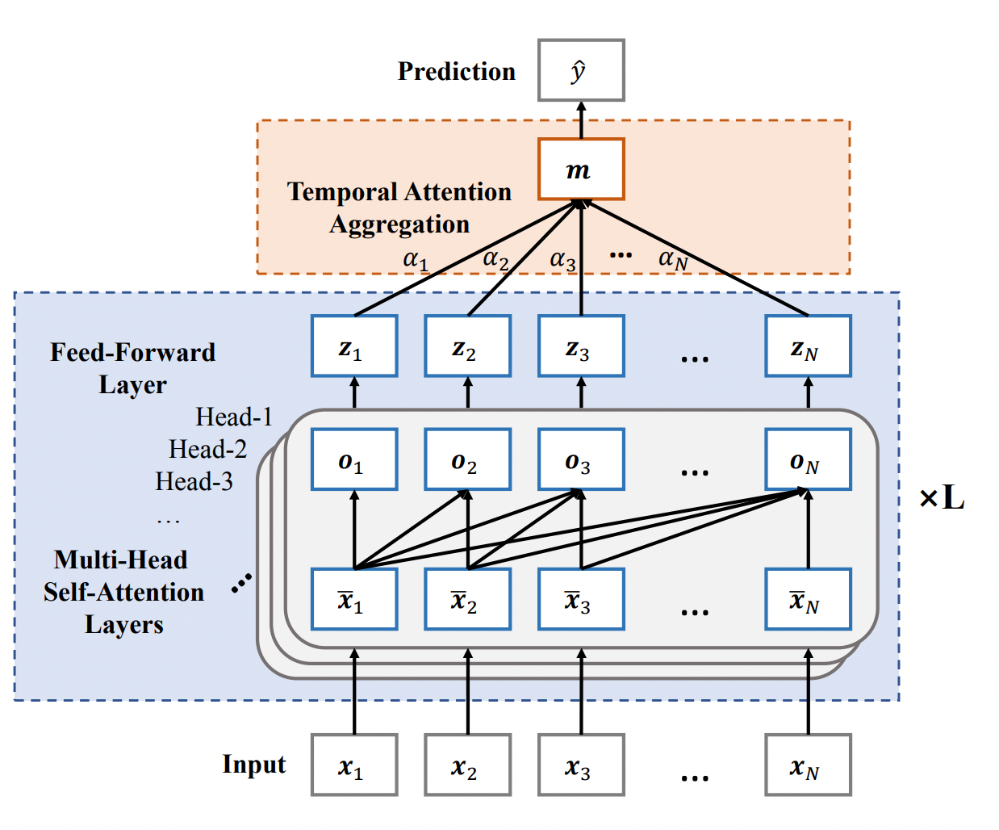
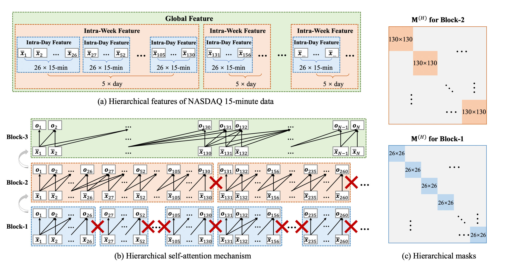

# Hierarchical Multi-Scale Gaussian Transformer for Stock Movement Prediction
## Summary
- This paper present several enhancements for the proposed basic Transformer. 
- Firstly, we propose a `Multi-Scale Gaussian Prior` to enhance the locality of Transformer. 
- Secondly, we develop an `Orthogonal Regularization` to avoid learning redundant heads in the multi-head self-attention mechanism. 
- Thirdly, we design a `Trading Gap Splitter` for Transformer to learn hierarchical features of high-frequency finance data. 
- Compared with other popular RNNs such as LSTM, the proposed method has the advantage to **mine extremely long-term dependencies** from financial time series.

## Model Structure

## My Question:
- What is 
  - `Temporal Attention Aggregation`?
  - `Multi-Scale Gaussian Prior`?
  - `Trading Gap Splitter`?