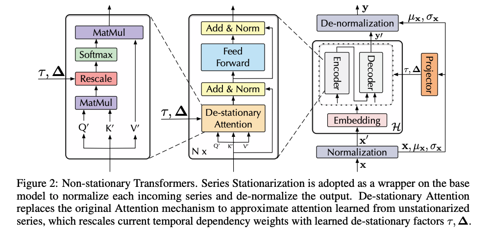

# Non-stationary Transformers: Exploring the Stationarity in Time Series Forecasting

| Title | Venue | Year | Code |
|-|-|-|-|
|  | NIPS | '22 | [code]() |

## Abstract
- **Cause**: Transformers have shown great power in time series forecasting due to their global-range modeling ability. However, their performance can degenerate terribly on non-stationary real-world data in which the joint distribution changes over time. 
    - **over-stationarization**: 
        - Previous studies primarily adopt stationarization to **attenuate(衰減、減少) the nonstationarity of original series for better predictability**. But the stationarized series deprived of inherent non-stationarity can be less instructive for real-world bursty events forecasting. 
        - leads Transformers to generate indistinguishable temporal attentions for different series and impedes(妨礙) the predictive capability of deep models. 
- **Effect:** To tackle the dilemma between series predictability and model capability, we propose Non-stationary Transformers as a generic framework with two interdependent modules: 
    - **Series Stationarization**: Unifies the statistics of each input and converts the output with restored statistics for better predictability.
    - **De-stationary Attention**: To address the over-stationarization problem, Destationary Attention is devised to recover the intrinsic non-stationary information into temporal dependencies by approximating distinguishable attentions learned from raw series. 
 
## Proposed Method

## Conclusion
- This paper addresses time series forecasting from the view of stationarity.
- Unlike previous studies that simply attenuate `non-stationarity` leading to `over-stationarization`, we propose an efficient way to increase `series stationarity` and renovate the internal mechanism to re-incorporate `non-stationary` information, thus boosting data predictability and model predictive capability simultaneously. 
- Experimentally, our method shows great generality and performance on six real-world benchmarks.
- And detailed derivations and ablations are provided to testify the effectiveness of each component in our proposed Non-stationary Transformers framework. 
- In the future, we will explore a more model-agnostic solution for the over-stationarization problem.

