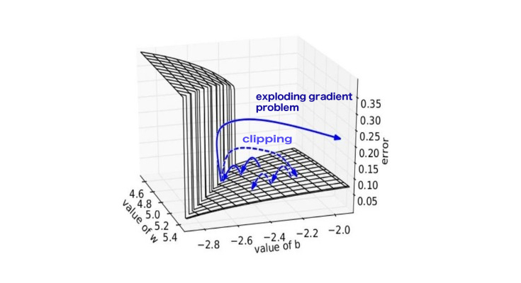

## Gradient Clipping
- Schemetic Diagram
    

    $$
        W = W - \eta \dfrac{\partial\mathcal{L}}{\partial W}
    $$

- **Purpose**: To prevent Exploding Gradient Problem
- **Heine Borel**

The purpose of Gradient Clipping is to limit the gradient in the set upper- and lower-bound:

$$
    \frac{\partial \mathcal{L}}{\partial W} \in [-M, M]
$$

- **limit**
    $$
    \lim_{n \to -\infty} a_n = x \\
    \forall \epsilon \in \mathbb{R}, \exists N \in X 
    $$
- [torch.nn.utils.clip_grad_norm](https://pytorch.org/docs/stable/generated/torch.nn.utils.clip_grad_norm_.html)

    
    
### Reference
- https://machinelearningjourney.com/index.php/2020/08/07/vanishing-and-exploding-gradients/