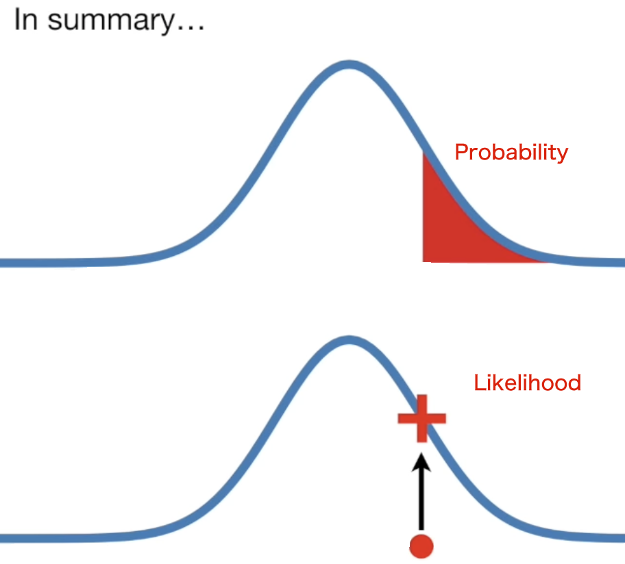

# Cross Entropy
- [torch.nn.CrossEntropyLoss](https://pytorch.org/docs/stable/generated/torch.nn.CrossEntropyLoss.html)
- input is unnormalized scores
#### Information Entropy
- Ref: https://www.ycc.idv.tw/deep-dl_2.html
#### Maximum Likelihood Estimation
- Ref: https://www.ycc.idv.tw/deep-dl_3.html
- Use Model to infer Data's distribution
    - We know the x, and we calculate the Probilities of Data distribution
    - Use $ln$ 
- Probability is not Likelihood
    
    - Distribution -> Probability
    - Likelihood is probability's reverse

#### Binary Cross Entropy
- for multi-Label Classification